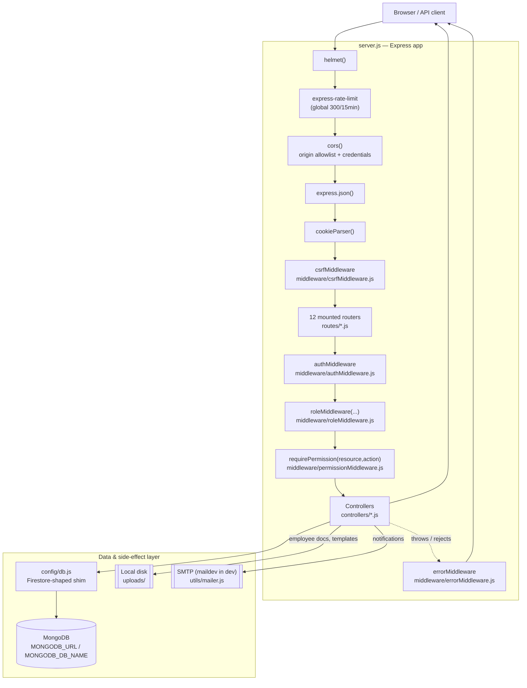

# 01 — Backend Architecture

## What this backend is

Fute Portal's backend is a single Node.js/Express 4 process (`main/backend/server.js`) serving a JSON REST API under `/api/*`. It was originally built against Firebase (Auth + Firestore) and has since been migrated to a self-hosted **MongoDB** database, without rewriting the ~170 call sites that used the Firestore Admin SDK's call shape. That's done by `config/db.js`, a **Firestore-shaped shim over the native MongoDB driver** — its own header comment states this explicitly:

> "Firestore-shaped shim over the native MongoDB driver. The app was written against the Firestore Admin SDK's call shape (collection().doc().get/set, where/orderBy/limit chains, batch(), runTransaction()); this module reproduces just enough of that surface that controllers keep working after swapping the import from `./config/firebase` to `./config/db`, instead of rewriting ~170 call sites across the app."

So every controller still calls `db.collection('name').doc(id).get()`, `.where(...).orderBy(...).limit(...).get()`, `db.batch()`, `db.runTransaction(fn)` — but underneath, `config/db.js` translates those calls into real MongoDB driver operations (`findOne`, `updateOne`, `insertOne`, Mongo `$set`/`$addToSet`, sessions/transactions, etc).

## Layered request flow

Every request goes through the same layers, in this order:

1. **Express app setup** — `server.js`: creates the app, registers global middleware, mounts routers, starts the HTTP server (unless running on Vercel, see `!process.env.VERCEL` check).
2. **Global middleware** (applied to every request, in this exact order in `server.js`):
   - `helmet()` — security headers.
   - `express-rate-limit` — global 300 req/15 min throttle.
   - `cors(...)` — origin allowlist + credentials.
   - `express.json()` — JSON body parsing.
   - `cookieParser()` — parses `req.cookies`.
   - `csrfMiddleware` (`middleware/csrfMiddleware.js`) — double-submit CSRF check on mutating requests.
3. **Routing** — 12 router modules mounted under `/api/...` (see `02-folder-structure.md` for the full list), each built with `express.Router()` in `routes/*.js`.
4. **Per-route middleware** — most routes additionally apply, in order: `authMiddleware` (JWT + session check) → `roleMiddleware(...)` (coarse role gate) → sometimes `requirePermission(resource, action)` (fine-grained action gate, e.g. `routes/itRoutes.js`'s asset routes) → the controller function.
5. **Controllers** (`controllers/*.js`) — read `req.body`/`req.params`/`req.query`, call into `config/db.js`'s shim, apply business rules, and reply via `utils/respond.js`'s `ok()`/`created()`/`fail()`.
6. **Data layer** — `config/db.js`'s `db.collection(...)` shim → native `mongodb` driver → MongoDB at `MONGODB_URL`/`MONGODB_DB_NAME`.
7. **Side channels** — some controllers also touch local disk (`utils/upload.js` + direct `fs` calls in `hrDeskController.js` for employee documents/templates) or send mail (`utils/mailer.js` → SMTP, self-hosted `maildev` in dev).
8. **Error handling** — any thrown error (sync or rejected promise, thanks to `express-async-errors` loaded at the top of `server.js`) falls through to `errorMiddleware` (`middleware/errorMiddleware.js`), the last `app.use(...)` in `server.js`.

## Diagram

## Layer purposes, files, and callers/callees

| Layer | File(s) | Purpose | Called by | Calls |
|---|---|---|---|---|
| App bootstrap | `server.js` | Wires middleware, mounts routers, starts server, handles graceful shutdown (`SIGTERM`/`SIGINT`) | Node process entrypoint (`npm start` → `node server.js`) | Everything below |
| Global middleware | `helmet`, `express-rate-limit`, `cors`, `express.json`, `cookie-parser` (npm packages), `middleware/csrfMiddleware.js` | Cross-cutting request hygiene/security applied to all routes | `server.js`'s `app.use(...)` calls | `utils/cookies.js` (`CSRF_COOKIE`), `utils/respond.js` (`fail`) |
| Routing | `routes/*.js` (12 files) | Maps HTTP method+path to a controller function, and declares the per-route middleware chain (`auth`, `role(...)`, `requirePermission(...)`) | `server.js`'s `app.use('/api/...', require('./routes/xxxRoutes'))` | `middleware/authMiddleware.js`, `middleware/roleMiddleware.js`, `middleware/permissionMiddleware.js`, `controllers/*.js` |
| Auth/session middleware | `middleware/authMiddleware.js` | Verifies JWT (from cookie or `Authorization` header), re-checks the live user profile (60s cache), checks session revocation, populates `req.user` | Route definitions (`auth` in every protected route) | `config/db.js`, `utils/sessions.js` (`isSessionRevoked`), `utils/jwt.js` (`verifyAccessToken`), `utils/cookies.js` |
| Authorization middleware | `middleware/roleMiddleware.js`, `middleware/permissionMiddleware.js` | Coarse role gate (`role('hr','founder')`) and fine-grained action gate (`requirePermission('assets','create')`) | Route definitions, after `auth` | `config/db.js` (permission matrix doc) |
| Controllers | `controllers/*.js` (24 files) | Business logic: validate input, read/write MongoDB via the shim, apply business rules, format the response | Route handlers | `config/db.js`, `utils/*.js`, sibling controllers (e.g. `dashboardController.js` imports from `slaController.js` and `departmentController.js`) |
| Data shim | `config/db.js` | Translates Firestore-shaped calls (`collection/doc/where/orderBy/limit/batch/runTransaction`) into native MongoDB driver calls; also implements the `auth` object (register/login/password verify) | Every controller, `middleware/authMiddleware.js`, `middleware/permissionMiddleware.js`, `utils/sessions.js`, `utils/auditLog.js`, `utils/notificationRules.js`, `utils/pagination.js` (via `FieldPath`) | `mongodb` npm package |
| Utilities | `utils/*.js` (10 files) | Shared helpers: JWT signing/verification, cookie management, refresh-session storage, uniform response envelope, cursor pagination, file-upload config, mail sending/templates, shared constants, audit logging, notification rule loading | Controllers, middleware | `config/db.js` (several of them), `jsonwebtoken`, `nodemailer`, `multer`, `bcryptjs` |
| Error handling | `middleware/errorMiddleware.js`, `express-async-errors` (loaded in `server.js`) | Catches every thrown/rejected error from any route handler and turns it into the app's uniform JSON error envelope | Express's error-handling pipeline (registered last in `server.js`) | `utils/respond.js` (`fail`) |

## Why the Firestore-shim design matters architecturally

Because `config/db.js` fully owns the translation between the Firestore-style API and MongoDB, **no controller file needs to know MongoDB exists**. This has two architectural consequences worth understanding:

- **Ordering caveats leak through the shim.** Firestore silently drops documents missing an `orderBy()` field from a result set; MongoDB's `.sort()` does not. Several controllers (e.g. `hrController.js`/`itController.js` via `complaintControllerFactory.js`, `hrDeskController.js`'s `makeCrud().list()`) deliberately *don't* use `.orderBy()` at the query level and instead sort in JavaScript after fetching, specifically to preserve the old "don't hide undated legacy docs" behavior. This is a controller-level workaround for a semantic difference between the two databases, not a shim bug.
- **Multi-document atomicity is real, not simulated.** `db.batch()` and `db.runTransaction(fn)` in `config/db.js` use actual MongoDB sessions/transactions (`client.startSession()`, `session.withTransaction(...)`), so ticket-status-plus-approval-record writes (`complaintControllerFactory.js`'s `updateStatus`, `approvalController.js`'s `decideApproval`) are genuinely atomic — this requires MongoDB to be running as a replica set (see `docs/BACKEND_ARCHITECTURE_STATUS.md` for the current deployment's status on this point).

## Cross-cutting design decisions worth knowing up front

- **Uniform response envelope** — every controller responds through `utils/respond.js` (`ok`, `created`, `fail`), so the wire format is always `{success, message, data}` or `{success:false, message, error:{code, details}}`. The frontend's `main/frontend/src/utils/api.js` axios interceptor unwraps this transparently.
- **Cursor-based pagination** — `utils/pagination.js`'s `paginatedQuery()` is the shared implementation used by most "list everything" endpoints (tickets, approvals, leave, assets, renders, tasks) to avoid full-collection reads on every poll.
- **Session/permission short-lived caches** — `authMiddleware.js`, `permissionMiddleware.js`, `sessions.js`, `dashboardController.js`, `analyticsController.js` all use small in-process `Map`/variable caches (30–60 second TTLs) instead of re-reading MongoDB on every request. This is explicitly a lesson learned from a real Firestore-quota incident (see `authMiddleware.js`'s comment).

See `02-folder-structure.md` for the full file inventory, `09-middleware.md` and `10-controllers.md` for per-file detail, and `23-code-call-graph.md` for concrete endpoint-level call chains.
