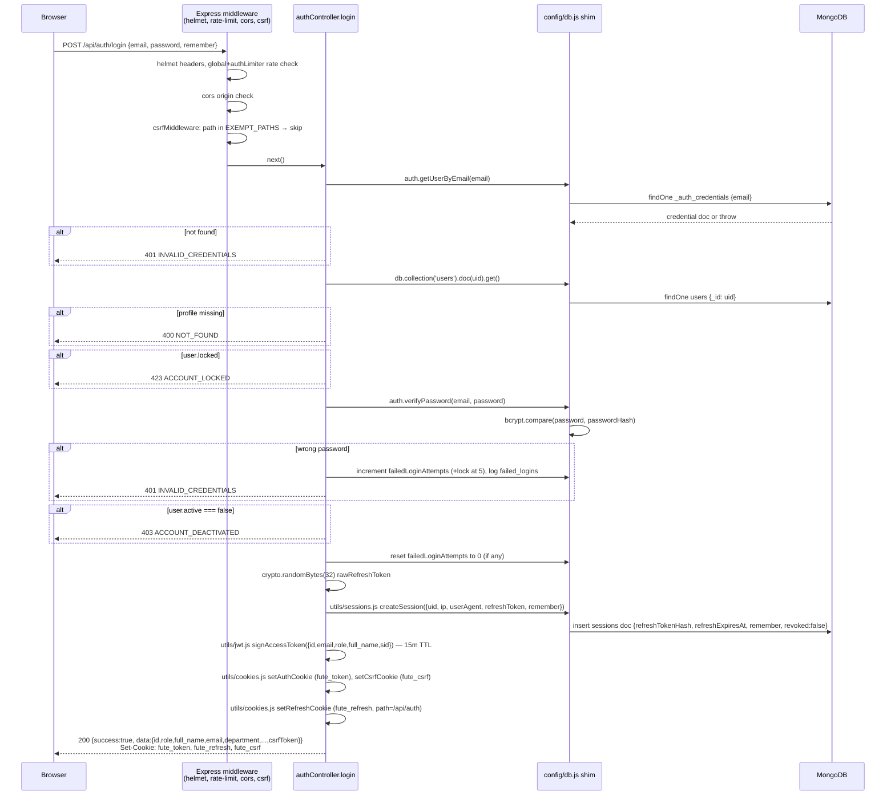
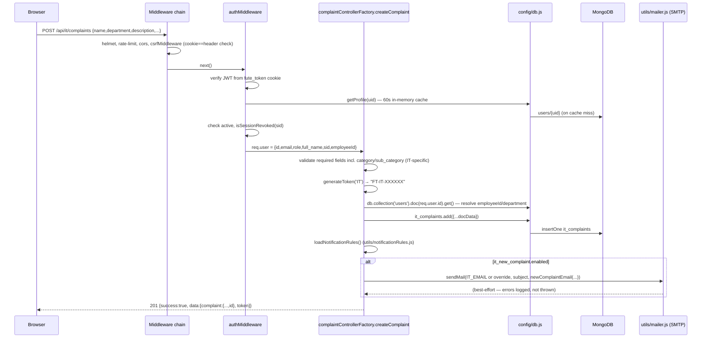

# 05 — Request/Response Flow

Four representative requests, traced step by step through the actual code. All four pass through the same global middleware chain set up in `server.js` before reaching their route: `helmet()` → global rate limiter (300/15min) → `cors` (origin check) → `express.json()` → `cookieParser()` → `csrfMiddleware` (`middleware/csrfMiddleware.js`) → the matched route file.

---

## 1. POST /api/auth/login

`routes/authRoutes.js` → `authLimiter` (10/15min) → `controllers/authController.js#login`. No `authMiddleware` (this endpoint issues the session). CSRF-exempt (`EXEMPT_PATHS` in `csrfMiddleware.js` — no session exists yet to protect).



Step-by-step:
1. Browser POSTs `{email, password, remember}` with `withCredentials: true` (frontend `src/utils/api.js`).
2. `helmet()` sets security headers; the global 300/15min limiter and `authLimiter` (10/15min) both check the caller's IP (`app.set('trust proxy', 1)` makes `req.ip` the real client IP behind Vercel/reverse proxy).
3. `cors` checks `Origin` against `allowedOrigins` (`FRONTEND_URL` env + the hardcoded Vercel URL) or a `localhost:<any port>` regex.
4. `csrfMiddleware` sees `/api/auth/login` in `EXEMPT_PATHS` and calls `next()` without checking any CSRF token.
5. `authController.login` destructures `{email, password, remember = true}`. Missing email/password → 400 `VALIDATION_ERROR`.
6. `auth.getUserByEmail(email)` (`config/db.js`) looks up `_auth_credentials` by email; a miss is caught and turned into a generic 401 `INVALID_CREDENTIALS` (doesn't leak "no such user").
7. The `users/{uid}` profile doc is fetched. If `locked === true`, respond 423 immediately without even checking the password.
8. `auth.verifyPassword` bcrypt-compares the password. On failure: increments `failedLoginAttempts`, sets `locked: true` once it reaches `LOCK_THRESHOLD` (5), records a `failed_logins` doc, returns 401.
9. On success: resets `failedLoginAttempts` to 0 if it was nonzero, checks `active !== false`.
10. A new session is created (`utils/sessions.js#createSession`) — one `sessions` document holding the SHA-256 hash of a fresh random refresh token, never the raw token itself.
11. `issueSessionCookies` signs a 15-minute JWT access token embedding `{id, email, role, full_name, sid}` and sets the `fute_token` cookie (httpOnly, `SameSite=None; Secure` in production, `Lax` locally), plus a fresh non-httpOnly `fute_csrf` cookie.
12. The refresh cookie (`fute_refresh`, scoped to `/api/auth`) is set separately, with a 7-day `maxAge` only if `remember` is true (otherwise a session cookie).
13. The JSON body echoes `csrfToken` so the frontend can cache it in memory (`api.js`'s `setCsrfToken`), sidestepping a race where `document.cookie` is re-read mid-refresh.

---

## 2. POST /api/it/complaints

`routes/itRoutes.js` → `authMiddleware` → `itController.createComplaint` (built by `complaintControllerFactory.createComplaintController`).



Step-by-step:
1. `csrfMiddleware` requires a matching `fute_csrf` cookie + `X-CSRF-Token` header (or `_csrf` body field) since POST is a mutating verb and this path isn't exempt.
2. `authMiddleware` (`middleware/authMiddleware.js`) reads the JWT from the `fute_token` cookie (or `Authorization: Bearer`), verifies it with `utils/jwt.js#verifyAccessToken`, then re-fetches the live profile via a 60-second in-memory cache (`getProfile`) so a role change or deactivation takes effect within a minute rather than the token's full 15-minute life. It also checks `isSessionRevoked(sid)` (`utils/sessions.js`, 30s cache).
3. `itController.createComplaint` (generated by the factory in `complaintControllerFactory.js`) validates `name, department, description, complaint_date, priority` plus IT's extra `requiredFields: ['category','sub_category']`.
4. `generateToken('IT')` builds a random `FT-IT-XXXXXX` token; `calcDuration` computes a human-readable age string.
5. If `req.user.id` resolves to a `users` doc, `resolvedEmployeeId`/`dbUserRole` are filled in from it (falls back to the client-supplied `employeeId`/`role` otherwise).
6. `opts.buildDocData` (IT's version) resolves `department`, echoes `category`/`sub_category`, and normalizes `approval`/`vpnNo`.
7. The full document is inserted into `it_complaints` via the Firestore-shaped shim (`db.collection('it_complaints').add(docData)`, which becomes a MongoDB `insertOne` under the hood in `config/db.js`).
8. `loadNotificationRules()` reads the `settings/notification_rules` doc (merged with defaults); if `it_new_complaint.enabled`, an email is sent via `utils/mailer.js#sendMail` to `IT_EMAIL` (or a configured override) using the `newComplaintEmail` HTML template (values escaped with `escapeHtml`). A mail failure is caught and logged — it never fails the ticket creation itself.
9. Response: 201 with the full created document plus its token.

---

## 3. POST /api/hr-desk/employees/:id/documents/:docType

`routes/hrDeskRoutes.js` → `authMiddleware` → `role('hr','founder')` → `upload.single('file')` (Multer, `utils/upload.js`) → `hrDeskController.uploadEmployeeDocument`.

```mermaid
sequenceDiagram
    participant B as Browser
    participant MW as Middleware chain
    participant AUTH as authMiddleware + role('hr','founder')
    participant UP as multer upload.single('file')
    participant C as hrDeskController.uploadEmployeeDocument
    participant DB as config/db.js
    participant M as MongoDB
    participant FS as Local disk (uploads/)
    participant Mail as utils/mailer.js

    B->>MW: POST .../documents/olSigned  (multipart/form-data)
    MW->>AUTH: helmet, rate-limit, cors, csrf, authMiddleware, roleMiddleware
    AUTH->>UP: next() (role ok)
    UP->>UP: fileFilter checks mimetype (PDF/JPG/Word), memoryStorage buffers it, 10MB cap
    UP->>C: req.file = {buffer, originalname, mimetype}
    C->>C: look up DOCUMENT_TYPES[docType]; 400 if unknown
    C->>DB: employees/{id}.get()
    DB->>M: findOne employees
    alt employee not found
        C-->>B: 404 NOT_FOUND
    end
    C->>C: safeName = sanitize(originalname); storagePath = employee-documents/{id}/{docType}-{ts}-{safeName}
    C->>FS: mkdirSync + writeFileSync(absolutePath, buffer)
    C->>DB: employees/{id}.update({[urlField]:downloadUrl,[fileNameField]:name,storagePaths.docType:storagePath})
    DB->>M: updateOne employees
    C->>DB: approvals.add({source:'HR',category:'document',status:'pending_founder',...})
    DB->>M: insertOne approvals
    C->>DB: users where role=='founder'
    C->>Mail: sendMail(each founder, "Document uploaded — ...")
    C-->>B: 200 {data:{id,[urlField]:downloadUrl,[fileNameField]:originalname,approvalId}}
```

Step-by-step:
1. `role('hr','founder')` runs before Multer, so an unauthorized caller is rejected before any file bytes are even parsed.
2. `upload.single('file')` (from `utils/upload.js`) uses `multer.memoryStorage()` — the file never touches disk during parsing — and its `fileFilter` rejects anything outside `ALLOWED_MIME_TYPES` (PDF, JPEG, `.doc`, `.docx`) with a 400 before the controller runs. Files over 10MB are rejected by Multer's `limits.fileSize`.
3. `uploadEmployeeDocument` validates `docType` against the `DOCUMENT_TYPES` map (`olSigned`, `nda`, `leavePolicy`, ..., `other1..3`) and confirms the `employees/{id}` document exists.
4. The original filename is sanitized (`replace(/[^\w.\-]/g,'_')`) and combined with the doc type + timestamp into a relative `storagePath` under `uploads/employee-documents/{id}/`; `fs.mkdirSync(..., {recursive:true})` + `fs.writeFileSync` persist the buffer to local disk (`UPLOAD_ROOT`, self-hosted — no cloud bucket).
5. The employee doc is updated with the type-specific URL field, filename field, and an internal `storagePaths.{docType}` dotted key (kept out of the API response — only the URL/filename are echoed back).
6. An `approvals` document (`category: 'document'`, `status: 'pending_founder'`) is created — the document is already live on the employee record; this is a sign-off/visibility trail, not a gate, per the code comment.
7. Every user with `role === 'founder'` is emailed via `notifyFounder` (best-effort — failures are caught per-recipient with `.catch(() => {})` so one broken address doesn't stop the others).
8. Response: 200 with the URL, filename, and new `approvalId`.

Download (`GET .../documents/:docType/download`) re-validates the same role gate, resolves `storagePaths[docType]`, and defends against path traversal by checking `absolutePath.startsWith(UPLOAD_ROOT)` before calling `res.download()` — see `15-security.md`.

---

## 4. POST /api/chat/:channelId/messages

`routes/chatRoutes.js` → `authMiddleware` → `chatController.sendMessage`.

```mermaid
sequenceDiagram
    participant B as Browser
    participant MW as Middleware chain
    participant AUTH as authMiddleware
    participant C as chatController.sendMessage
    participant DB as config/db.js
    participant M as MongoDB

    B->>MW: POST /api/chat/dm-abc-xyz/messages {text}
    MW->>AUTH: helmet, rate-limit, cors, csrf, authMiddleware
    AUTH->>C: req.user = {id, full_name, role, ...}
    C->>C: isDmChannel(channelId)? → dmParticipants includes req.user.id?
    alt not a participant
        C-->>B: 403 FORBIDDEN
    end
    C->>C: text = body.text.trim(); empty? → 400 VALIDATION_ERROR
    C->>DB: chat_messages.add({channelId, senderId, senderName, senderRole, text, created_at})
    DB->>M: insertOne chat_messages
    C-->>B: 201 {data:{id,channelId,senderId,senderName,senderRole,text,created_at}}
```

Step-by-step:
1. `channelId` comes from the URL param. If it starts with `dm-`, `canAccessChannel` parses the two participant ids out of the channel id (`dm-<uidA>-<uidB>`, always sorted) and checks the caller is one of them — otherwise 403 `FORBIDDEN`. Fixed channels (`general`, `it-support`) and `project-<id>` channels have no such check — any authenticated user may post.
2. `text` is trimmed; an empty string is rejected with 400.
3. Sender identity (`senderId`, `senderName`, `senderRole`) is always taken from `req.user` (the verified JWT payload) — never from the request body, so a client can't spoof who sent a message.
4. The message document is inserted into `chat_messages` with an ISO `created_at`.
5. Response: 201 with the full message including its new `id`.

Reading messages (`GET /:channelId/messages?since=`) applies the same `canAccessChannel` check, then either returns the last 50 messages (no `since`, sorted newest-first then reversed to oldest-first for display) or only messages with `created_at > since` (ascending) — the polling/incremental-fetch path used by the frontend's `TeamChatDrawer`.
