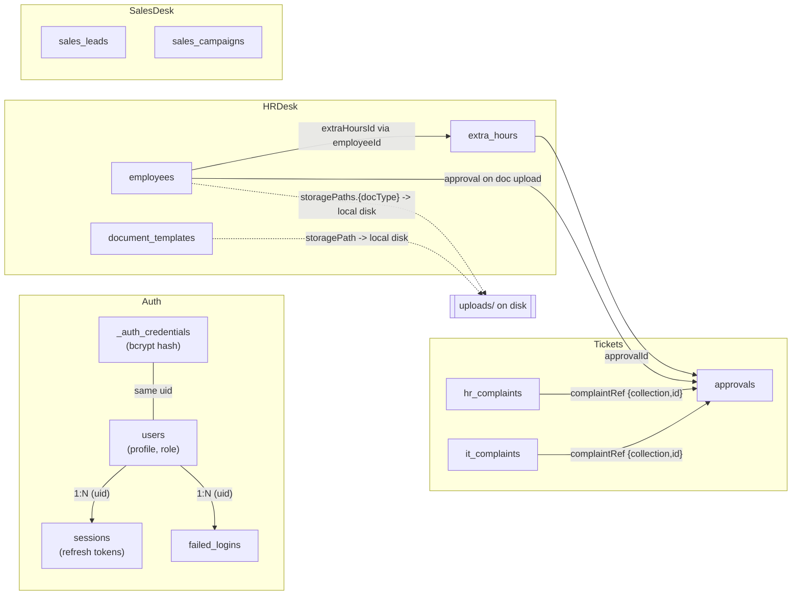

# 06 — Database

## The database layer is a shim, not an ODM

`main/backend/config/db.js` is a **hand-written Firestore-shaped shim over the native MongoDB driver** (`mongodb` npm package). It is not Mongoose, and it enforces no schema at the database layer. Its own header comment explains why it exists:

> "Firestore-shaped shim over the native MongoDB driver. The app was written against the Firestore Admin SDK's call shape (`collection().doc().get/set`, `where/orderBy/limit` chains, `batch()`, `runTransaction()`); this module reproduces just enough of that surface that controllers keep working after swapping the import from `./config/firebase` to `./config/db`, instead of rewriting ~170 call sites across the app."

This means:
- There is **no schema enforcement** anywhere in the data layer — no Mongoose-style `Schema`, no field types, no required-field validation at the DB level. Every "schema" documented below is *inferred from what the controllers actually read and write*, not declared anywhere in one place.
- Validation that exists is done manually in each controller (e.g. `if (!name || !department...) return fail(...)`).
- Documents in the same collection can have inconsistent shapes over time (the code frequently defends against this — e.g. `t.role || t.user_role || 'Employee'` fallback chains in `complaintControllerFactory.js`'s `enrichWithUserRole`).

## How the shim maps Firestore-style calls onto MongoDB

| Shim call | Real MongoDB operation |
|---|---|
| `db.collection(name).doc(id).get()` | `collection.findOne({ _id: id })` |
| `db.collection(name).doc(id).set(data)` (no `merge`) | `collection.replaceOne({ _id: id }, { _id: id, ...data }, { upsert: true })` |
| `db.collection(name).doc(id).set(data, { merge: true })` | `collection.updateOne({ _id: id }, { $set: data }, { upsert: true })` |
| `db.collection(name).doc(id).update(data)` | `collection.updateOne({ _id: id }, { $set: data })` — throws `NOT_FOUND` if `matchedCount === 0` |
| `db.collection(name).doc(id).delete()` | `collection.deleteOne({ _id: id })` |
| `db.collection(name).add(data)` | `collection.insertOne({ _id: generateId(), ...data })` |
| `.where(field, op, value)` | Builds a Mongo filter (`$eq`, `$ne`, `$lt`, `$lte`, `$gt`, `$gte`, `$in`; `array-contains` maps to `$eq` since Mongo arrays match by value automatically) |
| `.orderBy(field, dir)` | `.sort({ field: 1 or -1 })` |
| `.limit(n)` | `.limit(n)` |
| `.startAfter(...values)` | Keyset-pagination cursor, translated into an `$or`/`$and` filter comparing each ordered field against the cursor value (see `utils/pagination.js`, the only caller) |
| `.get()` on a query | `collection.find(filter).sort(sort).limit(n).toArray()` |
| `.count().get()` | `collection.countDocuments(filter)` — count only, no document transfer |
| `db.batch()` | Queues `set`/`update`/`delete` ops, then `commit()` runs them inside one `session.withTransaction(...)` |
| `db.runTransaction(fn)` | `client.startSession()` + `session.withTransaction(...)`, exposing a Firestore-style `tx.get/set/update/delete` |
| `db.ping()` | `client.db(dbName).command({ ping: 1 })` — used by `GET /healthz` in `server.js` |

**`generateId()`** produces a 20-character random alphanumeric string (using `crypto.randomBytes`), mirroring Firestore's own auto-ID format — used as MongoDB's `_id` for every `.add()`/`.doc()` (no id given) call, so ids "look and sort the same way the rest of the app (and any existing Firestore-era data export) already expects."

**`FieldValue.arrayUnion(...values)`** is the *only* Firestore write-transform the app uses (in `salesDeskController.logCall`). It returns a marker object that `splitFieldValues()` detects and translates into Mongo's `$addToSet` with `$each`.

**`FieldPath.documentId()`** is used once, in `utils/pagination.js`, as the tiebreaker field in cursor-based pagination's `orderBy` chain; the shim maps it to Mongo's real primary key, `_id`.

## Credentials vs. profile: two collections, deliberately

`_auth_credentials` (email, bcrypt `passwordHash`, `displayName`, `disabled`) is kept **separate** from `users` (role, department, profile data). The code's own reasoning:

> "Firebase Auth and the Firestore `users` profile doc were always two separate systems sharing only a uid ... kept that way here in a dedicated credentials collection, rather than merging into `users`, since several callers do a full (non-merge) `.set()` on the profile doc that would otherwise silently wipe the password hash."

`_auth_credentials` has the **only index created anywhere in this codebase**: a unique index on `email`, created once at startup:
```js
await c.db(dbName).collection('_auth_credentials').createIndex({ email: 1 }, { unique: true });
```
This is what actually prevents two concurrent registrations from creating duplicate accounts on the same email — the `findOne`-then-insert check in `auth.createUser()` is just a friendlier error path; the unique index is the real guard (a duplicate-key error, Mongo code `11000`, is caught and turned into the same `auth/email-already-exists` error).

**No other collection in this codebase has an index created in code.** Every other query relies on a full (bounded) collection scan. The app's actual mitigation for this is bounded read caps defined in `utils/constants.js`:
- `UNPAGINATED_READ_LIMIT = 200` — default cap for endpoints reading a whole collection without cursor pagination.
- `FOUNDER_LIST_CAP = 200` — same value, tracked separately for the founder-side merged HR+IT views that set an `X-Results-Truncated` header when hit.
- `DASHBOARD_SCAN_CAP = 5000` — cap for dashboard/SLA full-field scans that need per-document data, not just a count.
- `salesDeskController.js` additionally defines its own `SALES_LEADS_READ_LIMIT = 3000` and `analyticsController.js` its own `ANALYTICS_READ_CAP = 5000`, both for the same reason (a shared constant that every other resource also uses shouldn't have to grow for one outlier collection).

This is an explicit, documented tradeoff, not an oversight — see `dashboardController.js`'s in-memory `search()` function, which carries a `ponytail:` comment: *"fine at this app's real scale (dozens–low-hundreds of docs per collection); if any collection grows into the thousands this needs real indexed search instead."*

## Collections in use

Every collection actually referenced via `db.collection('...')` across the codebase, with the fields controllers read/write:

| Collection | Purpose | Key fields (inferred) | Notes / relationships |
|---|---|---|---|
| `users` | Profile + role data (not credentials) | `email`, `full_name`, `role` (employee/hr/it/sales/coordinator/founder/superadmin), `department`, `employee_id`/`employeeId`, `active` (bool, default true), `permissionOverrides` (object), `dashboardLayout`, `locked` (bool), `failedLoginAttempts`, `lockedAt`, `created_at` | `id` = same uid as `_auth_credentials`. `active === false` blocks login (`authController.login`) and blocks requests (`authMiddleware`). |
| `_auth_credentials` | Login credentials only | `email` (unique indexed), `passwordHash` (bcrypt), `displayName`, `disabled` | Never read directly by controllers — only via `config/db.js`'s `auth` object (`createUser`/`getUserByEmail`/`updateUser`/`deleteUser`/`verifyPassword`). |
| `sessions` | Refresh-token session tracking | `uid`, `ip`, `userAgent`, `loginAt`, `revoked` (bool), `remember` (bool), `refreshTokenHash`, `previousRefreshTokenHash`, `refreshExpiresAt`, `rotatedAt` | One doc per login/register. `sid` embedded in the access JWT lets a revoke take effect immediately. See `utils/sessions.js`. |
| `failed_logins` | Audit trail of bad password attempts | `uid`, `email`, `ip`, `at` | Written in `authController.login` on every wrong password; read by `securityController.listFailedLogins`. |
| `hr_complaints` / `it_complaints` | Ticket queues | `token` (`FT-HR-XXXXXX`/`FT-IT-XXXXXX`), `user_id`, `user_role`/`role`, `name`, `department`, `description`, `complaint_date`, `duration`, `submitted_at`, `priority` (Low/Medium/High), `employeeId`, `employeeStatus`, `solver`, `remarks`, `status` (Pending/In Progress/Waiting Approval/Completed), `updated_at`; IT also has `category`, `sub_category`, `approval` (bool), `vpnNo` | Created/updated via `controllers/complaintControllerFactory.js` (shared factory) — see `hrController.js`/`itController.js` for the per-queue config. |
| `approvals` | Founder approval queue | `source`, `title`, `sub`, `requestedBy`, `priority`, `category` (`document`/`extra-hours`/ticket categories/`General`), `status` (`pending_founder`/`approved`/`rejected`), `assetIdRef`, `complaintRef: { collection, id }`, `extraHoursId`, `employeeId`, `docType`, `remarks` (array of `{text, by, at}`), `createdAt`, `decidedAt`, `decidedBy`, `previousStatus` | Central linking collection — see relationships diagram below. |
| `leave_requests` | Employee leave applications | `user_id`, `employee`, `department`, `type`, `from`, `to`, `days`, `reason`, `status` (Pending/Approved/Rejected), `submitted_at`, `decidedBy`, `updated_at` | Decided by HR unless department is `Admin/Ops` or `IT`, which route to founder only (`leaveController.isFounderApproval`). |
| `assets` | IT asset inventory | `_id` = business identifier (e.g. `AST-1006`, client-chosen), `type`, `model`, `serialNo`, `assignedTo`, `department`, `purchaseDate`, `warrantyEnd`, `status`, `approvalStatus`, `hardDisk`, `componentsList`, `componentsLog`, `history`, `created_at` | Writes gated by both `roleMiddleware` and `requirePermission('assets', ...)`. |
| `renders` | Production render-job tracker | `date`, `sequence`, `frameNo`, `personName`, `endDate`, `allocatedSystems`, `status`, `created_at` | No role restriction on read/write routes. |
| `departments` | Department registry | `name`, `head`, `active` (bool), `created_at` | Deletion blocked if any `users` doc still references the department name (`departmentController.deleteDepartment`). |
| `settings` | Single-doc-per-key config store | doc id `role_permissions`: `{ [role]: [pageId,...] }`; doc id `action_permissions`: `{ [role]: { [resource]: [action,...] } }`; doc id `sla_policies`: `{ it: {...}, hr: {...} }`; doc id `system_config`: `{ slaHoursIt, slaHoursHr, workingHoursStart, workingHoursEnd, holidays }`; doc id `notification_rules`: `{ it_new_complaint, it_status_update, hr_new_complaint, hr_status_update }` | Not one doc per "record" — one fixed doc per config topic, always read with in-code defaults merged in. |
| `audit_logs` | Admin action trail | `actor_id`, `actor_email`, `actor_name`, `action`, `target`, `details`, `created_at` | Write-only via `utils/auditLog.js`'s `logAudit()`, fire-and-forget from the caller's perspective. |
| `tasks` | Coordinator/Employee task board | `projectId`, `title`, `assignee` (full name string, not a uid), `priority`, `status`, `dueDate`, `duration`, `comments`, `attachments`, `figma`, `pr`, `created_at`, `updated_at` | `assignee` is matched by name, not id — see `taskProjectController.getTasks`. |
| `projects` | Project list | Whatever fields are seeded directly — **no write endpoint exists in the backend**; read-only via `GET /api/coordinator/projects`. | Not paginated/ordered (no guaranteed `created_at` on seeded docs). |
| `chat_messages` | Team chat / DM messages | `channelId`, `senderId`, `senderName`, `senderRole`, `text`, `created_at` | Channel ids: fixed names, `project-<id>`, or `dm-<sortedUidA>-<sortedUidB>` (`chatController.makeDmChannelId`). |
| `sent_emails` | HR Desk "Sent" folder | `to`, `subject`, `preview` (first 80 chars), `body`, `sentBy`, `time` | Real SMTP send via `utils/mailer.js`, then a record kept for history. |
| `employees` | HR employee directory | `name`, `department`, `designation`, `status`, `email`, `phone`, `manager`, `joiningDate`, `employmentType`, many personal-info fields, `leaveEntitlement`, `storagePaths.{docType}` (internal, download-only), plus per-document-type `{doc}Url`/`{doc}FileName` fields (see Document Types below) | CRUD via `hrDeskController.js`'s `makeCrud('employees', ...)`. |
| `candidates` | Recruitment pipeline | `name`, `email`, `phone`, `stage`, `appliedFor`, `appliedOn` (ISO string), `resumeUrl`, `nextInterview` (denormalized summary), many recruiting-status fields | `appliedOn` transformed to ISO on write; `nextInterview` kept in sync by `syncNextInterview()` whenever an interview is scheduled. |
| `interviews` | Candidate interviews | `candidateId`, `candidate`, `type`, `interviewer`, `date`, `time`, `link`, `location`, `notes`, `status` | `afterWrite` hook updates the linked candidate's `nextInterview`. |
| `meetings` | HR meetings | `title`, `type`, `agenda`, `participants`, `date`, `time`, `notes` | Plain CRUD via `makeCrud`. |
| `attendance` | Daily attendance / leave-as-attendance rows | `employeeId`, `date` (`YYYY-MM-DD`), `status` (Present/Leave), `checkIn`/`checkOut` (`HH:MM` or `-`), `hours`, `workMode` (Office/WFH/Leave), `reason` | Written exclusively via self-service `check-in`/`check-out` (keyed to `req.user.employeeId`, never client-supplied); HR gets read-only list + delete, no create/update route. |
| `interview_feedback` | Interview feedback forms | `candidate`, `interviewId`, `interviewer`, `rating`, `recommendation`, `comments` | Plain CRUD via `makeCrud`. |
| `open_jobs` | Job postings | `title`, `department`, `applicants`, `openSince` | Plain CRUD via `makeCrud`. |
| `performance_entries` | Manual per-employee performance tracking | `employeeId`, `period`, `periodKey`, `category` (Walkthrough/Floor Plan/Masterplan/3D Views), `target`, `delivered` | One doc per (employee, period, category) — upserted by the frontend, not derived from `renders`. |
| `leave_entries` | Per-period leave "taken" counts | `employeeId`, `period`, `periodKey`, `taken` | Remaining leave = `employees.leaveEntitlement` minus the sum of `taken` across every period on file. |
| `document_templates` | Reusable blank HR document templates | `name`, `category`, `fileName`, `storagePath` (internal), `fileUrl`, `created_at` | File stored on local disk — see `16-file-storage.md`. |
| `extra_hours` | Employee extra-hours logging | `employeeId`, `loggedBy`, `projectCode`, `hours`, `date`, `fromTime`, `toTime`, `teammates` (array of names), `status` (`pending_founder`/`approved`/`rejected`), `approvalId`, `createdAt` | Founder-only approval (not HR) — see `08-authorization.md`. |
| `sales_leads` | Sales Desk pipeline | `companyName`, `contactName`, `designation`, address fields, `phone`/`mobile`/`email`, `status` (11-value enum), `priority` (Hot/Warm/Cold), `assignedTo`, `callLog` (array via `FieldValue.arrayUnion`), `dealValue`, `lostReason`, plus Marketing-Master-Sheet fields (`country`, `designationLevel`, `emailVerified`, `phoneVerified`, campaign-status fields) | Bulk-imported from `.xlsx` (two different sheet formats — see `11-business-logic.md`). |
| `sales_campaigns` | Sales campaign records | `name`, `sourceTag`, `targetCity`, `sentDate`, `createdBy`, `created_at` | Record-keeping only, not an actual mailer. |
| `sales_settings` | Sales Desk config (single doc, id `config`) | `monthlyRevenueTarget`, `dailyCallTargetPerRep` | Same single-doc pattern as `settings`. |

## Relationships



## Transactions

`db.runTransaction(fn)` wraps a real MongoDB client session (`client.startSession()` + `session.withTransaction(...)`), used in three places:

1. **`complaintControllerFactory.js`'s `updateStatus`** — updates the ticket and (on transition into `Waiting Approval`) creates the linked `approvals` doc atomically, so a failure between the two writes can't strand a ticket with no approval record.
2. **`approvalController.js`'s `decideApproval`** — updates the approval, the linked ticket (if any), and the linked `extra_hours` doc (if any) atomically, and re-reads the approval's status inside the transaction to reject a double-decision race.
3. **`utils/sessions.js`'s `consumeRefreshToken`** — reads/writes the session doc inside a transaction so two concurrent refresh calls for the same session can't both "succeed" off the same stale read.

**Operational caveat** (not a code bug): per `docs/BACKEND_ARCHITECTURE_STATUS.md`, MongoDB refuses multi-document transactions on a standalone instance — it must run as a (even single-node) replica set. As of that status doc, this was listed as "❌ Multi-doc transactions" / "not yet working" on the self-hosted deployment, failing cleanly with a 500 rather than a partial write. Confirm the target MongoDB instance is running with replica-set support (`rs.initiate()`) before relying on any of the three transactional flows above in a given environment.
