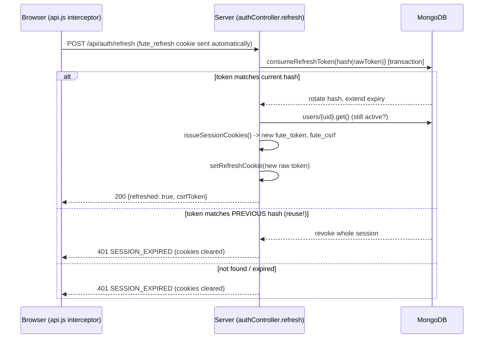
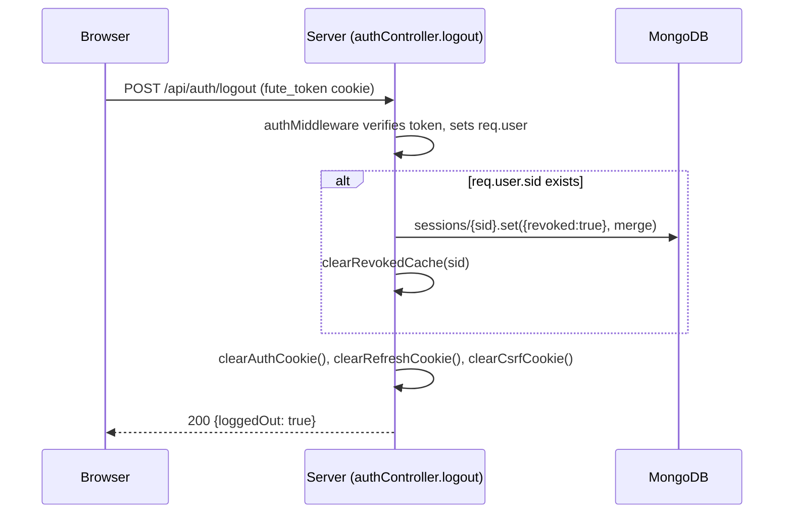

# 07 — Authentication

This document describes the login/JWT/refresh/CSRF/logout flow exactly as implemented today in `main/backend/controllers/authController.js`, `main/backend/middleware/authMiddleware.js`, `main/backend/middleware/csrfMiddleware.js`, `main/backend/utils/jwt.js`, `main/backend/utils/cookies.js`, and `main/backend/utils/sessions.js`.

## Design in one sentence

Session identity lives in an **httpOnly cookie** (not a JS-readable token), refreshed transparently via a **rotating opaque refresh token**, protected against forgery by a **double-submit CSRF cookie**, with short-lived in-memory caches to avoid re-hitting the database on every request.

The code comments make clear this replaced an earlier design: `authMiddleware.js` and `csrfMiddleware.js` both refer to auth having moved "from a JS-attached Authorization header... to a cookie... now that auth lives in a SameSite=None cross-origin cookie instead of a JS-attached header." The Authorization-header path is kept as a fallback in `authMiddleware.js` ("free to support... covers any non-browser API client that isn't cookie-based") but the browser flow described below is the primary path.

## The three cookies

Defined in `utils/cookies.js`:

| Cookie | httpOnly | Lifetime | Path | Purpose |
|---|---|---|---|---|
| `fute_token` (`AUTH_COOKIE`) | Yes | 15 min (mirrors `ACCESS_TOKEN_TTL`) | `/` | The JWT access token, attached automatically on every request. |
| `fute_refresh` (`REFRESH_COOKIE`) | Yes | 7 days if "remember me", else a browser-session cookie (no `maxAge`) | `/api/auth` only | Exchanged at `/api/auth/refresh` for a new access token. Scoped to `/api/auth` because "the refresh token is only ever needed by the refresh and logout endpoints." |
| `fute_csrf` (`CSRF_COOKIE`) | **No** (deliberate) | Mirrors the refresh cookie's lifetime | `/` | Double-submit CSRF token — see below. |

**Why `fute_csrf` is not httpOnly:** `csrfMiddleware.js`'s double-submit check relies on frontend JavaScript being able to read this cookie's value and echo it back in a header. The code's own reasoning: *"That's safe specifically because a cross-site attacker's page can't read a cookie that belongs to our origin, even though the browser will still send it along automatically — reading is what same-origin policy actually blocks, not sending."*

**`isDeployed` branching** (`utils/cookies.js`):
```js
const isDeployed = Boolean(process.env.VERCEL);
```
When deployed, cookies are set `secure: true, sameSite: 'none'` — required because the frontend and backend are on separate domains (cross-origin), and `SameSite=None` cookies must be `Secure` (HTTPS-only) per browser spec. Locally, frontend and backend share the `localhost` registrable domain (SameSite only cares about domain, not port), so `secure: false, sameSite: 'lax'` works over plain HTTP.

## Password authentication and account lockout

`authController.js` — `PASSWORD_LOGIN_ENABLED = true` is a code-level toggle ("flip to `true` to require the password again... both code paths are kept intact so switching back is a one-line change").

Login sequence:
1. Resolve the account by email via `auth.getUserByEmail()` (in `config/db.js`, backed by the `_auth_credentials` collection) *before* checking the password, so a lockout can be checked and a failed attempt recorded even when the password is wrong.
2. If `users/{uid}.locked === true`, reject with `423 ACCOUNT_LOCKED` — a Super Admin must unlock via the Security Center.
3. Verify the password with `auth.verifyPassword(email, password)` (bcrypt compare against the hash in `_auth_credentials`).
4. On failure: increment `users/{uid}.failedLoginAttempts`; once it reaches `LOCK_THRESHOLD = 5`, set `locked: true` and `lockedAt`; always write a row to `failed_logins` (`uid`, `email`, `ip`, `at`).
5. On success: reset `failedLoginAttempts` to 0 if it was nonzero, then issue tokens (below).

## JWT access token

`utils/jwt.js`:
```js
const ACCESS_TOKEN_TTL = '15m';
function signAccessToken(payload) { return jwt.sign(payload, process.env.JWT_SECRET, { expiresIn: ACCESS_TOKEN_TTL }); }
```
Payload shape: `{ id, email, role, full_name, sid }` where `sid` is the session document's id in the `sessions` collection.

The code's own rationale for the short TTL: *"Short on purpose — this is the token that would matter if it ever leaked (it's the one attached to every request). The refresh token... is what actually keeps someone signed in; this just limits how long a stolen access token stays useful."*

`server.js` refuses to even start if `JWT_SECRET` is unset:
```js
if (!process.env.JWT_SECRET) { console.error('FATAL: JWT_SECRET is not set. Refusing to start.'); process.exit(1); }
```

## Refresh token rotation with reuse detection

`utils/sessions.js` — the refresh token is an **opaque random value**, not a JWT (`crypto.randomBytes(32).toString('hex')`). Only its SHA-256 hash is ever persisted (`hashToken()`), "same principle as a password: if the sessions collection were ever read by someone who shouldn't, a hash alone can't be replayed as a cookie value."

Each session document (`sessions` collection) stores: `uid`, `ip`, `userAgent`, `loginAt`, `revoked`, `remember`, `refreshTokenHash`, `previousRefreshTokenHash`, `refreshExpiresAt` (`REFRESH_TTL_MS = 7 days`).

**`consumeRefreshToken(presentedHash, ...)`** — run inside a MongoDB transaction:
- If `presentedHash` matches the session's **current** `refreshTokenHash`: this is the normal case. Rotate — generate a new raw token, store its hash as the new current, move the old hash to `previousRefreshTokenHash`, extend `refreshExpiresAt`.
- If it instead matches the **previous** hash: that token was already rotated out by a legitimate refresh, so presenting it again means it was copied/stolen and replayed. **The entire session is revoked** (`revoked: true, revokedReason: 'refresh_token_reuse'`) rather than issuing yet another token to a possible attacker.
- If it matches neither: `not_found`.

This is the standard "refresh token rotation with reuse detection" pattern in plain terms: a refresh token is single-use; if the *previous* one is ever seen again, the server assumes it leaked and kills the whole session rather than trusting either party.

## CSRF protection — double-submit cookie

`middleware/csrfMiddleware.js`, applied globally in `server.js` after `cookieParser()`:

```js
const SAFE_METHODS = new Set(['GET', 'HEAD', 'OPTIONS']);
const EXEMPT_PATHS = new Set(['/api/auth/login', '/api/auth/register', '/api/auth/refresh']);
```

Check (for any non-safe method, non-exempt path):
```js
const cookieToken = req.cookies?.[CSRF_COOKIE];
const headerToken = req.headers['x-csrf-token'] || req.body?._csrf;
if (!cookieToken || !headerToken || cookieToken !== headerToken) return 403 CSRF_INVALID;
```

Why the header **or** a `_csrf` body field is accepted: *"a handful of browser extensions strip non-standard request headers on cross-site calls, which was surfacing as an intermittent false 'CSRF invalid' for real, logged-in users. The double-submit security property only needs some value the frontend echoed back that a cross-site attacker couldn't have read off the cookie itself — it doesn't have to be a header."* (Confirmed in `main/frontend/src/utils/api.js`, which sends both.)

**Why each exempt path is safe to skip:**
- `/login`, `/register`: no session/CSRF cookie exists yet to compare against. "A forged cross-site login can't read the response anyway (CORS), and there's no existing session for it to hijack."
- `/refresh`: "takes no attacker-controlled input (the refresh cookie itself, sent automatically and unreadable/unforgeable cross-site, IS the credential this endpoint checks) and its response never reaches the attacker's page (CORS) — a forged call just silently rotates the victim's own session, which isn't something an attacker can leverage."

## Session issuance — `issueSessionCookies()`

`authController.js` centralizes the sequence used by register, login, and refresh:
```js
function issueSessionCookies(res, { id, email, role, full_name, sessionId, remember }) {
  const accessToken = signAccessToken({ id, email, role, full_name, sid: sessionId });
  setAuthCookie(res, accessToken);
  return setCsrfCookie(res, remember); // returns the raw csrf token
}
```
The CSRF token is *also* returned in the JSON response body (not just set as a cookie) so the frontend can cache it in memory — the comment explains this closed a real race: reading `document.cookie` on every request could race a concurrent silent refresh rotating the cookie's value mid-flight, causing an intermittent "CSRF token missing or invalid" for logged-in users.

## Request-time verification — `authMiddleware.js`

```js
const token = req.cookies?.[AUTH_COOKIE] || (authHeader?.startsWith('Bearer ') ? authHeader.split(' ')[1] : null);
```
1. If no token: `401 UNAUTHORIZED`.
2. Verify the JWT (`verifyAccessToken`) — invalid or expired: `401 INVALID_TOKEN` (this is the expected path when a 15-minute access token has simply expired; the frontend's `api.js` response interceptor catches this and silently calls `/api/auth/refresh`).
3. Re-fetch the user's live profile (via a 60-second in-memory cache, see below). Missing: `401 ACCOUNT_NOT_FOUND`. `active === false`: `403 ACCOUNT_DEACTIVATED`.
4. Check `isSessionRevoked(decoded.sid)` (via a 30-second cache in `utils/sessions.js`). Revoked: `401 SESSION_REVOKED`.
5. Populate `req.user = { id, email, role, full_name, sid, employeeId }`.

## Why the caches exist

Both caches exist because of a **real incident**, documented directly in the code:

> `authMiddleware.js`: "Re-checking every request against Firestore (no caching at all) blew through the project's Firestore read quota within minutes under normal traffic ('8 RESOURCE_EXHAUSTED: Quota exceeded' on every endpoint, including login) — a much heavier cost than the stale-token risk it was meant to close."

- **Profile cache** (`authMiddleware.js`, `CACHE_MS = 60_000`): a deleted/demoted account loses access within 60 seconds instead of immediately, in exchange for far fewer database reads.
- **Session-revocation cache** (`utils/sessions.js`, `CACHE_MS = 30_000`): a "force logout" or session revoke takes up to 30 seconds to take effect on an in-flight token, same tradeoff.

Both are per-process `Map`s (`uid -> {data, expiresAt}` / `sessionId -> {revoked, expiresAt}`), with explicit cache-busting on writes that should be immediate (e.g. `logout()` and `revokeSession()` call `clearRevokedCache(sessionId)`).

## Sequence diagrams

### Login

```mermaid
sequenceDiagram
    participant B as Browser
    participant S as Server (authController.login)
    participant DB as MongoDB

    B->>S: POST /api/auth/login {email, password, remember}
    S->>DB: auth.getUserByEmail(email) [_auth_credentials]
    S->>DB: users/{uid}.get()
    alt account locked
        S-->>B: 423 ACCOUNT_LOCKED
    else
        S->>DB: auth.verifyPassword(email, password) [bcrypt.compare]
        alt wrong password
            S->>DB: increment failedLoginAttempts, maybe lock; add failed_logins row
            S-->>B: 401 INVALID_CREDENTIALS
        else success
            S->>DB: createSession() [sessions collection]
            S->>S: signAccessToken(), setAuthCookie()
            S->>S: setCsrfCookie(), setRefreshCookie()
            S-->>B: 200 {id, role, full_name, ..., csrfToken}<br/>Set-Cookie: fute_token, fute_refresh, fute_csrf
        end
    end
```

### Silent refresh (triggered by the frontend on any 401)



### Logout



## `GET /api/auth/me`

Re-fetches the caller's own profile on every page load (not trusting a cached client copy) and — notably — echoes back the caller's *current* CSRF cookie value in the response body (not a new one, just what `req.cookies` already holds). This exists because some browsers were observed blocking page JavaScript from reading a cross-site cookie via `document.cookie` even though it is explicitly non-httpOnly and still sent correctly to the server — `req.cookies` server-side is unaffected, so handing the value back through the response body is "the only reliable channel left" for a tab that's already logged in but hasn't triggered a login/refresh response in this tab yet.

## `POST /api/auth/verify-password`

Re-authentication for risk-tiered confirm dialogs (delete user, force-logout, etc.). Verifies against **the caller's own** email from the JWT (`req.user.email`), never a client-supplied email — so it cannot be used to test another account's password. Rate-limited identically to login/register (10 requests / 15 min per IP) specifically because a stolen JWT would otherwise let an attacker brute-force the account's real password here with no throttle at all.
