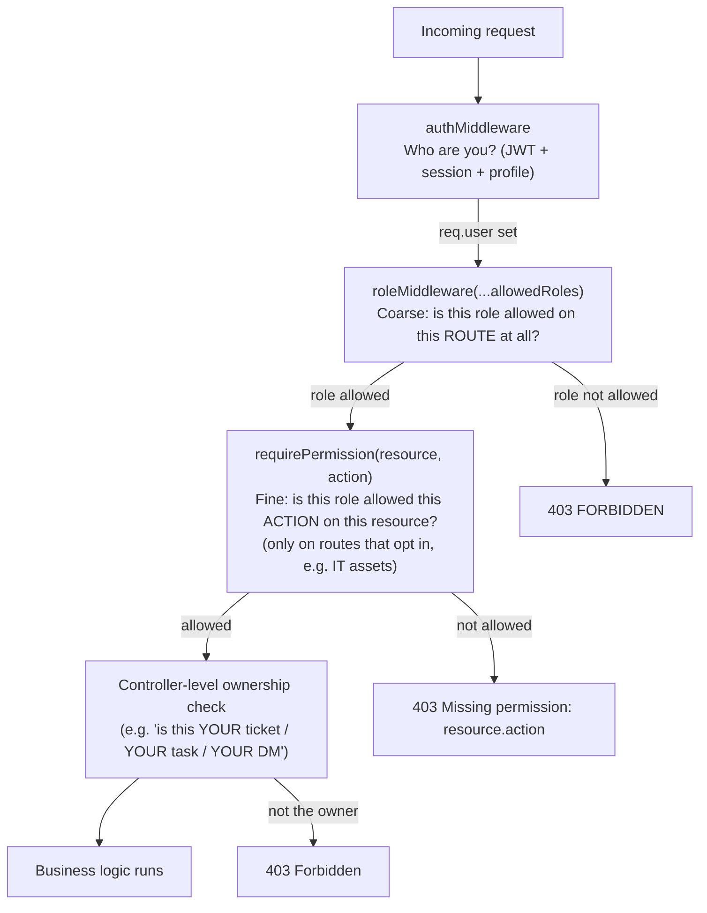

# 08 — Authorization

Authorization in this backend is **layered**, applied in this order on any given route: *who are you* (authentication) → *coarse role gate* → *fine-grained action gate (where used)* → *controller-level ownership check (where applicable)*.



There is **no formal role-hierarchy data structure** in the code (no `roleRank` table, no "founder inherits hr+it" logic). Every route declares its own explicit allow-list of role strings. Document this as **flat, per-route role checks**, not a hierarchy — a role like `founder` or `superadmin` is granted broad access only because it is *listed* on most routes, not because the system understands it as "senior."

## Layer 1 — `roleMiddleware(...allowedRoles)`

`main/backend/middleware/roleMiddleware.js`:
```js
function roleMiddleware(...allowedRoles) {
  return (req, res, next) => {
    if (!req.user || !allowedRoles.includes(req.user.role)) return fail(res, {status: 403, ...});
    next();
  };
}
```
A simple allow-list check against `req.user.role` (set by `authMiddleware`). Examples pulled directly from the route files:

| Route | Allowed roles |
|---|---|
| `GET /api/hr/complaints` (`hrRoutes.js`) | `hr`, `founder` |
| `GET /api/it/complaints` (`itRoutes.js`) | `it`, `founder` |
| `PATCH /api/approvals/:id/decide` (`approvalRoutes.js`) | `hr`, `founder` (further narrowed inside the controller — see below) |
| `GET /api/founder/users` (`founderRoutes.js`) | `superadmin` only |
| `router.get('/sla-policies', auth, ...)` (`founderRoutes.js`) | any authenticated role (no `role()` call at all) |
| `POST /api/sales-desk/leads` (`salesDeskRoutes.js`) | `sales`, `founder` |
| `GET /api/founder/security/*` (`securityRoutes.js`) | `superadmin` only, every route |

Some routes call `auth` only, with no `role()` — meaning "any authenticated user," e.g. `GET /api/founder/departments`, `GET /api/founder/system-settings`, `GET /api/founder/role-permissions` (comment: "every logged-in user reads this to gate their own nav").

## Layer 2 — `requirePermission(resource, action)` (granular, opt-in)

`main/backend/middleware/permissionMiddleware.js` — layered **after** `roleMiddleware` on the routes that use it. It reads a single settings document, `settings/action_permissions`, shaped `{ [role]: { [resource]: [action, ...] } }`, cached for 30 seconds:

```js
function requirePermission(resource, action) {
  return async (req, res, next) => {
    if (!req.user) return 401;
    if (req.user.role === 'superadmin') return next(); // superadmin always passes
    const matrix = await getActionPermissionsMatrix();
    const allowedActions = matrix[req.user.role]?.[resource];
    if (!allowedActions || allowedActions.includes(action)) return next(); // default-allow if unconfigured
    return 403 `Missing permission: ${resource}.${action}`;
  };
}
```

**Default-allow when unconfigured** is deliberate: *"Unconfigured role/resource combos default to allowed... so shipping this doesn't retroactively lock anyone out until Super Admin explicitly restricts something via the Action Permissions panel."* This means `requirePermission` is a way for a Super Admin to *narrow* what a role can do beyond the base role check — not a whitelist that must be populated for things to work.

**Only concrete use in the codebase today:** `itRoutes.js` gates IT asset writes:
```js
router.post('/assets', auth, role('it', 'founder'), requirePermission('assets', 'create'), createAsset);
router.put('/assets/:id', auth, role('it', 'founder'), requirePermission('assets', 'edit'), updateAsset);
router.delete('/assets/:id', auth, role('it', 'founder'), requirePermission('assets', 'delete'), deleteAsset);
```
Comment: *"IT can be allowed to create/edit assets but denied delete"* — i.e. the coarse role check says "IT may touch the assets routes at all," and this layer lets a Super Admin further say "but not delete."

## Two separate permission documents, and why

`controllers/permissionController.js` manages two distinct `settings` docs:

| Document | Shape | Read by | Written by | Purpose |
|---|---|---|---|---|
| `role_permissions` | `{ [role]: [pageId, ...] }` | Any logged-in user (`GET /api/founder/role-permissions`) | `superadmin` only | Page/nav-level visibility — which pages a role's UI shows at all. |
| `action_permissions` | `{ [role]: { [resource]: [action,...] } }` | Any logged-in user (`GET /api/founder/action-permissions`) | `superadmin` only | Action-level gating, enforced server-side via `requirePermission`. |

They are kept as **separate documents rather than one shared doc** deliberately: *"`updateRolePermissions` does a full `.set()` of that doc from the page-toggle UI — sharing one doc would let a page-visibility change silently wipe out the action matrix."* `GET /api/founder/permissions` (`permissionController.getPermissions`) exists purely to combine both reads into one round trip for the frontend's single poll tick.

## Layer 3 — Controller-level ownership checks

These are **not middleware** — they are `if` statements inside the specific controller function that needs them, because the "am I the owner" question depends on data only the controller has already fetched (the document itself). Every instance found in the codebase:

| Controller / function | Check | File |
|---|---|---|
| `complaintControllerFactory.deleteComplaint` | Only the ticket's own `user_id` may delete it — not staff, not founder | `controllers/complaintControllerFactory.js` |
| `complaintControllerFactory.reopenComplaint` | Owner-only, and only from `status === 'Completed'` | same |
| `complaintControllerFactory.updateFields` | Owner is restricted to `ownerEditableFields` (ticket content only: description/category/sub_category/priority); staff (matching `opts.staffRole`, `founder`, `superadmin`) get the full `editableFields` set (can also set `employeeStatus`/`solver`/`remarks`/etc.) | same — prevents a submitter from self-resolving or reassigning their own ticket |
| `approvalController.decideApproval` | Category `'document'`/`'extra-hours'` (`HR_DECIDABLE_CATEGORIES`) may be decided by `hr` in addition to `founder`; every other category is founder-only, checked *inside* the transaction after the category is read from the document | `controllers/approvalController.js` |
| `leaveController.decide` | `Admin/Ops` and `IT` department leave routes to founder only, even though the route itself allows `hr` | `controllers/leaveController.js`, `isFounderApproval()` |
| `taskProjectController.updateTaskStatus` | Only the task's own `assignee` (matched by full name) or a `coordinator`/`founder` may change status — prevents an arbitrary employee from toggling another employee's task from a task id they merely saw in a list | `controllers/taskProjectController.js` |
| `taskProjectController.getTasks` | An `employee` role is scoped to `tasks.where('assignee','==',req.user.full_name)`; `coordinator`/`founder` see the whole board | same |
| `chatController.canAccessChannel` | A `dm-<uidA>-<uidB>` channel is only readable/writable by its two encoded participants; fixed/`project-<id>` channels are open to any authenticated user | `controllers/chatController.js` |
| `hrDeskController` attendance/leave/extra-hours self-service (`myTodayAttendance`, `myAttendanceHistory`, `checkIn`, `checkOut`, `myLeaveSummary`, `myPerformance`, `myExtraHours`, `submitExtraHours`) | Always resolves via `req.user.employeeId` from the JWT, **never** a client-supplied id — one employee's session can only ever touch their own record | `controllers/hrDeskController.js` |
| `superAdminUserController.updateUser` / `setUserActive` / `deleteUser` | Explicitly blocks `uid === req.user.id` — Super Admin cannot edit/deactivate/delete their own account through this panel (prevents accidental self-lockout) | `controllers/superAdminUserController.js` |
| `hrRoutes.js` / `itRoutes.js` route wiring | "HR staff, founders, or the submitter employee can update ticket fields" / "Only the submitter employee can delete/reopen their own ticket" — the route itself has no `role()` call for these, delegating entirely to the ownership check above | `routes/hrRoutes.js`, `routes/itRoutes.js` |

## Summary table — which layer does what

| Question | Answered by |
|---|---|
| "Is this a valid, non-expired, non-revoked session?" | `authMiddleware` |
| "May this role even call this route family?" | `roleMiddleware(...roles)` |
| "May this role perform this specific action on this resource, per the Super-Admin-configured matrix?" | `requirePermission(resource, action)` (only on routes that opt in — currently just IT assets) |
| "Does this specific document belong to / was created by / is assigned to this specific user?" | An `if` check inside the controller, after the document is fetched |

Roles observed in the codebase: `employee`, `hr`, `it`, `sales`, `coordinator`, `founder`, `superadmin`. `ASSIGNABLE_ROLES` (self-service account creation via Super Admin, `superAdminUserController.js`) excludes `founder`/`superadmin` deliberately ("no self-service way to mint either from this screen"); `EDITABLE_ROLES` (promoting an *existing* user) additionally allows moving someone into `founder`, since "superadmin outranks founder" is treated as a legitimate admin action, but minting a second `superadmin` is still not exposed anywhere in the API.
