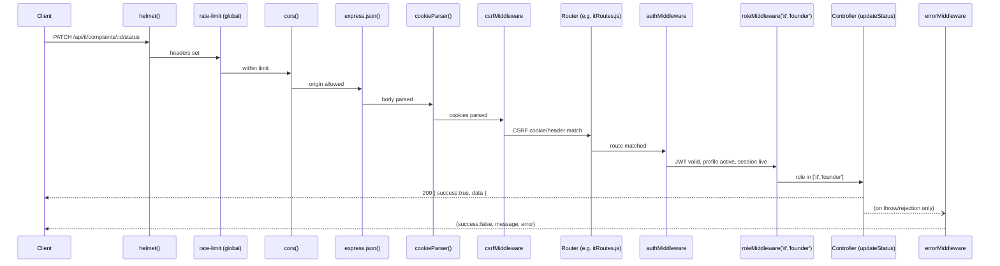

# 09 — Middleware

This app uses two categories of middleware: **global** (applied to every request in `server.js`, in a fixed order) and **per-route** (applied selectively inside `routes/*.js`).

## Global middleware (registered in `server.js`, in this order)

### 1. `helmet()`
- **Package:** `helmet` (npm).
- **Purpose:** Sets a battery of security-related HTTP response headers (e.g. `X-Content-Type-Options`, `X-Frame-Options`-equivalent CSP directives, etc.) with its secure defaults.
- **Runs on:** every request, first in the chain.
- **Routes:** all.

### 2. Global `express-rate-limit`
- **Defined in:** `server.js`.
- **Config:** `windowMs: 15 * 60 * 1000` (15 min), `limit: 300`, standard headers on, legacy headers off.
- **Purpose:** baseline throttle so any endpoint without its own stricter limiter still can't be hammered unbounded. Comment in `server.js` notes this sits *underneath* the stricter `authLimiter` (`routes/authRoutes.js`) and `expensiveReadLimiter` (`routes/founderRoutes.js`).
- **Depends on:** `app.set('trust proxy', 1)` (set just above it) — needed so Vercel's forwarding hop doesn't collapse every client onto one IP bucket.
- **Response on limit:** `{success:false, message:'Too many requests, please try again later', error:{code:'RATE_LIMITED'}}`.

### 3. `cors(...)`
- **Purpose:** restricts cross-origin API access to known frontend origins (`process.env.FRONTEND_URL`, the hardcoded `https://project-ticket-plum.vercel.app`, and any `http://localhost:<port>`), and enables `credentials: true` so the httpOnly session cookie can be sent/received cross-origin.
- **Key logic:** `origin(origin, callback)` allows no-`Origin`-header requests (curl, server-to-server) and same-origin, else checks the allowlist; anything else calls back with `new Error('Not allowed by CORS')`, which `errorMiddleware.js` turns into a 403.
- **`maxAge: 600`:** caches the browser's CORS preflight (`OPTIONS`) response for 600 seconds, so polling endpoints don't double their request count.
- **Runs on:** every request, including preflight `OPTIONS`.

### 4. `express.json()`
- **Purpose:** parses JSON request bodies into `req.body`. Multipart bodies (file uploads) bypass this — `multer` (via `utils/upload.js`) handles those on the specific routes that need them.

### 5. `cookieParser()`
- **Package:** `cookie-parser`.
- **Purpose:** parses the `Cookie` header into `req.cookies`, which `authMiddleware.js` and `csrfMiddleware.js` both read.

### 6. `csrfMiddleware` (`middleware/csrfMiddleware.js`)
- **Purpose:** Double-submit-cookie CSRF protection. Since the session now lives in a `SameSite=None` cross-origin cookie (required because frontend/backend are separate origins), it's sent on cross-site requests too — exactly what `SameSite` normally blocks. This middleware closes that gap.
- **Logic:**
  ```js
  const SAFE_METHODS = new Set(['GET', 'HEAD', 'OPTIONS']);
  const EXEMPT_PATHS = new Set(['/api/auth/login', '/api/auth/register', '/api/auth/refresh']);
  function csrfMiddleware(req, res, next) {
    if (SAFE_METHODS.has(req.method) || EXEMPT_PATHS.has(req.path)) return next();
    const cookieToken = req.cookies?.[CSRF_COOKIE];
    const headerToken = req.headers['x-csrf-token'] || req.body?._csrf;
    if (!cookieToken || !headerToken || cookieToken !== headerToken) {
      return fail(res, { status: 403, message: 'CSRF token missing or invalid', code: 'CSRF_INVALID' });
    }
    next();
  }
  ```
- **What it checks:** the non-httpOnly `fute_csrf` cookie (readable by frontend JS) must match a value the frontend echoes back, either as the `X-CSRF-Token` header (primary) or `_csrf` in the JSON body (fallback, for browser extensions that strip non-standard headers cross-site).
- **Exemptions and why:** `login`/`register` happen before any session exists (nothing to compare against, and a forged cross-site call can't read the response anyway due to CORS); `refresh` is exempt because its actual credential is the refresh cookie itself (unforgeable, unreadable cross-site), not attacker-controlled input.
- **Runs on:** every mutating request (`POST`/`PATCH`/`PUT`/`DELETE`) globally, before routing.

## Per-route middleware

### `authMiddleware` (`middleware/authMiddleware.js`)
- **Purpose:** the core "who is making this request" check. Applied as `auth` on nearly every protected route.
- **Logic (in order):**
  1. Reads the token from the `fute_token` httpOnly cookie, or falls back to an `Authorization: Bearer <token>` header (for non-browser clients).
  2. `verifyAccessToken(token)` (`utils/jwt.js`) — a missing/invalid/expired token returns 401 `INVALID_TOKEN` (the frontend's `api.js` interceptor is expected to silently call `/api/auth/refresh` on this and retry).
  3. Looks up the live user profile via `getProfile(decoded.id)`, which checks a 60-second in-process `Map` cache (`profileCache`) before reading `db.collection('users').doc(uid).get()` — this cache exists specifically because uncached per-request reads once exhausted the (then-)Firestore read quota within minutes.
  4. Rejects if the profile no longer exists (401 `ACCOUNT_NOT_FOUND`) or is deactivated (403 `ACCOUNT_DEACTIVATED`).
  5. Checks `isSessionRevoked(decoded.sid)` (`utils/sessions.js`, its own 30-second cache) — 401 `SESSION_REVOKED` if the session was force-logged-out.
  6. Sets `req.user = { id, email, role, full_name, sid, employeeId }` and calls `next()`.
- **Modifies:** `req.user`.
- **Used by:** essentially every route except `POST /api/auth/register`, `POST /api/auth/login`, `POST /api/auth/refresh`.

### `roleMiddleware` (`middleware/roleMiddleware.js`)
- **Purpose:** coarse allow-list check on `req.user.role`.
- **Logic:** `roleMiddleware(...allowedRoles)` returns a middleware that 403s (`FORBIDDEN`) unless `req.user` exists and its role is in the allowed list.
- **Must run after** `authMiddleware` (it reads `req.user`, which only `authMiddleware` sets).
- **Used by:** almost every route file, e.g. `role('hr','founder')` in `routes/hrRoutes.js`, `role('superadmin')` throughout `routes/founderRoutes.js` and `routes/securityRoutes.js`.

### `requirePermission(resource, action)` (`middleware/permissionMiddleware.js`)
- **Purpose:** fine-grained, Super-Admin-configurable gate layered *after* `roleMiddleware` — a role can be allowed to touch a route family in general but denied a specific action on a specific resource.
- **Logic:**
  ```js
  function requirePermission(resource, action) {
    return async (req, res, next) => {
      if (!req.user) return fail(res, {status:401, ...});
      if (req.user.role === 'superadmin') return next();
      const matrix = await getActionPermissionsMatrix(); // 30s cache, from settings/action_permissions
      const allowedActions = matrix[req.user.role]?.[resource];
      if (!allowedActions || allowedActions.includes(action)) return next(); // unconfigured = default-allow
      return fail(res, {status:403, message:`Missing permission: ${resource}.${action}`, code:'FORBIDDEN'});
    };
  }
  ```
  - `superadmin` always bypasses.
  - An unconfigured role/resource pair **defaults to allowed**, matching the frontend's `PermissionsContext.canAccess` default — so shipping this feature never retroactively locked anyone out.
  - Backed by a 30-second cache (`cached`), cleared immediately by `clearActionPermissionsCache()` whenever `permissionController.js`'s `updateActionPermissions` writes a change.
- **Used by:** currently only `routes/itRoutes.js`'s asset routes — `requirePermission('assets','create'|'edit'|'delete')`.

### `errorMiddleware` (`middleware/errorMiddleware.js`)
- **Purpose:** the last `app.use(...)` in `server.js`; Express recognizes it as error-handling middleware by its 4-argument signature `(err, req, res, next)`.
- **Logic:**
  ```js
  function errorMiddleware(err, req, res, next) {
    console.error(err);
    if (res.headersSent) return next(err);
    const status = err.status || (err.message === 'Not allowed by CORS' ? 403 : 500);
    const message = err.status ? err.message : (status === 403 ? err.message : 'Internal server error');
    const code = err.code || (status === 403 && err.message === 'Not allowed by CORS' ? 'CORS_NOT_ALLOWED' : `HTTP_${status}`);
    fail(res, { status, message, code });
  }
  ```
  - Any controller that throws `Object.assign(new Error(msg), {status, code})` gets that exact message/status/code sent to the client.
  - Anything else (an unexpected `TypeError`, a raw MongoDB driver error) is logged server-side in full but only reported to the client as a generic `Internal server error` (500) — this stops internal details leaking through error messages.
- **Depends on `express-async-errors`:** required at the very top of `server.js`, *before* any route is required. This patches Express 4's router so a rejected promise inside any `async` route handler is forwarded here automatically — no controller needs its own `try/catch` just to avoid a hung request.

### The final 404 handler (`server.js`, not a separate file)
```js
app.use((req, res) => fail(res, { status: 404, message: 'Not found', code: 'NOT_FOUND' }));
```
Registered after all routers but before `errorMiddleware` — catches any URL that matched no route, so unmapped paths get the same JSON envelope as every other response instead of Express's default HTML 404 page.

### Route-specific rate limiters (not global, but middleware nonetheless)
- **`authLimiter`** (`routes/authRoutes.js`) — `windowMs: 15min, limit: 10` — applied to `/register`, `/login`, `/refresh`, `/verify-password`. Purpose: per-IP throttle on top of the per-account lockout (`authController.js`'s `LOCK_THRESHOLD`), so an attacker can't spread password guesses across many accounts from one IP, or brute-force `/verify-password` using a stolen JWT.
- **`expensiveReadLimiter`** (`routes/founderRoutes.js`) — `windowMs: 60s, limit: 20` — applied to `/analytics`, `/analytics/export`, `/dashboard-overview`, `/sla-compliance`. Purpose: backstops the underlying multi-collection scans those endpoints run, since a caller varying query params bypasses the endpoints' own in-memory response caches.

## Middleware order for a typical mutating request


