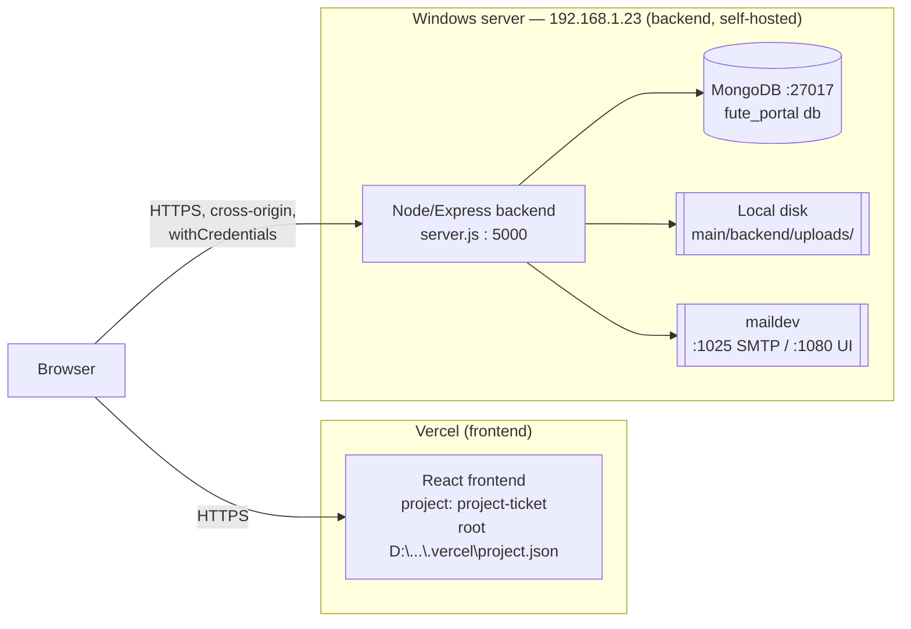
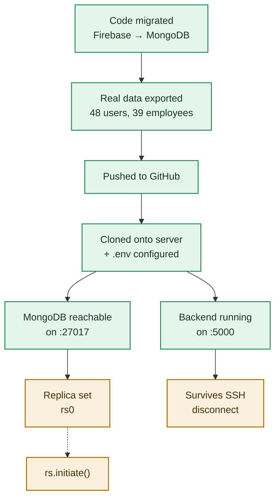

# 20 — Deployment

Fute Portal's frontend and backend are deployed as two separate, independently-hosted systems on two different origins. This is not a design choice made for this doc — it's the actual reason the CSRF/CORS/cross-origin-cookie design exists (see [07-authentication.md](./07-authentication.md)).

## Topology

- **Frontend**: hosted on Vercel. The repo root `.vercel/project.json` shows `projectName: "project-ticket"`. Built with Vite (`import.meta.env.VITE_API_BASE_URL`, see `main/frontend/src/utils/api.js`).
- **Backend**: **self-hosted** on a Windows machine at `192.168.1.23`, running the Node/Express app directly (`node server.js`, port from `PORT` env var, default 5000). This is per `docs/BACKEND_ARCHITECTURE_STATUS.md` and `docs/DEPLOYMENT_PIPELINE_STATUS.md`, both dated 2026-09-03/05 and treated here as ground truth over anything inferred from code alone.
- **Database**: MongoDB running locally on the same 192.168.1.23 host, port 27017, database name `fute_portal`.
- **Mail**: `maildev` (a self-hosted SMTP capture server, see `main/backend/package.json` dependency and `utils/mailer.js`) — not a real outbound mail relay.

### Stale artifact: `main/backend/.vercel/project.json`

The backend folder still contains a `.vercel/project.json` (`projectId: prj_QL4UoG24X6nBqONXu7I0NCiKhGZA`, `projectName: "backend"`). This is a leftover from an earlier phase when the backend itself was deployed to Vercel (before the self-hosted MongoDB migration documented in `BACKEND_ARCHITECTURE_STATUS.md`). It is not evidence the backend is still deployed there today — the two status docs are explicit that the backend now runs on 192.168.1.23.

**Worth verifying (inferred, not confirmed by re-running the code):** `server.js` has `if (!process.env.VERCEL) { app.listen(...) }` and `utils/cookies.js` has `const isDeployed = Boolean(process.env.VERCEL);` which switches cookies between `SameSite=Lax/non-Secure` (local dev) and `SameSite=None/Secure` (deployed). Both of these checks were written assuming a Vercel-hosted backend. On the current self-hosted 192.168.1.23 deployment, `process.env.VERCEL` is presumably never set, so:
- `isDeployed` would be `false`, meaning cookies would be issued as `SameSite=Lax`, non-`Secure`.
- Since the frontend (Vercel, HTTPS) and backend (192.168.1.23, likely plain HTTP per the live spot-check `GET http://192.168.1.23:5000/...`) are cross-origin, a `SameSite=Lax` cookie would **not** be sent on the frontend's cross-origin requests to the backend, which would break login entirely.

This is flagged here as a real risk to double-check against the live deployment, not asserted as a confirmed bug — the actual production `.env` may set some other flag, or the live behavior may already be broken and simply not surfaced in the status docs (which check `/api/auth/me` returning a 401, which is exactly what an unauthenticated OR a cookie-not-sent request would also return). See [27-troubleshooting.md](./27-troubleshooting.md) for the symptom this would produce.

## Deployment pipeline (as verified 2026-09-05)

Reproduced from `docs/DEPLOYMENT_PIPELINE_STATUS.md`, which is the authoritative, independently-verified source (checked via direct `curl` to the live ports, not taken on a report):

| Stage | Status (2026-09-05) | Note |
|---|---|---|
| Code migrated off Firebase | ✅ Done | 30 backend files touched; Firestore-shaped shim (`config/db.js`) over MongoDB; bcrypt auth; local file storage. |
| Real data exported | ✅ Done | All 27 Firestore collections copied into MongoDB. |
| Pushed to GitHub, cloned to server | ✅ Done | `C:\fute-portal-backend` on the server, `.env` configured with the Mongo URL and secrets. |
| MongoDB reachable on :27017 | ✅ up as of last check | Was fully down on 2026-09-04; flaky on 2026-09-05 (one probe answered normally, one connection-reset with the port still open). |
| Replica set (`rs0`) | 🟡 **not independently confirmed** | No direct `mongosh`/driver check was performed; only inferred from the app working end-to-end. This matters because [06-database.md](./06-database.md)'s multi-document transactions (`db.runTransaction`, `db.batch().commit()` in `config/db.js`) require a replica set — MongoDB refuses transactions on a standalone instance. |
| Backend reachable on :5000 | ✅ up as of last check | `GET /api/auth/me` returned a genuine `401 {"success":false,"message":"No token provided",...}` with real Helmet/rate-limit headers — confirmed to be this codebase, not a stale process. Was fully down on 2026-09-04. |
| Survives SSH disconnect / crash | 🟡 **unverified, previously failed silently** | The service previously ran "for a few hours, then stopped" with no alert — traced to Windows OpenSSH killing a PM2 daemon started under an interactive SSH session once that session closed. Fix (per `BACKEND_ARCHITECTURE_STATUS.md`) is installing the process under **NSSM** as a real Windows Service instead of a bare PM2 process — pending admin action as of the last update. |

**No CI/CD pipeline automation was found in the explored codebase.** No GitHub Actions workflow files, no other CI config, were encountered while reading `main/backend`. Deployment to the server is manual (`git pull` / re-clone + restart), per the pipeline above. This is stated as "not found," not "does not exist" — a workflow could exist outside the folders explored for this documentation pass.

## Environment variables required in production

See [13-environment-variables.md](./13-environment-variables.md) for the full list read directly from source. Values below are what `BACKEND_ARCHITECTURE_STATUS.md` states for the current server (redacted where secret):

| Variable | Production value (per status doc) |
|---|---|
| `MONGODB_URL` | `mongodb://192.168.1.23:27017` |
| `MONGODB_DB_NAME` | `fute_portal` |
| `JWT_SECRET` | `<SECRET>` (a 96-byte random value, generated at deploy time) |
| `SMTP_HOST` / `SMTP_PORT` | `localhost` / `1025` — local `maildev` capture, no real outbound mail |
| `PORT` | `5000` |
| `FRONTEND_URL` | `http://192.168.1.23` per the status doc's own environment table — **this appears to point at the backend server's own address, not the Vercel frontend URL**; this is reproduced as written in the source doc and flagged as worth double-checking, since `server.js`'s CORS allow-list uses `FRONTEND_URL` to decide which origins may call the API, and the actual frontend is Vercel-hosted, not served from 192.168.1.23. Not resolved further here — see [27-troubleshooting.md](./27-troubleshooting.md). |

## Known gaps as of the last status check (2026-09-05)

1. **Multi-document transactions** (`db.runTransaction`, ticket status → approval record writes, approval decisions) depend on a replica set that has not been independently confirmed running.
2. **Process persistence** across SSH disconnects/crashes is unverified — the fix (NSSM Windows Service) was identified but not confirmed applied at last check.
3. **MongoDB port flakiness** — one live probe to `:27017` succeeded, a subsequent one reset the connection with the port still reported open. Not a hard crash, but worth continued monitoring.
4. **CORS/cookie SameSite behavior** relies on `process.env.VERCEL`, a flag from an earlier Vercel-hosted-backend architecture (see the stale-artifact note above) — worth verifying it still produces `Secure`/`SameSite=None` cookies against the actual self-hosted deployment.
5. No CI/CD found — deploys are manual per the pipeline diagram above.

Not determinable from the current codebase: the exact process manager command line in production (NSSM service name/config), the real TLS/HTTPS termination setup for the backend (the frontend is HTTPS via Vercel; whether 192.168.1.23:5000 is plain HTTP or fronted by a reverse proxy with TLS is not shown in any file read for this documentation pass), and whether `rs.initiate()` has since been run.
