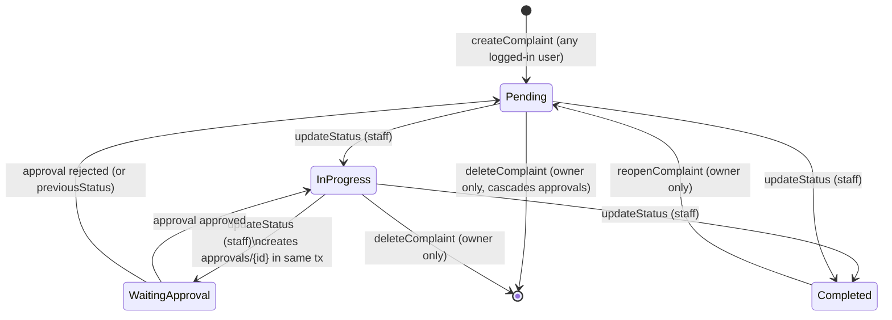
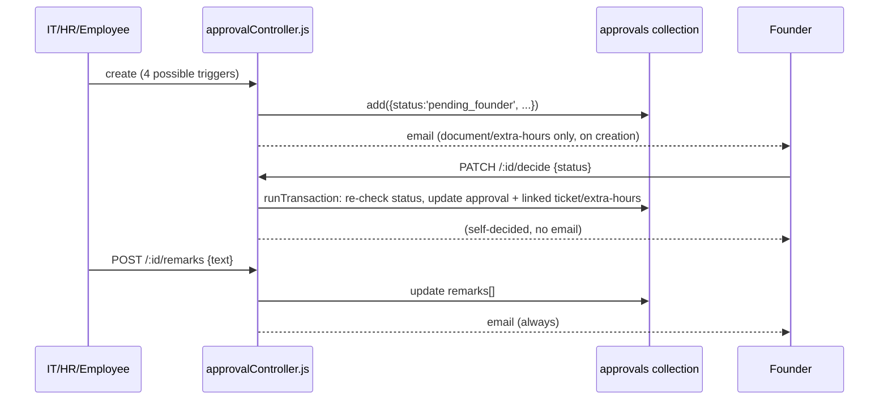
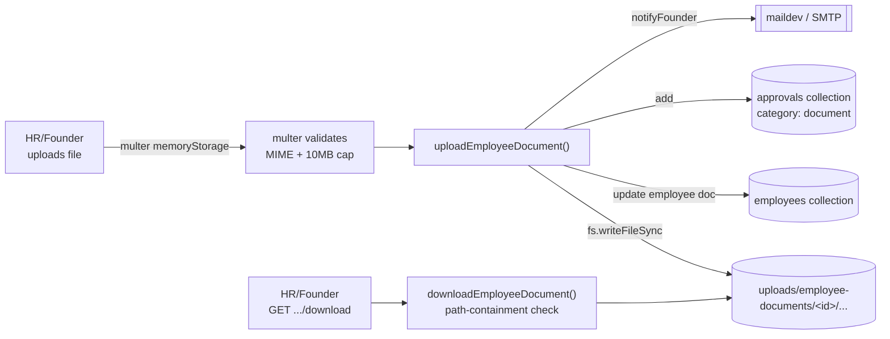
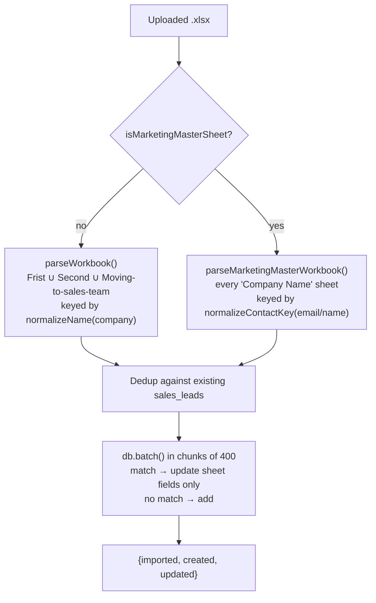
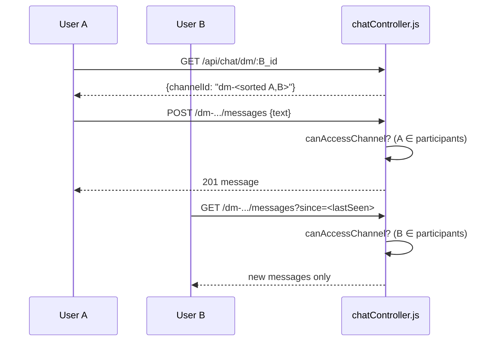

# 22 — Feature Flows

Step-by-step walkthroughs of the major features, tracing real functions in call order. See `05-request-response-flow.md` for a lower-level (middleware-by-middleware) trace of a few of these same endpoints, `07-authentication.md` for the full auth mechanism, and `11-business-logic.md` for *why* each rule below exists.

---

## 1. Ticket creation & resolution (HR / IT complaint lifecycle)

Both queues share one implementation — `controllers/complaintControllerFactory.js`'s `createComplaintController(opts)` — instantiated separately by `controllers/hrController.js` (`collectionName: 'hr_complaints'`) and `controllers/itController.js` (`collectionName: 'it_complaints'`, plus IT-only fields like `vpnNo`).

**Create** — `POST /api/hr/complaints` or `POST /api/it/complaints`
1. `authMiddleware` resolves `req.user` from the JWT cookie (any logged-in role may submit).
2. `createComplaint()` validates required fields, generates a token (`FT-HR-XXXXXX` / `FT-IT-XXXXXX`), looks up the submitter's `users` profile to resolve `employeeId`/role, and builds the ticket doc (`status: 'Pending'`, `solver: 'Team 1'`/`'Unassigned'`).
3. `collection.add(docData)` writes to Mongo via the `config/db.js` shim.
4. `loadNotificationRules()` (`utils/notificationRules.js`) is checked; if the queue's `*_new_complaint` rule is enabled, `sendMail()` notifies HR_EMAIL/IT_EMAIL (or a configured override).
5. Responds `201` with the created ticket + token.

**Status change** — `PATCH /.../complaints/:id/status` (staff/founder only)
1. `updateStatus()` validates the new status is one of `Pending | In Progress | Waiting Approval | Completed`.
2. Runs `db.runTransaction(...)`: reads the ticket, writes the new status, and — only on a genuine transition *into* `Waiting Approval` — also creates a linked `approvals` doc (see `11-business-logic.md` §2).
3. On success, if the queue's `*_status_update` notification rule is enabled, emails the original submitter.

**Field edit** — `PATCH /.../complaints/:id/fields` — either staff (full `editableFields`) or the ticket's own owner (`ownerEditableFields` only — content fields, not resolution fields). See `11-business-logic.md` §3.

**Delete** — `DELETE /.../complaints/:id` — owner-only; cascades to any linked `approvals` doc in one `db.batch()`.

**Reopen** — `PATCH /.../complaints/:id/reopen` — owner-only, only from `Completed` → back to `Pending`.

---

## 2. Approvals

Approvals (`controllers/approvalController.js`, collection `approvals`) are created four different ways and always decided/remarked through the same two endpoints.

**Creation paths:**
| Trigger | Function | category |
|---|---|---|
| Ticket → "Waiting Approval" | `complaintControllerFactory.updateStatus()` | ticket's own category / `'HR'` |
| Direct IT/HR request | `approvalController.createApproval()` (`POST /api/approvals`) | caller-supplied, default `'General'` |
| Employee document upload | `hrDeskController.uploadEmployeeDocument()` | `'document'` |
| Extra hours submission | `hrDeskController.submitExtraHours()` | `'extra-hours'` |

**Decide** — `PATCH /api/approvals/:id/decide` — `{ status: 'approved' | 'rejected' }`
1. Route-level `role('hr','founder')` — any founder, or an HR user if the approval's category is HR-decidable.
2. `decideApproval()` runs a transaction: reads the approval, rejects with `409` if already decided, enforces the category-based authority check (`HR_DECIDABLE_CATEGORIES`), then writes the decision and (if linked) updates the ticket's status or the extra-hours doc's status in the same transaction.
3. If HR (not founder) decided it, `notifyFounder()` emails every `founder` user.

**Remark** — `POST /api/approvals/:id/remarks` — appends `{ text, by, at }` to the approval's `remarks` array and always emails the founder, regardless of who added it.

---

## 3. HR Desk — employee documents

`controllers/hrDeskController.js`, `POST /api/hr-desk/employees/:id/documents/:docType`, HR/founder only.

1. `routes/hrDeskRoutes.js` applies `upload.single('file')` (`utils/upload.js` — multer memoryStorage, PDF/JPG/Word only, 10MB cap) before the controller runs.
2. `uploadEmployeeDocument()` looks up `docType` in the fixed `DOCUMENT_TYPES` map (10 named types + 3 free "Other" slots), 404s if the employee doesn't exist.
3. The filename is sanitized (`replace(/[^\w.\-]/g, '_')`), the file is written to `uploads/employee-documents/{employeeId}/{docType}-{timestamp}-{safeName}` via `fs.writeFileSync`.
4. The employee doc is updated with the download URL, original filename, and the real on-disk path under `storagePaths.{docType}` (kept separate from the public-facing URL field — see `16-file-storage.md`).
5. An `approvals` doc (`category: 'document'`) is created for sign-off, and the founder is emailed.
6. Response returns only the two client-facing fields (URL + filename) plus the new `approvalId` — never the raw `storagePaths` value.

**Download** — `GET /.../documents/:docType/download` (HR/founder only): looks up `storagePaths.{docType}` from the employee doc, verifies the resolved absolute path still starts with `UPLOAD_ROOT` (defense in depth against path traversal), then `res.download(...)`.

---

## 4. Sales Desk — lead import

`controllers/salesDeskController.js`, `POST /api/sales-desk/leads/import`, sales/founder only, `uploadSpreadsheet.single('file')` (.xlsx, 15MB cap).

1. `ExcelJS.Workbook().xlsx.load(req.file.buffer)` parses the uploaded workbook in memory.
2. `isMarketingMasterSheet()` detects the format by header shape (`Company Name` header present anywhere).
3. Format-specific parse: `parseWorkbook()` (Bangalore-list, per-company union of `Frist`/`Second`/`Moving to sales team`) or `parseMarketingMasterWorkbook()` (per-contact, scans every worksheet with a `Company Name` header).
4. The full existing `sales_leads` collection is read once (bounded at `SALES_LEADS_READ_LIMIT = 3000`) and indexed by the same dedup key the parser uses (`normalizeName` or `normalizeContactKey`).
5. Parsed leads are chunked into batches of 400 and written via `db.batch()` — an existing-key match becomes an `update` (sheet-sourced fields only, preserving `dealValue`/`callLog`); no match becomes a new `add`.
6. Responds with `{ imported, created, updated }` counts.

---

## 5. Team chat

`controllers/chatController.js`, collection `chat_messages`.

**Channel model** — three kinds of `channelId`, all authenticated users may access fixed/project channels; DMs are restricted:
- Fixed channels (`general`, `it-support`, ...) and `project-<id>` — open to any authenticated user (same posture as `GET /api/coordinator/projects`).
- DM channels — id is `dm-<uidA>-<uidB>` with the two uids **sorted**, so either participant opening the thread computes the same id. `resolveDmChannel()` (`GET /api/chat/dm/:otherUserId`) just computes this id — it never creates a document; the channel "exists" the moment a message is posted into it.

**Access control** — `canAccessChannel(channelId, userId)`: any non-DM channel passes; a DM channel only passes if `userId` is one of the two encoded participants.

**List** — `GET /api/chat/:channelId/messages?since=<ISO>`: no `since` → last 50 messages (`HISTORY_LIMIT`), newest-first fetched then reversed to oldest-first for display; with `since` → only newer messages, ascending (incremental poll fetch).

**Send** — `POST /api/chat/:channelId/messages` `{ text }`: sender identity always comes from `req.user` (JWT), never the request body.

**Directory** — `GET /api/chat/directory`: a minimal people list (id, name, role, department) for the DM picker, excluding the caller and inactive users.

---

## 6. Auth (register / login / refresh / logout) — concise flow

Full mechanism (cookies, CSRF, rotation, lockout) is in `07-authentication.md`. In short:

1. **Register** (`POST /api/auth/register`) — creates a `_auth_credentials` doc (bcrypt hash) + a `users` profile (`role` forced to `'employee'`), then immediately logs the new account in (issues cookies) exactly like `login()` does.
2. **Login** (`POST /api/auth/login`) — resolves account → checks lock → verifies password → creates a `sessions` doc → issues `fute_token` (15 min JWT), `fute_refresh` (7-day opaque token, hashed at rest), and `fute_csrf` cookies.
3. **Refresh** (`POST /api/auth/refresh`) — no `authMiddleware`; authenticates itself off the refresh cookie, rotates the session's stored token hash, re-issues all three cookies. Called transparently by the frontend's axios interceptor (`main/frontend/src/utils/api.js`) on any 401.
4. **Logout** (`POST /api/auth/logout`) — marks the session `revoked: true` server-side (not just clearing cookies), so a copied access token stops working within its cache TTL even if the browser cookies were somehow retained.
