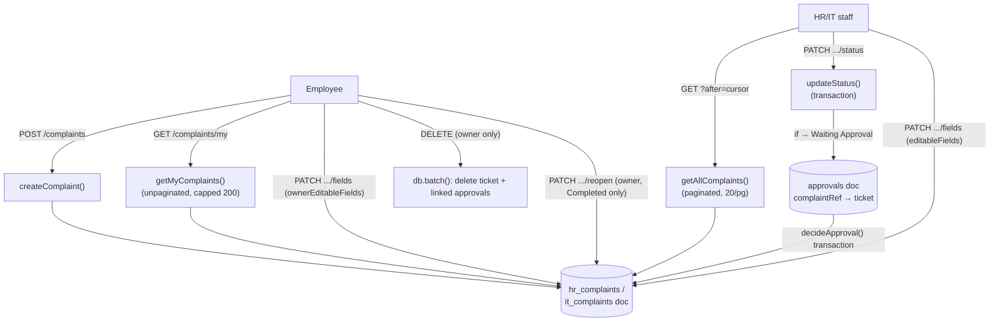
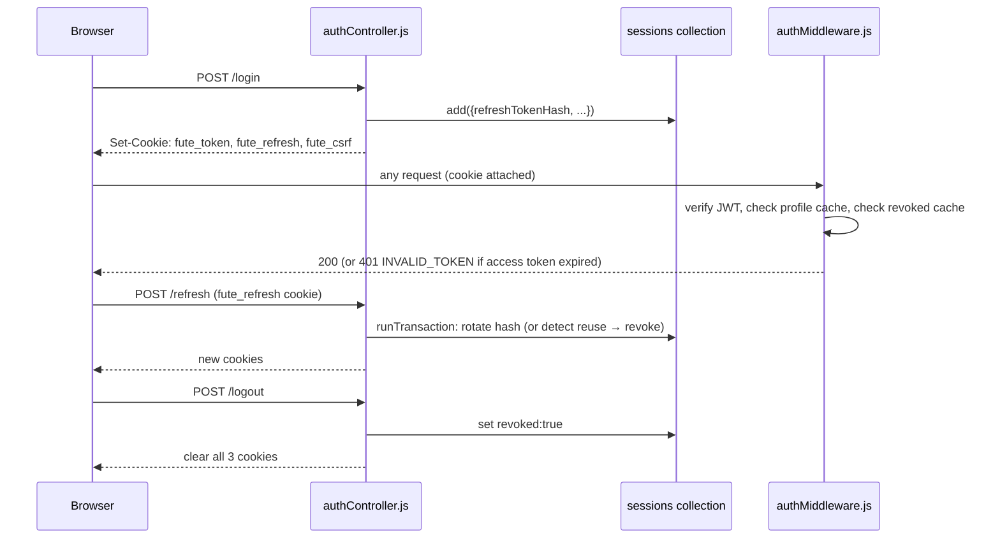
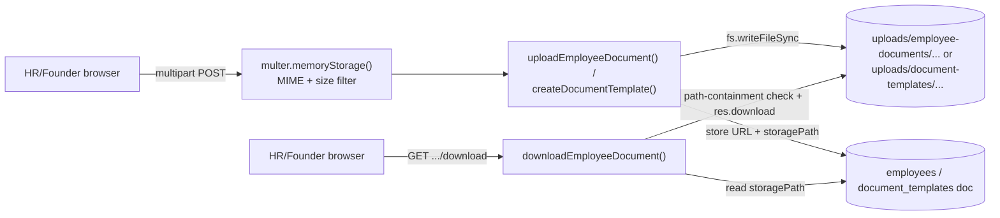

# 24 — Data Flow

How three representative kinds of data move through the system across create/read/update/delete. See `22-feature-flows.md` for the feature-level walkthroughs these are drawn from, and `06-database.md` for full collection schemas.

---

## 1. A ticket (`hr_complaints` / `it_complaints` document)

**Create** — any authenticated user, `POST /api/{hr,it}/complaints` → `complaintControllerFactory.createComplaint()` → `collection.add(docData)`. The doc is stamped with the creator's `user_id`, resolved `role`/`department`, a generated token, and `status: 'Pending'`.

**Read** —
- Staff (`hr|it`, `founder`) — `GET /.../complaints?after=<cursor>` → `getAllComplaints()` → `paginatedQuery()` (20/page, ordered by `submitted_at` desc, keyset cursor).
- Owner — `GET /.../complaints/my` → `getMyComplaints()` → `where('user_id','==',req.user.id)`, bounded at `UNPAGINATED_READ_LIMIT` (200), sorted in JS.
- Anyone logged in — `GET /.../complaints/search?token=...` → exact-match lookup.
- Founder — `GET /api/founder/complaints` (`superAdminUserController.getAllComplaints`) merges both `hr_complaints` and `it_complaints`, tagged `dept_tag`.

**Update** —
- Staff — `PATCH .../status` (transactional; may also create a linked `approvals` doc — see below) or `PATCH .../fields` (full `editableFields`).
- Owner — `PATCH .../fields` (restricted `ownerEditableFields`), `PATCH .../reopen` (Completed → Pending only).

**Delete** — owner only, `DELETE .../complaints/:id` — cascades to any linked `approvals` doc in the same `db.batch()`.

**Link to `approvals`** — when a ticket transitions to `Waiting Approval`, `approvals/{id}` is created with `complaintRef: { collection, id }` pointing back at the ticket. `approvalController.decideApproval()` reads that pointer to also update the ticket's status when the approval is decided.

---

## 2. A user session

**Create (login/register)** — `authController.login()`/`register()`:
1. `createSession()` (`utils/sessions.js`) writes one `sessions` doc: `uid`, `ip`, `userAgent`, `remember`, `refreshTokenHash` (SHA-256 of a random 32-byte token — the raw token is never stored), `refreshExpiresAt`.
2. `issueSessionCookies()` signs a 15-minute JWT (`utils/jwt.js`) embedding the new session's id as `sid`, and sets it as the `fute_token` cookie (httpOnly).
3. The raw refresh token is set as the `fute_refresh` cookie (httpOnly, path-scoped to `/api/auth`).
4. A random CSRF token is set as the `fute_csrf` cookie (**not** httpOnly — the frontend must be able to read it) and also returned in the JSON body.

**Read (every authenticated request)** — `middleware/authMiddleware.js`:
1. Reads `fute_token` from cookies (or an `Authorization: Bearer` header as fallback).
2. `verifyAccessToken()` checks the JWT signature/expiry.
3. Looks up the user's live profile via a 60-second in-process cache (`getProfile()`) — catches a role change or deactivation within a minute without re-reading the DB on every request.
4. Checks `isSessionRevoked(decoded.sid)` via a separate 30-second cache (`utils/sessions.js`).
5. Populates `req.user`.

**Update (refresh)** — `authController.refresh()` → `consumeRefreshToken()`:
1. Hashes the presented raw refresh cookie value and looks for a `sessions` doc whose `refreshTokenHash` matches.
2. On match: rotates `refreshTokenHash` → new value, stashes the old hash as `previousRefreshTokenHash`, extends `refreshExpiresAt`. Runs in a transaction to prevent two concurrent refreshes racing.
3. On a match against `previousRefreshTokenHash` instead (reuse of an already-rotated token): revokes the whole session (`revoked: true, revokedReason: 'refresh_token_reuse'`).
4. Re-issues all three cookies as in login.

**Delete/revoke** —
- Self-service — `authController.logout()`: sets `revoked: true` on the caller's own session, clears all three cookies.
- Admin — `securityController.revokeSession()` (single session) or `forceLogoutUser()` (every active session for a uid, via `db.batch()`).
- Either path calls `clearRevokedCache(sessionId)` so the change is visible on the very next request rather than waiting out the 30-second cache.

---

## 3. An uploaded file (employee document / document template)

**Create** — `hrDeskController.uploadEmployeeDocument()` or `createDocumentTemplate()`:
1. `multer.memoryStorage()` (`utils/upload.js`) buffers the file in memory during the request — MIME-type filtered (PDF/JPG/Word), size-capped (10MB) — no disk write happens until the controller runs.
2. The controller sanitizes the original filename (`replace(/[^\w.\-]/g, '_')`) and builds a server-generated relative path under `UPLOAD_ROOT` (`main/backend/uploads/`).
3. `fs.mkdirSync(..., {recursive:true})` + `fs.writeFileSync()` persist the buffer to local disk.
4. The DB doc (`employees` or `document_templates`) stores **two** things: a public-facing download **URL** (an internal API route, e.g. `/api/hr-desk/employees/:id/documents/:docType/download`) and, separately, the real on-disk relative path (`storagePaths.{docType}` or `storagePath`) — the raw path is never sent to the client.

**Read (download)** — `downloadEmployeeDocument()` / `downloadDocumentTemplate()`:
1. Auth + role middleware (HR/founder only) gates the route.
2. The controller looks up the stored relative path from the DB doc — never accepts a path from the client.
3. Resolves it against `UPLOAD_ROOT` and verifies the result still starts with `UPLOAD_ROOT` (defense-in-depth path-traversal check, even though the path is always server-generated).
4. `res.download(absolutePath, originalFileName)` streams the file with the original filename restored for the download prompt.

**Update** — `updateDocumentTemplate()`: a new file is optional on edit (renaming/recategorizing a template doesn't require re-uploading); if a new file is provided, it's written to a fresh path and the doc's `storagePath`/`fileUrl` are updated — the old file on disk is not deleted (**Inferred** — no cleanup call present in the code).

**Delete** — `makeCrud(...).remove()` deletes the Firestore-shim doc but the underlying file on disk is left in place (**Inferred** — no `fs.unlink` call exists anywhere in `hrDeskController.js`; this is a real orphaned-file gap, see `16-file-storage.md` for treatment as a potential weakness).

