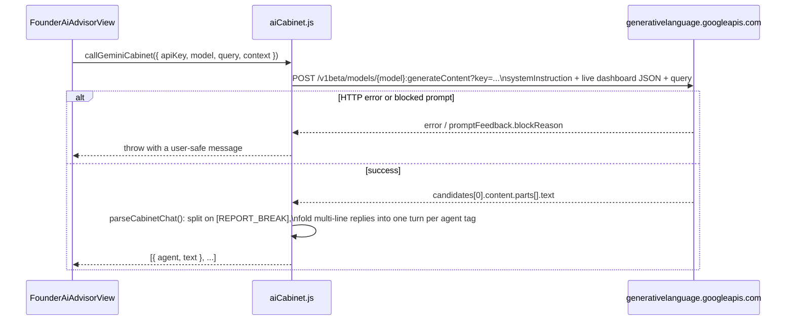
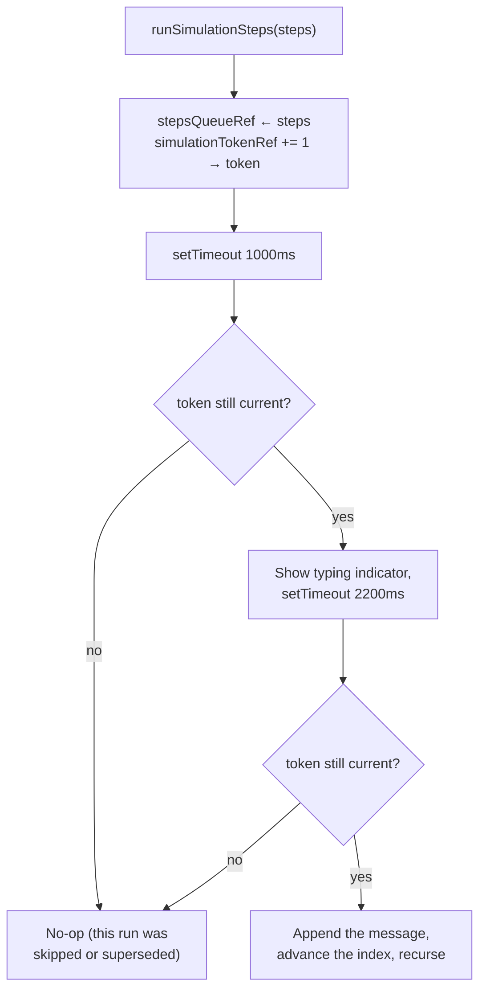

# AI_WORKFLOW.md
# Fute Services: AI Agent Command Room (Founder Dashboard)

> This describes the AI Cabinet feature, as built in `src/components/FounderAiAdvisorView.jsx` and `src/utils/aiCabinet.js`.

---

## 1. What It Is

This is a panel on the Founder's dashboard (found in the sidebar under "Fute AI+") where the Founder can either pick a ready-made question template or type a question of their own. They then watch five "personas" (simulated characters, each standing in for a department: HR, IT, Coordinator, an Employee representative, and the Founder's own chief-of-staff persona) discuss the company's live dashboard data together and arrive at a suggested plan of action.

## 2. The Two Modes

```mermaid
flowchart TD
    Q["Founder submits a question\n(template button or free text)"] --> M{"Cloud Gemini API\nconfigured?"}

    M -->|"key present"| CALL["callGeminiCabinet()\nreal Gemini request"]
    CALL -->|success| PARSE["Parse [agentId]: text\nturns from the response"]
    CALL -->|failure\n(bad key / network / empty response)| WARN["Toast explaining why"] --> LOCAL
    M -->|"no key, or Local Simulation selected"| LOCAL["Offline scripted dialogue\n(getSimulatedDialogue)"]

    PARSE --> ANIM["Typing animation, one turn at a time"]
    LOCAL --> ANIM
    ANIM --> REPORT["generateExecutiveReport()\n(always computed locally from\nlive React Context data)"]
```

Whether the AI is running in the cloud (a live call to Google's Gemini AI) or as a local simulation (no internet call, a scripted conversation instead), the two modes end up feeding the exact same downstream process: the typing animation, the "skip to the end" button, and the final report. This works because both modes end up producing the same simple list of `{ agent, text }` pairs (who's speaking and what they said) before that point. Nothing further down the pipeline knows or cares which mode actually produced the conversation.

## 3. The System Prompt (the instructions given to the AI before it starts)

`src/utils/aiCabinet.js` exports `CABINET_SYSTEM_PROMPT`, the set of instructions built around five personas:

| Persona | id | Domain |
|---|---|---|
| Payel (HR AI) | `hr` | Recruitment, attendance, leave |
| IT Desk AI | `it` | Tickets, hardware, data protection |
| Project Planner AI | `coordinator` | Timelines, task allocation |
| Employee Rep AI | `employee` | Ground-level morale and blockers |
| Ratish (Founder AI) | `founder` | Synthesizes and decides |

These instructions tell the AI model to: reference real numbers and names from the data it's given (formatted as JSON, a structured data format computers use to pass information around), let the personas respond to and sometimes disagree with each other instead of speaking one after another in isolation, work through the discussion from "what's the problem" to "what are the trade-offs" to "here's the decision," and reply in a natural mix of Hindi and English rather than sounding like a stiff corporate memo. The output has to follow a specific format: lines like `[agentId]: text`, somewhere between four and six of them, followed by a line that reads exactly `[REPORT_BREAK]`, and then a structured report in JSON.

## 4. Why Half of What the AI Produces Gets Thrown Away

The instructions still ask the AI for a structured report after `[REPORT_BREAK]`, but the app **only actually uses the conversation part**, not that report. Instead, `generateExecutiveReport()` builds the report itself, directly and predictably, from the same live dashboard data (tickets, leave requests, approvals, projects). Its suggested action items point to specific tabs in the app (`'approvals'`, `'projects'`, `'it'`, `'hr'`), which are wired to real navigation actions. Trusting the AI to generate that tab name itself would be risky: if it made up or garbled a value, clicking that action item could break navigation entirely. The genuine value the AI adds is the natural, question-specific conversation, and that's the only part the app actually uses.

## 5. Calling Gemini (Google's AI model)



- Each person supplies **their own API key** (a personal access code for Google's AI service): typed into the Settings drawer, and saved only in that browser's own local storage on that device. There is no server in between relaying this. The browser talks straight to Google.
- What gets sent to the AI is a trimmed-down snapshot (counts and a handful of named examples), not the full list of every employee or candidate, to keep the request small and avoid sharing more information than the conversation actually needs.
- The request is sent with a "temperature" setting of 0.8 (a setting that controls how varied or predictable an AI's replies are, on a scale that typically runs from 0 to 1). This is deliberate: the goal is for it to read like a live, natural discussion rather than a fixed script that says the same thing every time.

## 6. The Backup Plan When There's No Internet or No AI Key: Local Simulation

Four scripts, written by hand ahead of time (`audit`, `onboard`, `bottlenecks`, `infra`), fill in live numbers (open tickets, pending approvals, pending leave requests, the slowest-moving project) into an otherwise fixed conversation written in Hindi/English. If someone types a question that doesn't match any of the ready-made template buttons, the app tries to match it by keyword to whichever script fits closest (`detectLocalTemplateType`), rather than always falling back to the generic audit script no matter what was actually asked. That keyword-matching was added during development, because the earlier version was quietly ignoring what people actually typed.

## 7. The Typing Animation, and a Timing Bug It Used to Have



Before this fix, clicking "skip" (or starting a new question while a conversation was still mid-animation) only updated the app's internal state, it never actually stopped the delayed actions ("timers") already scheduled to run. Those old, stale timers would go off anyway a moment later, read outdated information, and could wrongly cut off whatever conversation was *currently* playing. Now, every time the animation starts, it's given its own unique tracking number ("token"). If a delayed action fires and its token no longer matches the current one, the app recognizes it's stale and ignores it. This bug was found and fixed through hands-on testing in the browser, not by reading the code. It reliably showed up by skipping a conversation and starting a new one within about a second of each other.

## 8. What Data Gets Sent to the AI as Context

`buildDashboardContext()` builds a deliberately small snapshot, not the full sample datasets:

```json
{
  "hr": { "employeeCount": 6, "pendingLeaves": [...], "activeCandidatesCount": 5 },
  "it": { "openTickets": [...], "pendingApprovals": [...], "expiringAssetsCount": 2 },
  "projects": { "count": 4, "averageProgress": 0, "slowestProject": {...}, "taskProgressPct": 0 }
}
```
