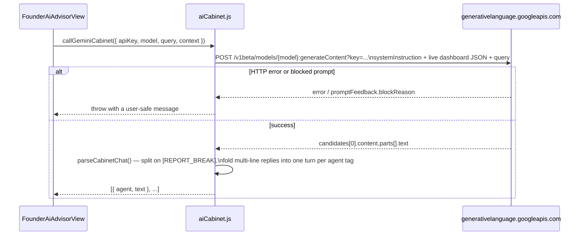
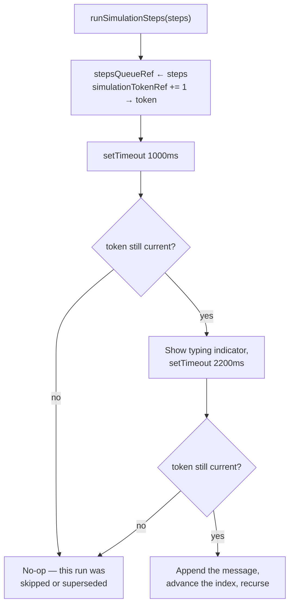

# AI_WORKFLOW.md
# Fute Services — AI Agent Command Room (Founder Dashboard)

> Describes the AI Cabinet feature as implemented in `src/components/FounderAiAdvisorView.jsx` and `src/utils/aiCabinet.js`.

---

## 1. What It Is

A panel on the Founder dashboard (sidebar → "Fute AI+") where the Founder can pick a quick-operation template or type a free-form question, and watch five department personas — HR, IT, Coordinator, Employee-rep, and the Founder's own chief-of-staff persona — discuss the live dashboard data and land on an action plan.

## 2. The Two Modes

```mermaid
flowchart TD
    Q["Founder submits a question\n(template button or free text)"] --> M{"Cloud Gemini API\nconfigured?"}

    M -->|"key present"| CALL["callGeminiCabinet()\nreal Gemini request"]
    CALL -->|success| PARSE["Parse [agentId]: text\nturns from the response"]
    CALL -->|failure\n(bad key / network / empty response)| WARN["Toast explaining why"] --> LOCAL
    M -->|"no key, or Local Simulation selected"| LOCAL["Offline scripted dialogue\n(getSimulatedDialogue)"]

    PARSE --> ANIM["Typing animation, one turn at a time"]
    LOCAL --> ANIM
    ANIM --> REPORT["generateExecutiveReport()\n— always computed locally from\nlive React Context data"]
```

Cloud mode and local-simulation mode converge on the exact same downstream pipeline — the typing animation, the skip-to-end control, and the report — because both resolve to the same `{ agent, text }[]` shape before that point. Nothing downstream knows or cares which mode produced the conversation.

## 3. The System Prompt

`src/utils/aiCabinet.js` exports `CABINET_SYSTEM_PROMPT`, built around five personas:

| Persona | id | Domain |
|---|---|---|
| Payel (HR AI) | `hr` | Recruitment, attendance, leave |
| IT Desk AI | `it` | Tickets, hardware, data protection |
| Project Planner AI | `coordinator` | Timelines, task allocation |
| Employee Rep AI | `employee` | Ground-level morale and blockers |
| Ratish (Founder AI) | `founder` | Synthesizes and decides |

The prompt instructs the model to: reference real numbers and names from the supplied JSON context, let personas build on or push back on each other rather than speak in isolation, converge from problem → trade-offs → an executive decision, and reply in a natural Hinglish-English blend rather than robotic corporate English. Output must be `[agentId]: text` lines, four to six turns, followed by a line reading exactly `[REPORT_BREAK]` and then a JSON report.

## 4. Why the Model's Report Half Is Discarded

The prompt still asks for a structured JSON report after `[REPORT_BREAK]` — but the client **only parses the chat half**. `generateExecutiveReport()` builds the report deterministically from the same live Context data instead (tickets, leave requests, approvals, projects), and its action items carry `targetTab` values (`'approvals'`, `'projects'`, `'it'`, `'hr'`) that are wired to real `onNavigate` calls. Trusting a model-generated tab value there risks a hallucinated or malformed string breaking navigation. The model's genuine value-add is the humanized, query-specific conversation — that's the only part consumed client-side.

## 5. Calling Gemini



- The API key is **bring-your-own**: entered in the Settings drawer, stored in that browser's `localStorage` only. There is no backend proxy for this call — the browser talks to Google directly.
- The context sent is a trimmed snapshot (counts and a few named examples), not the full employee/candidate rosters, to keep the request small and avoid leaking more than the conversation needs.
- `temperature: 0.8` — deliberately not deterministic; this is meant to read like a live discussion, not a fixed script.

## 6. Local Simulation Fallback

Four hand-written scripts (`audit`, `onboard`, `bottlenecks`, `infra`) interpolate live counts (open tickets, pending approvals, pending leaves, slowest project) into otherwise-fixed Hinglish dialogue. A typed question that doesn't match a template button is keyword-matched to the closest script (`detectLocalTemplateType`) rather than always defaulting to the generic audit — a fix made when building this feature, since the original behavior silently ignored what was actually asked.

## 7. Typing Animation & the Race Condition It Used to Have



Before this token was added, `handleSkip()` (and starting a new query while one was mid-animation) only updated state and refs — it never cancelled the `setTimeout` chain already in flight. That stale timer would fire later regardless, read the by-then-reused refs, and could wrongly terminate whatever simulation was *currently* running. Every call to `runSimulationSteps` now takes its own token; any callback whose token no longer matches `simulationTokenRef.current` is stale and does nothing. This was caught and fixed during manual browser testing of the feature, not by inspection — it reproduced reliably by skipping a conversation and issuing a new one within about a second.

## 8. Data Sent as Context

`buildDashboardContext()` — deliberately small, not the full mock datasets:

```json
{
  "hr": { "employeeCount": 6, "pendingLeaves": [...], "activeCandidatesCount": 5 },
  "it": { "openTickets": [...], "pendingApprovals": [...], "expiringAssetsCount": 2 },
  "projects": { "count": 4, "averageProgress": 0, "slowestProject": {...}, "taskProgressPct": 0 }
}
```
