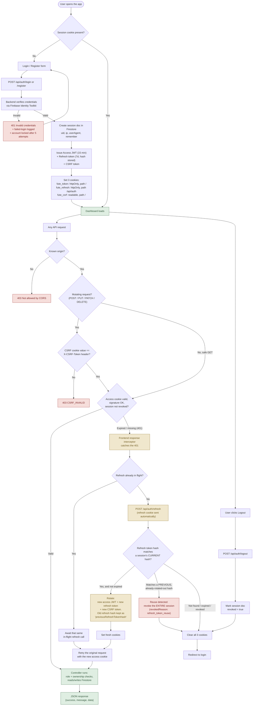

# How Logging In Works: Secure Cookies and Refresh Tokens

**Last updated:** 2026-08-29 · **Related doc:** `docs/SECURITY.md`

This document explains, step by step, how a person's login session is kept secure in Project-Ticket. It replaces an older approach (one long-lived login token saved in the browser's local storage) with a safer one: a short-lived "access" token plus a longer-lived "refresh" token, both stored in a special kind of cookie called `httpOnly`, which JavaScript running on the page cannot read. That matters because if a malicious script ever ran on the site, it still couldn't steal these cookies directly.

## Summary

| Token | How long it lasts | Where it's stored | What it's for |
|---|---|---|---|
| Access token (`fute_token`) | 15 minutes | An `httpOnly` cookie (hidden from page scripts), used on every page | Sent with every request. This is what the server actually checks to confirm who you are. |
| Refresh token (`fute_refresh`) | 7 days (or just until the browser closes, if "Remember me" was left unchecked) | An `httpOnly` cookie, but only sent to the login-related pages, not everywhere | Used to get a new access token once the old one expires. It is never sent anywhere else, which limits where it could ever be exposed. |
| CSRF token (`fute_csrf`) | Matches however long the refresh token lasts | A regular cookie (not hidden from scripts), used everywhere | Sent back as a special header on any request that changes data, as proof the request really came from this app's own website and not a forged request from somewhere else. |

The refresh token is **replaced every time it's used**: a new one is issued and the old one stops working. If someone ever tries to reuse an old, already-replaced refresh token, the system treats that as a sign the token was stolen. It immediately shuts down that whole login session, forcing everyone, including the real user, to log in again.

## Complete flow



## Why it's built this way

- **The access token only lasts 15 minutes.** This limits how much damage a leaked or stolen token could do, without forcing the user to type their password over and over (that's what the refresh token is for).
- **The refresh token is only sent to the login-related pages.** It never travels to any of the roughly 60 other pages/features in the app, so there are far fewer places it could ever be exposed.
- **The refresh token gets replaced every time it's used, and reuse is detected.** This is the standard way to defend against a copied refresh token. The real, legitimate device always has the newest one, so if a copy is ever replayed, the system catches it the moment either the real device or the copy is used first and the token moves on to its replacement.
- **There's a separate cookie just for CSRF protection** (CSRF stands for Cross-Site Request Forgery: a trick where another website tries to make requests to this app pretending to be the logged-in user). This is needed because the login cookies have to work across two different website addresses (the frontend and the backend live on separate domains), which turns off a browser safety feature that would normally block this kind of trick automatically. The extra cookie brings that protection back: a forged request from another website can't read this cookie, so it can never produce a matching value to prove it's legitimate.
- **Only one refresh request happens at a time**, even if several parts of the page notice the login has expired at the same moment. Without this, two refresh requests could collide, and the second one would look like a stolen, already-used token by mistake.

## Simplified, step-by-step version

The same three flows above, written out in plain, linear steps.

### Complete authentication flow

```
USER
  ↓
Login (Email + Password)
  ↓
FRONTEND
  ↓
POST /api/auth/login
  ↓
BACKEND
  ↓
Verify Email + Password (Firebase Identity Toolkit)
  ↓
Create Access JWT (15 min) + Refresh Token (7d, hash stored in Firestore)
  ↓
Set HttpOnly + Secure Cookies (fute_token, fute_refresh, fute_csrf)
  ↓
BROWSER
  ↓
User opens Dashboard
  ↓
Frontend calls API
  ↓
Browser automatically sends Cookie
  ↓
CORS Check
  ↓
CSRF / SameSite Protection (mutating requests only)
  ↓
JWT Verification
  ↓
Token Valid?
  ├── NO  → 401 Unauthorized
  │
  └── YES
       ↓
     Get User ID (from JWT payload)
       ↓
     Database (Firestore)
       ↓
     Get User Data
       ↓
     Backend
       ↓
     Frontend
       ↓
     Dashboard
```

### Token refresh: what happens when the access token expires

```
API Request
    ↓
JWT Expired
    ↓
/api/auth/refresh
    ↓
Verify Refresh Token (hash match, not expired, not already rotated)
    ↓
Create New Access JWT + New Refresh Token (rotated)
    ↓
Update Cookies
    ↓
API Request continues (original request retried automatically)
```

*If the refresh token presented turns out to be an old, already-replaced one instead of the current one, things go differently: the whole session gets shut down instead of a new token being issued. See the reuse-detection path in the full diagram above for how that works.*

### Logout

```
Logout
  ↓
POST /api/auth/logout
  ↓
Revoke Refresh Token (session doc marked revoked = true)
  ↓
Clear Cookies (fute_token, fute_refresh, fute_csrf)
  ↓
User Logged Out
```
