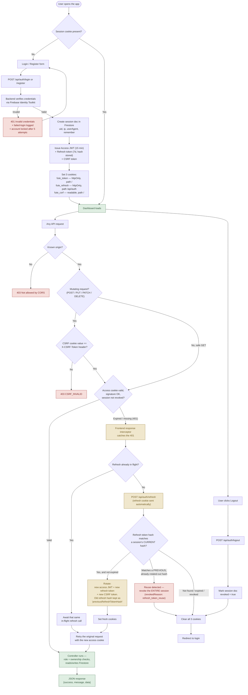

# Authentication Workflow — httpOnly Cookies + Rotating Refresh Tokens

**Last updated:** 2026-08-29 · **Companion doc:** `docs/SECURITY.md`

This document is the complete, current structure of how sessions work in Project-Ticket, after the switch from a single 7-day JWT in `localStorage` to a short-lived access token + rotating refresh token, both in `httpOnly` cookies.

## Summary

| Token | Lifetime | Storage | Purpose |
|---|---|---|---|
| Access token (`fute_token`) | 15 minutes | `httpOnly` cookie, path `/` | Sent on every request; what `authMiddleware.js` actually checks |
| Refresh token (`fute_refresh`) | 7 days (or a browser-session cookie if "Remember me" is off) | `httpOnly` cookie, path `/api/auth` only | Exchanged for a new access token when the old one expires — never sent to any other route |
| CSRF token (`fute_csrf`) | Mirrors the refresh token's lifetime | Regular (non-`httpOnly`) cookie, path `/` | Echoed back as an `X-CSRF-Token` header on every mutating request — proves the request came from this app's own frontend, not a forged cross-site one |

The refresh token is **rotated** on every use — a new one is issued and the old one is invalidated. If an already-invalidated (rotated-out) refresh token is ever presented again, that's treated as evidence of theft: the entire session is revoked immediately, forcing a real re-login even for the legitimate device.

## Complete flow



## Why each piece exists

- **15-minute access token** — limits how long a leaked/stolen access token would actually be usable, without making the user re-enter their password constantly (that's the refresh token's job).
- **Refresh token scoped to `path: /api/auth`** — it's never sent to any of the ~60 other API routes, only the auth endpoints that need it, shrinking where it could ever leak from.
- **Rotation + reuse detection** — the standard defense against a copied refresh token: the legitimate client always has the *current* one, so an attacker replaying an older copy is caught the moment the real client (or the attacker) uses theirs first and rotates past it.
- **Separate CSRF cookie** — required because the access/refresh cookies must be `SameSite=None` to work across the frontend/backend's separate Vercel domains, which removes the browser's own built-in CSRF protection. The double-submit pattern (cookie value must match a header value) restores it: a forged cross-site request can't read our cookie to produce a matching header.
- **Single-flight refresh on the frontend** — several components can hit a 401 around the same moment (e.g. a few widgets polling together); without coalescing them into one shared refresh call, the second one to arrive would find the first had already rotated the token and get incorrectly treated as a reuse/theft attempt.

## Simplified step-by-step

The same three flows above, written linearly.

### Complete authentication flow

```
USER
  ↓
Login (Email + Password)
  ↓
FRONTEND
  ↓
POST /api/auth/login
  ↓
BACKEND
  ↓
Verify Email + Password (Firebase Identity Toolkit)
  ↓
Create Access JWT (15 min) + Refresh Token (7d, hash stored in Firestore)
  ↓
Set HttpOnly + Secure Cookies (fute_token, fute_refresh, fute_csrf)
  ↓
BROWSER
  ↓
User opens Dashboard
  ↓
Frontend calls API
  ↓
Browser automatically sends Cookie
  ↓
CORS Check
  ↓
CSRF / SameSite Protection (mutating requests only)
  ↓
JWT Verification
  ↓
Token Valid?
  ├── NO  → 401 Unauthorized
  │
  └── YES
       ↓
     Get User ID (from JWT payload)
       ↓
     Database (Firestore)
       ↓
     Get User Data
       ↓
     Backend
       ↓
     Frontend
       ↓
     Dashboard
```

### Token refresh — when the Access JWT expires

```
API Request
    ↓
JWT Expired
    ↓
/api/auth/refresh
    ↓
Verify Refresh Token (hash match, not expired, not already rotated)
    ↓
Create New Access JWT + New Refresh Token (rotated)
    ↓
Update Cookies
    ↓
API Request continues (original request retried automatically)
```

*If the presented refresh token turns out to be an already-rotated-out one instead of the current one, this branches differently: the whole session is revoked instead of a new token being issued — see the reuse-detection path in the full diagram above.*

### Logout

```
Logout
  ↓
POST /api/auth/logout
  ↓
Revoke Refresh Token (session doc marked revoked = true)
  ↓
Clear Cookies (fute_token, fute_refresh, fute_csrf)
  ↓
User Logged Out
```
