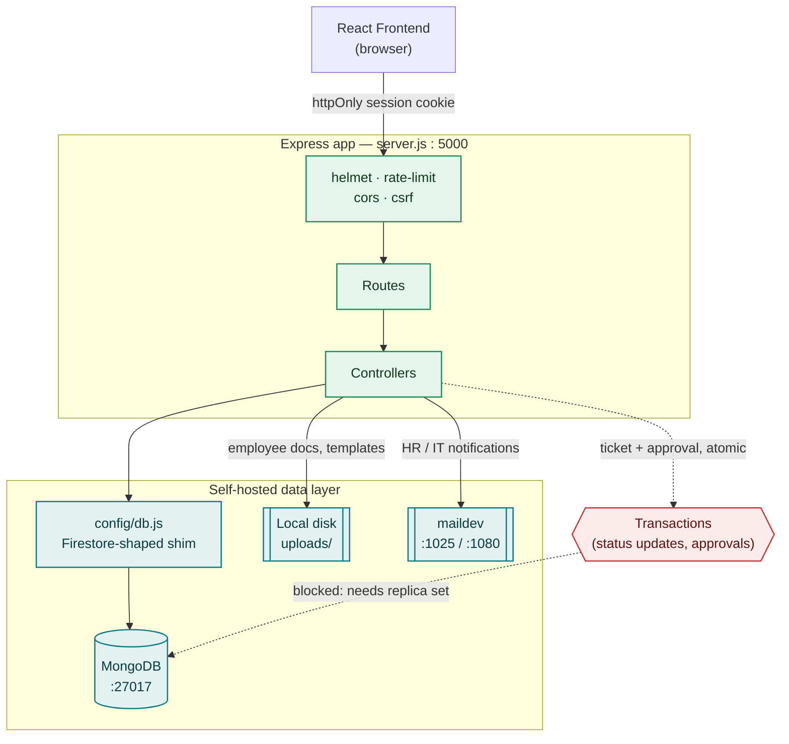

# Fute Portal Backend — Architecture & Status

Architecture and current operating status of the self-hosted backend, following its migration off Firebase onto MongoDB on the temp server at `192.168.1.23`.

Generated 2026-09-03 · Node 24 · Express 4 · MongoDB `:27017` · Host FS123 (192.168.1.23)

## Migration in numbers

| Metric | Value |
|---|---|
| Firestore collections migrated | 27 |
| User accounts | 48 |
| Employee records | 39 |
| Backend files touched | 30 |
| Cloud dependencies remaining | 0 |

## Current status

- ✅ Auth (bcrypt + JWT)
- ✅ CRUD & queries
- ✅ Pagination
- ✅ Local file storage
- ✅ Email capture (maildev)
- ❌ Multi-doc transactions
- ⚠️ Process persistence

## System map — request path

## Life of a request

1. **Cookie arrives** — the browser attaches its httpOnly `fute_token` automatically, never read or set from page JavaScript.
2. **Middleware chain** — `helmet`, a 300-req/15-min rate limiter, an origin-checked `cors`, then `csrfMiddleware` on any mutating verb.
3. **Auth + session** — `authMiddleware` verifies the JWT, re-checks the live profile (60s cache), and confirms the session hasn't been revoked.
4. **Route → controller** — role/permission middleware gates the route before the controller runs, e.g. `role('hr','founder')`.
5. **config/db.js shim** — controllers call `db.collection(x).where().orderBy().limit()` exactly as they did against Firestore; the shim translates that onto the native MongoDB driver underneath.
6. **Response** — a uniform `{ success, message, data }` envelope, with any mutation also updating `audit_logs`.

## Data layer — representative collections

| Collection | Holds | Docs |
|---|---|---:|
| `users` | Profiles — role, department, permission overrides | 48 |
| `_auth_credentials` | bcrypt password hashes, kept separate from profile docs | 48 |
| `employees` | HR directory records, including document storage paths | 39 |
| `it_complaints` / `hr_complaints` | Support tickets | 6 |
| `sessions` | Refresh-token rotation, revocation state | 350 |
| `sales_leads` | Sales desk pipeline | 30 |
| `audit_logs` | Admin action trail | 100 |
| `settings` | SLA policy, system config — fixed single docs | 2 |

## Not yet working

**Multi-document transactions.** Ticket status updates and approval decisions write to two or three collections atomically. MongoDB refuses this on a standalone instance — it needs to run as a (single-node) replica set. Fails cleanly with a 500, no partial writes.

**Process persistence.** Windows OpenSSH kills PM2's daemon when the SSH session closes, since `webteam` has no interactive login. Fix is installing PM2 as a proper Windows Service — pending admin action.

## Environment

| Key | Value |
|---|---|
| `MONGODB_URL` | `mongodb://192.168.1.23:27017` |
| `MONGODB_DB_NAME` | `fute_portal` |
| `JWT_SECRET` | 96-byte random secret, generated at deploy time |
| `SMTP_HOST` / `SMTP_PORT` | `localhost` : `1025` — maildev, no auth |
| `PORT` | `5000` |
| `FRONTEND_URL` | `http://192.168.1.23` — CORS allow-list |
