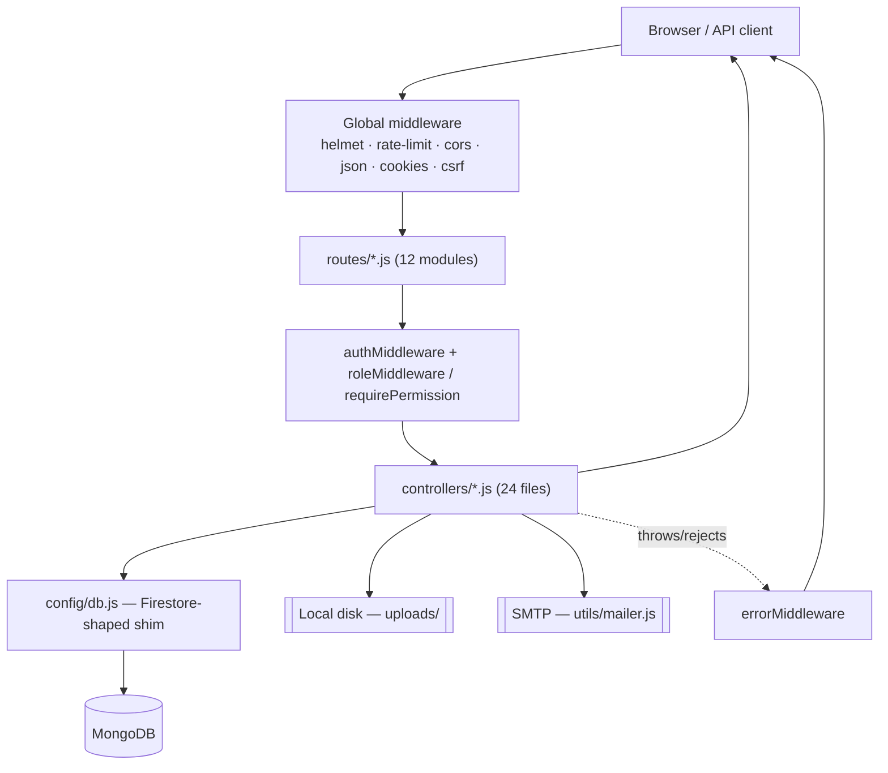

# Fute Portal Backend — Master Documentation

This is the single overview document for the Fute Portal backend (`main/backend`). It synthesizes the 27 detail documents in this folder — it does not repeat their full content. Every claim below is grounded in the actual source code in `main/backend`; anything that couldn't be determined from the code is marked as such. Follow the "See:" links for full detail on any section.

Fute Portal is a ticketing/HR/IT/Sales internal business portal ("HR complaints", "IT complaints", approvals, leave, assets, HR desk, Sales desk, team chat, a Super Admin/Founder console) for a company with roles Employee, HR, IT, Sales, Coordinator, Founder, and Super Admin.

---

## 1. Project Overview

- **Stack**: Node.js + Express 4 (`main/backend/server.js`), MongoDB (self-hosted, native `mongodb` driver via a hand-written Firestore-shaped shim in `config/db.js`), JWT-based session cookies with CSRF protection, local-disk file storage, SMTP mail via `nodemailer` (self-hosted `maildev` capture server in dev).
- **History**: the app was originally built against Firebase (Auth + Firestore) and was migrated to a self-hosted backend without rewriting the ~170 call sites written against Firestore's API shape — `config/db.js` reproduces that call shape over MongoDB instead. Frontend is a separate React app (`main/frontend`, Vite + axios) deployed on Vercel; the backend is self-hosted on a Windows server (see §21 Deployment).
- **Frontend**: only referenced where needed to explain backend contracts (e.g. `main/frontend/src/utils/api.js`'s response envelope unwrapping and CSRF-token caching) — not documented in depth here per this project's scope.

See: `01-backend-architecture.md`, `02-folder-structure.md`.

## 2. Backend Architecture

Every request flows through the same layers, in order: **global middleware** (helmet → rate-limit → cors → json → cookie-parser → csrf) → **routing** (12 router modules mounted under `/api/...` in `server.js`) → **per-route middleware** (`authMiddleware` → `roleMiddleware`/`requirePermission`) → **controller** → **`config/db.js` shim** → **MongoDB**, with side channels to local disk (uploads) and SMTP (notifications). Errors from any layer (including rejected promises, thanks to `express-async-errors`) fall through to `errorMiddleware`, the last middleware registered.



The single most important architectural fact: **`config/db.js` is not an ODM** — it's a shim that translates Firestore-style calls (`collection().doc().get/set`, `.where().orderBy().limit()`, `.batch()`, `.runTransaction()`) onto the native MongoDB driver, so no controller needs to know MongoDB exists underneath. See §7 Database below and `06-database.md` for full mechanics.

See: `01-backend-architecture.md`, `23-code-call-graph.md`.

## 3. Folder Structure

```
main/backend/
├── server.js              # Express app entrypoint
├── config/db.js           # Firestore-shaped shim over MongoDB + auth object
├── controllers/           # 24 files — business logic
├── middleware/            # 5 files — authMiddleware, csrfMiddleware, roleMiddleware,
│                           #   permissionMiddleware, errorMiddleware
├── routes/                # 12 files — one per API area, mounted in server.js
├── utils/                 # 10 files — jwt, cookies, sessions, respond, pagination,
│                           #   upload, mailer, constants, auditLog, notificationRules
├── uploads/                # local disk file storage (employee docs, document templates)
└── package.json
```

Full purpose/"what breaks if removed" for every file: `02-folder-structure.md`. Full per-file deep-dive (imports, functions, callers/callees, DB interaction, error handling, security notes) for every non-trivial file: `03-file-by-file-explanation.md` (the longest document in this set, ~680 lines).

## 4. File Responsibilities (Summary)

| Area | Files | Responsibility |
|---|---|---|
| Entry point | `server.js` | Middleware wiring, route mounting, `/healthz`, graceful shutdown |
| Data layer | `config/db.js` | Firestore-shaped shim + `auth` (bcrypt credentials) |
| Auth/session | `middleware/authMiddleware.js`, `utils/jwt.js`, `utils/cookies.js`, `utils/sessions.js`, `controllers/authController.js` | Login, JWT issuance/verification, refresh rotation, logout, cookies |
| Authorization | `middleware/roleMiddleware.js`, `middleware/permissionMiddleware.js`, `controllers/permissionController.js` | Role gates, action-level permission matrix, page-level nav permissions |
| Tickets | `controllers/complaintControllerFactory.js` (+ `hrController.js`/`itController.js`) | HR/IT complaint CRUD, status transitions, approvals linkage |
| Approvals | `controllers/approvalController.js` | Decision workflow, HR-decidable categories, remarks |
| HR Desk | `controllers/hrDeskController.js` | Employees, candidates, interviews, attendance, extra hours, leave summary, document templates (largest controller, ~700 lines) |
| Sales Desk | `controllers/salesDeskController.js` | Leads CRUD, Excel import (two sheet formats), campaigns, settings (~700 lines) |
| Other desks | `assetController.js`, `renderController.js`, `taskProjectController.js`, `leaveController.js`, `chatController.js` | IT assets, render jobs, coordinator tasks, leave requests, team chat |
| Founder/Super Admin console | `superAdminUserController.js`, `analyticsController.js`, `dashboardController.js`, `departmentController.js`, `slaController.js`, `systemSettingsController.js`, `notificationController.js`, `securityController.js` | User management, analytics/CSV export, dashboard overview, departments, SLA policy, system settings, notification rules, security center |
| Shared utilities | `utils/*.js` | Response envelope, pagination, uploads, mail, constants, audit log |

Full detail: `03-file-by-file-explanation.md`, `10-controllers.md`.

## 5. API System

12 route modules mounted at: `/api/auth`, `/api/hr`, `/api/it`, `/api/founder` (+ `/api/founder/security`), `/api/approvals`, `/api/leave`, `/api/coordinator`, `/api/production/renders`, `/api/hr-desk`, `/api/sales-desk`, `/api/chat`, plus `/`, `/healthz`, and a JSON catch-all 404. **Full endpoint count documented: see `04-api-documentation.md`'s summary table** (the detail doc enumerates every method+path with auth/authz, request/response shape, status codes, and example payloads).

Every response uses one uniform envelope (`utils/respond.js`): `{success:true, message, data}` (`ok`/`created`) or `{success:false, message, error:{code, details}}` (`fail`). Three rate limiters apply: global 300 req/15min (`server.js`), `authLimiter` 10 req/15min on login/register/refresh/verify-password (`routes/authRoutes.js`), and `expensiveReadLimiter` 20 req/60s on founder analytics/dashboard/SLA-compliance endpoints (`routes/founderRoutes.js`).

See: `04-api-documentation.md`.

## 6. Request/Response Flow

Full step-by-step traces (with mermaid sequence diagrams) exist for: login, IT ticket creation, HR employee-document upload, and team-chat message send. A compact call-chain reference for ten representative endpoints (login, ticket create/status-update, approval decide, document upload/download, sales import, chat send, dashboard overview, refresh) is in the call-graph doc.

See: `05-request-response-flow.md`, `23-code-call-graph.md`.

## 7. Database

MongoDB, accessed exclusively through `config/db.js`'s Firestore-shaped shim (**not** an ODM — no schema enforcement at the DB layer; every "schema" in the detail doc is inferred from controller code). Only one index is created in code: a unique index on `_auth_credentials.email` (`config/db.js`). Every other collection relies on unindexed scans bounded by read caps (`utils/constants.js`: `UNPAGINATED_READ_LIMIT=200`, `FOUNDER_LIST_CAP=200`, `DASHBOARD_SCAN_CAP=5000`) or cursor pagination (`utils/pagination.js`).

~28 collections are in active use, grouped as: identity (`users`, `_auth_credentials`, `sessions`, `failed_logins`), tickets (`hr_complaints`, `it_complaints`, `approvals`), HR desk (`employees`, `candidates`, `interviews`, `meetings`, `attendance`, `interview_feedback`, `open_jobs`, `performance_entries`, `leave_entries`, `document_templates`, `extra_hours`, `sent_emails`), sales desk (`sales_leads`, `sales_campaigns`, `sales_settings`), org/admin (`departments`, `settings` [single-doc keys: `role_permissions`, `action_permissions`, `sla_policies`, `system_config`, `notification_rules`], `audit_logs`), and misc (`assets`, `renders`, `tasks`, `projects`, `chat_messages`, `leave_requests`).

`db.batch()` and `db.runTransaction()` use real MongoDB client sessions/transactions — genuinely atomic, but requiring MongoDB to run as a replica set (an operational prerequisite tracked in `docs/BACKEND_ARCHITECTURE_STATUS.md`, not a code issue).

See: `06-database.md`.

## 8. Authentication

Password auth via bcrypt (`config/db.js`'s `auth` object) with a 5-failed-attempt account lockout (`authController.js`, `LOCK_THRESHOLD`). Sessions are three cookies: `fute_token` (15-minute JWT access token, httpOnly), `fute_refresh` (opaque, sha256-hashed-at-rest, 7-day refresh token, httpOnly, path-scoped to `/api/auth`), and `fute_csrf` (non-httpOnly, so the frontend can echo it back as a CSRF header). Refresh rotation includes **reuse detection**: presenting an already-rotated-out refresh token revokes the entire session, treating it as a stolen-token replay (`utils/sessions.js: consumeRefreshToken`).

Cookie flags branch on `process.env.VERCEL` (`SameSite=None; Secure` when deployed/cross-origin vs `Lax` for local same-site dev) — see §12 for a flagged concern about this check in the current self-hosted deployment.

See: `07-authentication.md`.

## 9. Authorization

Three layers: (1) `roleMiddleware(...allowedRoles)` — coarse per-route allow-list; (2) `requirePermission(resource, action)` (`middleware/permissionMiddleware.js`) — granular action-level gate reading the `settings/action_permissions` doc, used today only on IT asset routes; (3) controller-level ownership checks scattered through the code (ticket owner-only delete/reopen, task assignee-or-manager, chat DM participants-only, HR-desk self-scoping via `req.user.employeeId`, Super Admin self-action guards). There is no formal role-hierarchy data structure — authorization is flat, per-route role lists, not an inherited hierarchy.

See: `08-authorization.md`.

## 10. Middleware

`helmet`, `express-rate-limit` (×3 instances), `cors` (origin allow-list + credentials), `express.json`, `cookie-parser`, `csrfMiddleware` (double-submit cookie, 3 exempt paths), `authMiddleware` (JWT + 60s profile cache + session-revocation check), `roleMiddleware`, `requirePermission`, `errorMiddleware` (last, catches everything via `express-async-errors`), and the inline 404 catch-all in `server.js`.

See: `09-middleware.md`.

## 11. Controllers

24 controller files. The two largest (`hrDeskController.js`, `salesDeskController.js`, ~700 lines each) share a **CRUD factory pattern** (`makeCrud()` in `hrDeskController.js`; `createComplaintController()` in `complaintControllerFactory.js` for tickets) to avoid duplicating list/create/update/delete logic across near-identical resources.

See: `10-controllers.md`, `03-file-by-file-explanation.md`.

## 12. Services (Internal — No Separate Service Layer)

This codebase has no distinct "services" folder — business logic lives directly in controllers, with shared cross-cutting logic factored into `utils/*.js` (mailer, sessions, pagination, notification rules, audit log) and `config/db.js` (data access). This is a deliberate architectural observation, not a gap: for an app of this size, controller-embedded logic plus shared utils is a reasonable, low-ceremony structure. Where controllers import from sibling controllers directly (e.g. `dashboardController.js` importing `SLA_POLICIES_DOC` from `slaController.js`), that's noted in `10-controllers.md`.

## 13. Business Logic

Seventeen-plus non-trivial business rules are documented with their rationale (quoted from code comments where present, marked "Inferred" otherwise): ticket token generation, the ticket→approval transaction on "Waiting Approval", owner-vs-staff field-edit splits, approval decision authority (HR can decide `document`/`extra-hours` categories only), refresh-token reuse detection, SLA breach/near-breach computation, attendance self check-in/out math, leave department-based approval routing, Super Admin self-action guards, the Sales Desk Excel-import merge/dedupe logic (two distinct sheet formats), and CSV/formula-injection neutralization on exports.

See: `11-business-logic.md`.

## 14. External Services

Only two: **MongoDB** (self-hosted, not "external" in the cloud sense — see §7) and **SMTP mail** via `nodemailer` (`utils/mailer.js`), pointed at a self-hosted `maildev` capture server by default (no auth, `SMTP_HOST=localhost`, `SMTP_PORT=1025`); `SMTP_USER`/`SMTP_PASS` would redirect it to a real relay if ever set. **No cloud storage, payment, SMS, or third-party analytics integration exists in the backend** — stated explicitly rather than omitted.

See: `12-external-services.md`.

## 15. Environment Variables

`JWT_SECRET` (required — `server.js` fails fast with `process.exit(1)` if unset), `MONGODB_URL`/`MONGODB_DB_NAME` (optional, default to local Mongo), `PORT` (default 5000), `SMTP_HOST`/`SMTP_PORT`/`SMTP_USER`/`SMTP_PASS`, `HR_EMAIL`/`IT_EMAIL` (read dynamically), `FRONTEND_URL` (CORS allow-list), `VERCEL` (platform-injected). The on-disk `.env` still carries dead legacy `FIREBASE_*` variables from before the Mongo migration that are read nowhere in current code — flagged, not documented as live config. All real secret values are redacted as `<SECRET>` throughout this doc set.

See: `13-environment-variables.md`.

## 16. Error Handling

`express-async-errors` (loaded first in `server.js`) forwards any rejected promise from an async route handler to `errorMiddleware` automatically — no per-controller try/catch is required just to avoid a hung request. Controllers signal intentional, client-safe errors via `Object.assign(new Error(msg), {status, code})`; `errorMiddleware` shows that message verbatim, but hides any *unexpected* error's message behind a generic "Internal server error" (logging the real one server-side via `console.error`). Over 20 distinct error `code` strings are cataloged (e.g. `VALIDATION_ERROR`, `CSRF_INVALID`, `ACCOUNT_LOCKED`, `SESSION_EXPIRED`).

See: `14-error-handling.md`.

## 17. Security

Currently implemented: bcrypt password hashing, 5-attempt account lockout, 15-minute JWT access tokens in httpOnly cookies, refresh-token rotation with reuse detection, double-submit CSRF cookies, three tiers of rate limiting, per-controller input validation, HTML/CSV injection escaping (`utils/mailer.js: escapeHtml`, CSV `csvEscape`/`escapeCsv` in two controllers), MIME-type allow-listed file uploads with size limits, path-traversal containment checks on every file-download route, `helmet()` default security headers, an origin-allow-listed CORS policy, and an `audit_logs` trail for admin actions.

Flagged weaknesses (see the detail doc's full three-way breakdown): no password complexity requirement beyond a 10-character minimum; `helmet()` uses defaults only (no custom CSP); in-memory per-process caches (profile, permission, session-revocation, dashboard, analytics) mean a revoked session or deactivated account can stay valid for up to ~60 seconds, and won't be shared if the backend is ever horizontally scaled; there is no automated test coverage for any of this; `audit_logs` doesn't cover ticket/approval/leave/chat/sales actions, only admin/user-management actions.

See: `15-security.md` for the full **Currently Implemented / Potential Weaknesses / Recommended Improvements** breakdown.

## 18. File Storage

Two upload paths (multer `memoryStorage`, never touching disk until explicitly written): employee documents (PDF/JPG/DOC/DOCX, 10MB limit, `utils/upload.js`'s `upload`) and sales-lead spreadsheets (`.xlsx`, 15MB limit, `uploadSpreadsheet`). Files are written to local disk under `main/backend/uploads/` (`employee-documents/<id>/...`, `document-templates/<category>/...`), with the resolved path stored on the owning MongoDB document — never exposed to the client directly. Every download route re-derives the absolute path server-side and checks `absolutePath.startsWith(UPLOAD_ROOT)` before serving (the path-traversal defense-in-depth this task specifically asked to be documented), and both upload and download routes require `auth` + `role('hr','founder')`. There is no cloud storage and no backup/redundancy mechanism found in code for the `uploads/` folder — an operational, not code-level, gap worth flagging.

See: `16-file-storage.md`.

## 19. Background Jobs

**None exist.** No cron library, task queue, or `setInterval`-based recurring job was found anywhere in the backend. All "caching" behavior (profile cache, permission cache, session-revocation cache, dashboard cache, analytics cache) is a simple in-memory `Map`/variable with a 30–60 second TTL inside request-handling code — not a background job system, and not shared across multiple server processes if the app is ever horizontally scaled.

See: `17-background-jobs.md`.

## 20. Logging

`console.error`/`console.log` only — no structured logging library (no winston/pino), no request-logging middleware (no morgan), no APM/error-tracking service. `GET /healthz` (pings MongoDB, returns latency or a 503) is the only real health-check surface. `utils/auditLog.js`'s `audit_logs` collection is the closest thing to an audit trail, but only covers admin/user-management actions (department/user/session/permission/settings changes) — ticket, approval, leave, chat, and sales-lead activity have no audit trail beyond their own `created_at`/`updated_at` timestamps.

See: `18-logging-monitoring.md`.

## 21. Dependencies

Production: `bcryptjs`, `cookie-parser`, `cors`, `dotenv`, `exceljs` (Sales Desk import), `express`, `express-async-errors`, `express-rate-limit`, `helmet`, `jsonwebtoken`, `maildev` (bundled as a production dependency, not dev — flagged as notable), `mongodb`, `multer`, `nodemailer`. Dev: `nodemon` only. No test framework is installed. A `package.json` `overrides` block pins `jose`, `qs`, and `maildev`'s nested `nodemailer` — likely a supply-chain/vulnerability pin, but no comment in the file confirms the exact reason (marked Inferred).

See: `19-dependencies.md`.

## 22. Deployment

Backend: self-hosted on a Windows server at `192.168.1.23`, Node process on port 5000, MongoDB on the same host at port 27017 (needs to run as a replica set for the multi-document transactions used in ticket/approval workflows — not independently confirmed working as of the last status check). Frontend: Vercel-hosted, separate origin (`project-ticket` Vercel project) — this cross-origin split is *why* the cookie/CORS/CSRF design in §8–9 exists. A stale `main/backend/.vercel/project.json` remains from an earlier Vercel-hosted phase of the backend; `server.js`/`utils/cookies.js`'s `process.env.VERCEL` check was written for that era and is worth independently re-verifying now that the backend runs elsewhere (flagged, not asserted broken). No CI/CD pipeline automation was found in the explored backend repository.

See: `20-deployment.md` (synthesizes `docs/BACKEND_ARCHITECTURE_STATUS.md` and `docs/DEPLOYMENT_PIPELINE_STATUS.md`/`.pdf` as ground truth).

## 23. Testing

**No automated tests exist for the backend.** `package.json` has no `test` script and no test framework dependency; no test files were found in `main/backend`. Highest-risk untested surfaces: the auth/session/CSRF flow, the Sales Desk Excel-import normalization functions (highly branchy), and the transactional ticket/approval/refresh-rotation flows. Adding `jest`/`supertest` for route-level tests and unit tests for the `normalize*` import helpers is a recommendation, not a description of existing coverage.

See: `21-testing.md`.

## 24. Feature Flows

End-to-end, diagrammed flows exist for: ticket creation & resolution, approvals (all four ways one gets created), HR Desk employee documents, Sales Desk lead import, team chat, and auth (register/login/refresh/logout).

See: `22-feature-flows.md`.

## 25. Data Flow

Full create/read/update/delete traces (with diagrams) for the three most representative kinds of data in this system: a ticket document, a user session, and an uploaded file.

See: `24-data-flow.md`.

## 26. Call Graph

Ten concrete route→middleware→controller→DB call chains (login, ticket create/status-update, approval decide, document upload/download, sales import, chat send, dashboard overview, refresh).

See: `23-code-call-graph.md`.

## 27. Teacher Explanation

A WHAT/WHY/HOW/WHERE/WHEN/WHAT-IF walkthrough of this project's five core backend concepts, using this codebase's actual functions as examples: Express middleware, JWT access tokens, the Firestore-shaped shim, CSRF double-submit cookies, and the roles/permissions/ownership authorization layering.

See: `25-teacher-explanation.md`.

## 28. Glossary

30+ terms relevant to this stack (JWT, CSRF, double-submit cookie, bcrypt, RBAC, ODM vs. driver, replica set, multer, path traversal, TTL cache, and more), each tied back to where this project actually uses it.

See: `26-glossary.md`.

## 29. Troubleshooting

Ten real, code-grounded problems with symptom/cause/fix: the intermittent CSRF-cache race, MongoDB connection misconfiguration, the `JWT_SECRET` fail-fast crash, CORS origin mismatches, account lockout, the refresh-token-reuse "forced logout" behavior, the MongoDB-replica-set requirement for transactions, upload rejections, the path-containment check, and the SSH-disconnect-kills-the-process deployment history.

See: `27-troubleshooting.md`.

## 30. Current Architecture Summary

Fute Portal's backend is a single-process Express app with a deliberately thin architecture: routes declare their own auth/role/permission middleware chain, controllers hold all business logic directly (no separate service layer), and a hand-written Firestore-shaped shim is the sole gateway to MongoDB — a pragmatic choice that preserved ~170 existing Firestore-style call sites through a database migration rather than rewriting them against an ODM. Session security (JWT + rotating refresh tokens + double-submit CSRF + reuse detection) and authorization (role gates + a granular permission matrix + scattered ownership checks) are both more sophisticated than the app's overall size might suggest, reflecting iterative hardening documented directly in the code's own comments. The biggest structural gaps are operational rather than architectural: no automated tests, no structured logging/APM, in-memory-only caching that won't survive horizontal scaling, and a self-hosted deployment (MongoDB replica set, process persistence) that — per the project's own status docs — wasn't fully verified as of the last check.

## 31. Potential Improvements

(Recommendations only — no code changes were made as part of producing this documentation.)

1. **Testing**: add `jest` + `supertest` for route-level integration tests, prioritizing auth/CSRF/session flows and the Sales Desk import `normalize*` functions (`21-testing.md`).
2. **Observability**: add structured logging (e.g. `pino`) and request correlation IDs; consider an error-tracking service; extend `audit_logs` to cover ticket/approval/leave/chat/sales-lead mutations, not just admin actions (`18-logging-monitoring.md`).
3. **Horizontal scaling readiness**: replace the five in-memory TTL caches (`authMiddleware.js`, `permissionMiddleware.js`, `utils/sessions.js`, `dashboardController.js`, `analyticsController.js`) with a shared cache (e.g. Redis) if the backend is ever run as more than one process (`17-background-jobs.md`, `15-security.md`).
4. **Security hardening**: add a password complexity policy beyond the 10-character minimum; configure `helmet()`'s Content-Security-Policy explicitly rather than relying on defaults (`15-security.md`).
5. **Deployment verification**: confirm the MongoDB replica set (`rs0`) is actually initialized, and that the Node process survives an SSH disconnect via a real Windows Service (NSSM) rather than a bare PM2 daemon under an interactive session (`20-deployment.md`, `27-troubleshooting.md`).
6. **Cleanup**: remove the dead `FIREBASE_*` variables from `.env` and re-verify whether `server.js`/`utils/cookies.js`'s `process.env.VERCEL` branching still matches reality now that the backend is self-hosted rather than Vercel-hosted (`13-environment-variables.md`, `20-deployment.md`).
7. **Backups**: define and automate a backup strategy for the `uploads/` local-disk file store, which currently has no redundancy (`16-file-storage.md`).

---

*This master document was generated by reading the actual source code in `main/backend` end to end (server.js, config/db.js, all controllers/middleware/routes/utils, package.json, .env.example) plus the existing `docs/BACKEND_ARCHITECTURE_STATUS.md` and `docs/DEPLOYMENT_PIPELINE_STATUS.md` for deployment ground truth. See `README.md` in this folder for the full index of detail documents.*
