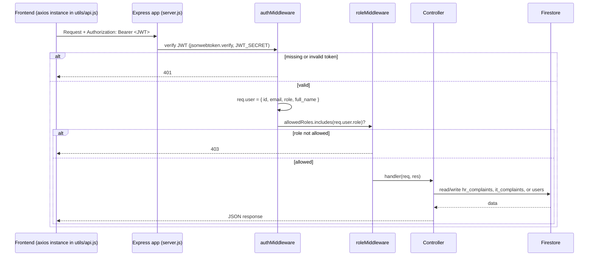
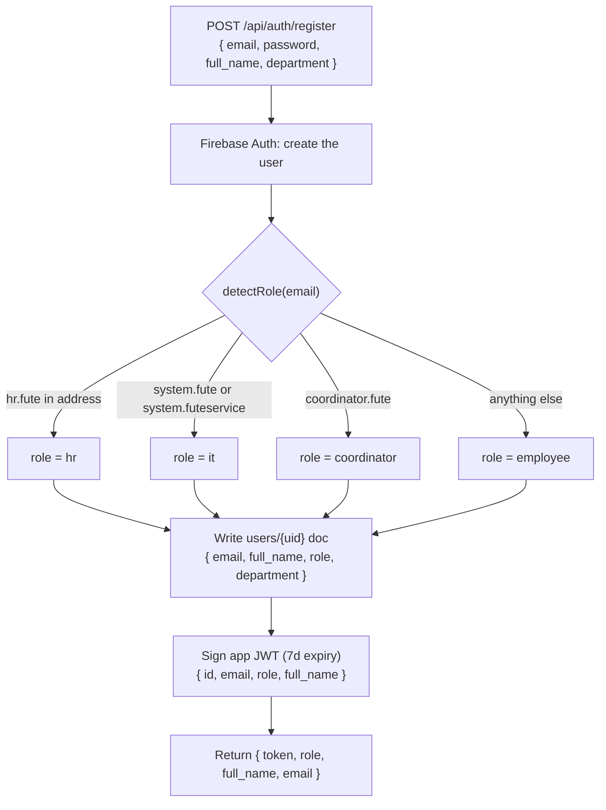
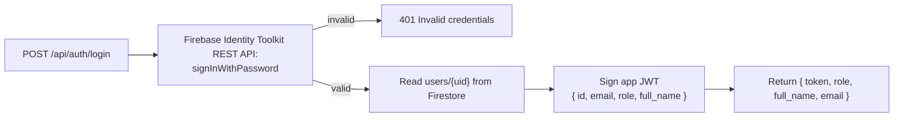
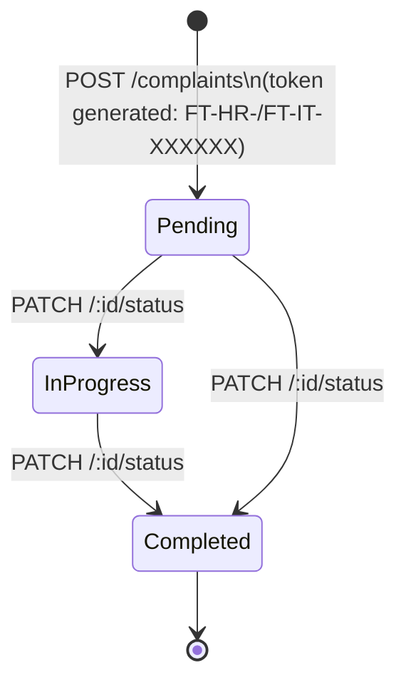
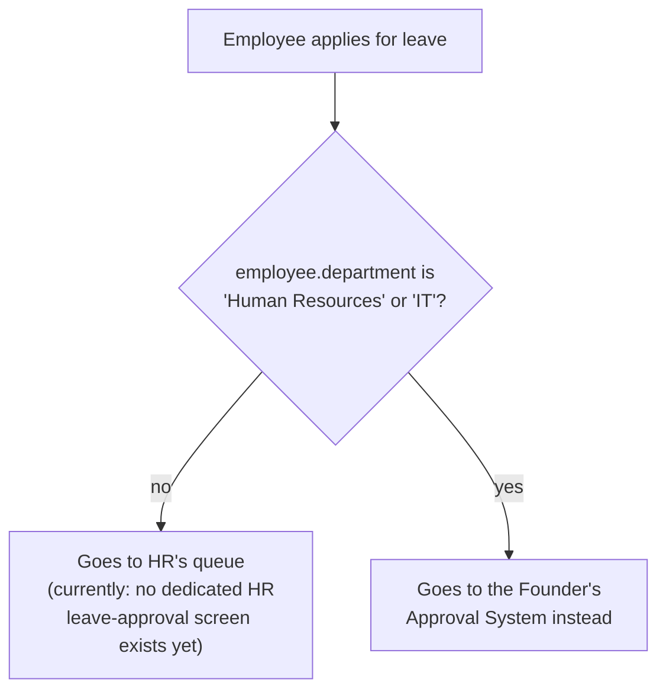
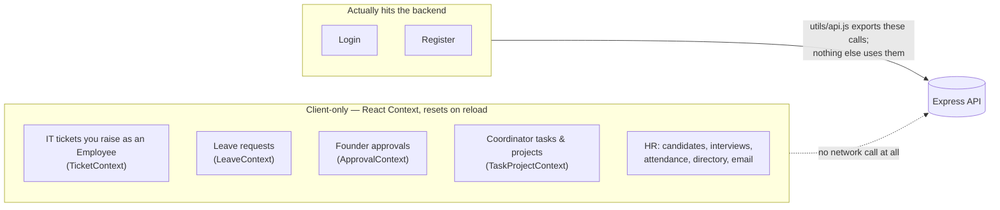
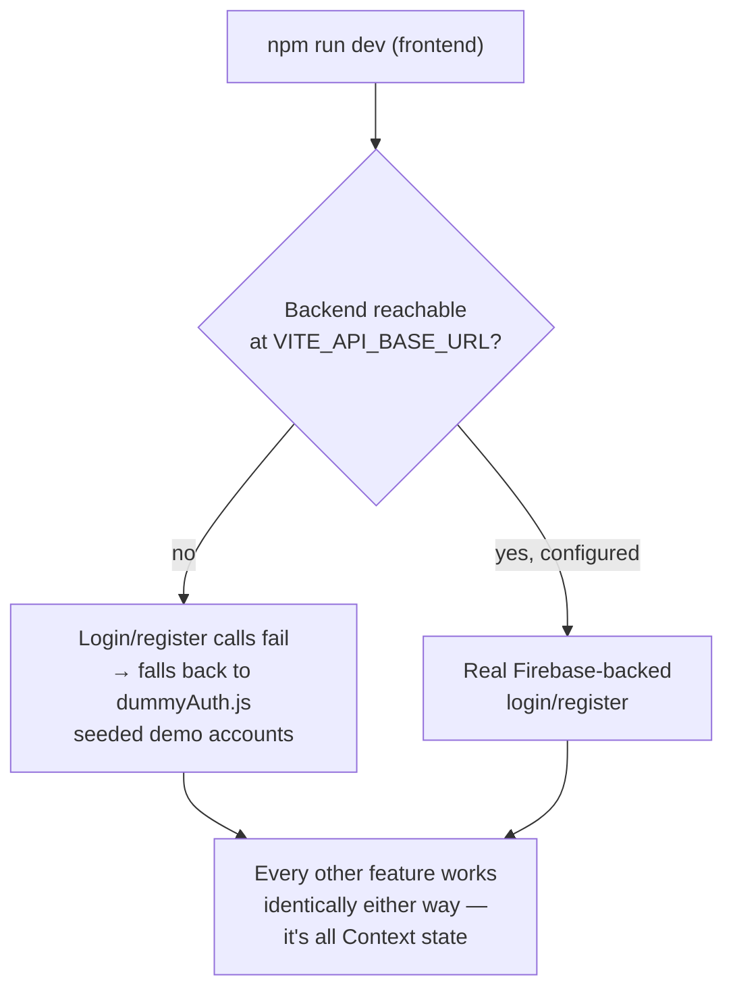

# BACKEND_WORKFLOW.md
# Fute Services — Project Ticket Portal

> What the Express + Firebase backend actually does, what the frontend actually calls, and — deliberately spelled out — where those two stop matching up. Written from the code in `main/backend` and `main/frontend/src`, cross-checked against a live authorization test run during QA.

---

## 1. Request Lifecycle

Every route except `/api/auth/*` requires a bearer token; every route beyond "any authenticated user" also runs `roleMiddleware(...allowedRoles)`. This was exercised directly (stubbed Firestore, real JWT signing/verification) during QA: 22/22 checks passed, covering no token, a malformed token, a token signed with the wrong secret, and every wrong-role combination across HR/IT/Founder — none of them leaked into a handler they shouldn't reach.

## 2. Registration & Role Detection

`founder` is never self-registered — it's set by hand directly in the `users` Firestore collection.

## 3. Login

Firebase's Admin SDK can create/manage users but can't verify a password directly, so login makes a second call to Google's own REST endpoint to check the password, then re-signs the app's own JWT from the result:

## 4. Complaint Lifecycle (HR & IT)

The one feature that's fully wired end to end, frontend to Firestore:

- Creating a complaint emails the department mailbox (`HR_EMAIL` / `IT_EMAIL`) via Nodemailer.
- Updating status emails the original submitter.
- Both emails are best-effort — a mail failure is logged, not thrown, so a submission or status change still succeeds if SMTP is down.
- `duration` is computed server-side once, at write time (`complaint_date` → now), not recalculated on read.

Who can do what:

| Action | Employee | HR | IT | Founder |
|---|:---:|:---:|:---:|:---:|
| Submit an HR or IT complaint | ✅ | ✅ | ✅ | ✅ |
| List all HR complaints | ❌ | ✅ | ❌ | ✅ |
| List all IT complaints | ❌ | ❌ | ✅ | ✅ |
| List own complaints | ✅ | ✅ | ✅ | ✅ |
| Search any complaint by token | ✅ | ✅ | ✅ | ✅ |
| Update HR complaint status | ❌ | ✅ | ❌ | ✅ |
| Update IT complaint status | ❌ | ❌ | ✅ | ✅ |
| List everything, both departments | ❌ | ❌ | ❌ | ✅ |

## 5. Leave & Approval Routing

Not a backend endpoint — there's no leave collection or route — but the *routing rule* is a real piece of authorization logic worth documenting where the rest of the access-control rules live.

The reasoning, straight from the source comment in `LeaveContext.jsx`: HR's job is staff management, not approving its own department's time off — so a leave request from someone *in* HR or IT routes to the Founder rather than back into HR's own queue. Every other department's leave still logically belongs to HR, but as of this writing the Founder's Pending Leaves view is the only screen that can decide *any* leave request, from any department — see §6 below for why (it's the same Context-only limitation as everything else that isn't the HR/IT complaint model).

## 6. What Isn't Wired Up (and why it matters)

This is the most important thing to understand about the current backend: **almost nothing in the UI actually calls it.**

`main/frontend/src/utils/api.js` already exports functions for the ticket/complaint endpoints (`getHrComplaints`, `getItComplaints`, `updateHrStatus`, etc.) — they're written and ready. No page currently imports and calls most of them; the dashboards read and write their own `useState`/Context copies of seed data instead. Two consequences worth knowing before building on top of this:

1. **Nothing persists across a reload**, and nothing is shared between two people's browsers — a ticket an Employee raises only appears in "IT's queue" because both views read the same in-memory `TicketContext`, not because it reached a server.
2. The Firestore-backed model only covers the original **HR/IT complaint** shape (§4). There is no backend model yet for tasks, projects, leave requests, or approvals — wiring the frontend to the API would need new collections and endpoints for those, not just new `fetch` calls.

This isn't a bug to "fix" casually — it's the actual state of an app that's further along on the frontend than the backend. Closing the gap is a real project: pick one feature (tickets are the natural first candidate, since the backend model already exists), replace its Context's local mutations with the matching `utils/api.js` calls, and add loading/error states the mock data never needed.

## 7. Local Development Without a Live Backend

Because of §5, most of the app is fully usable with the Express server not even running:

This is intentional and documented in the login page's own source comments, not an accident — it's what let the QA pass in the previous phase of this project run entirely against `npm run dev` with no backend process alive at all.
