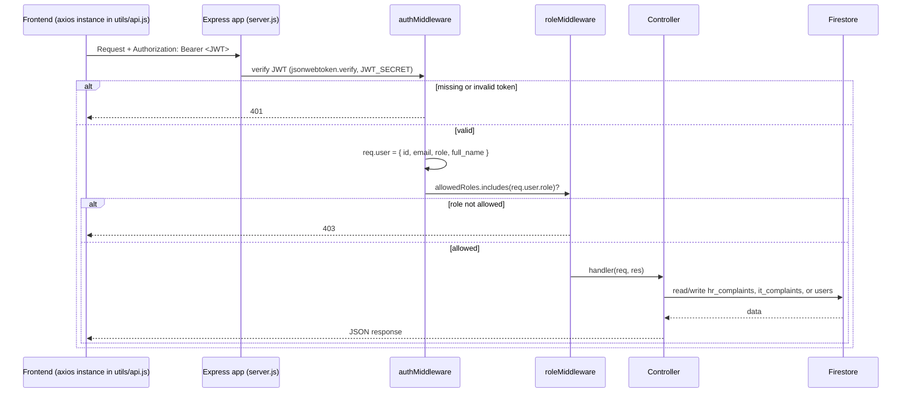
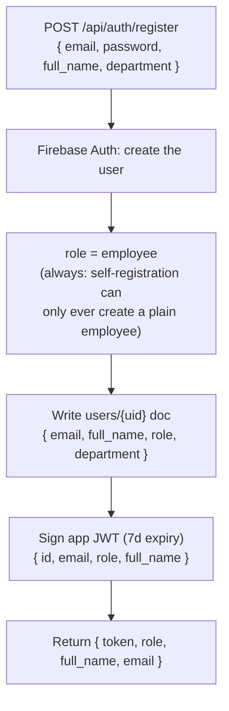
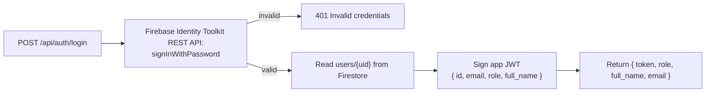
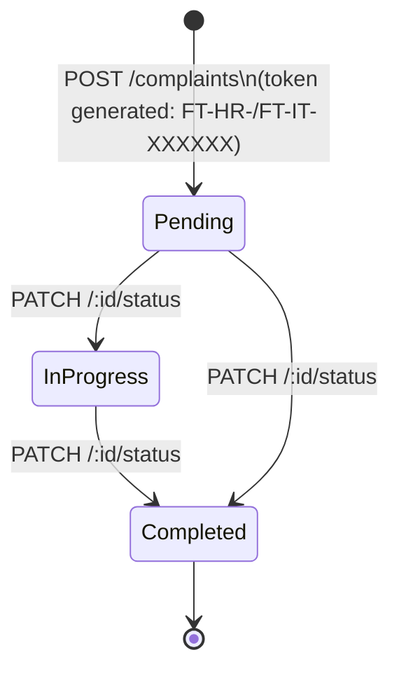
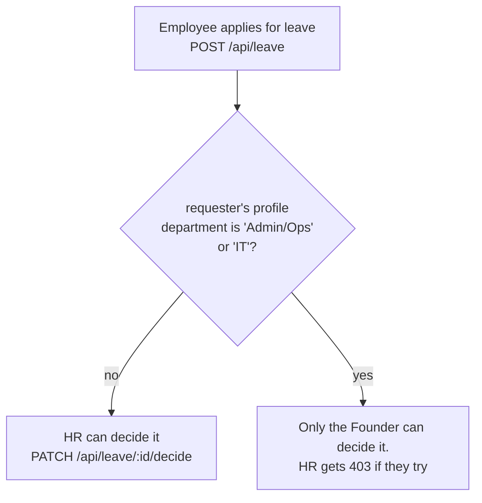
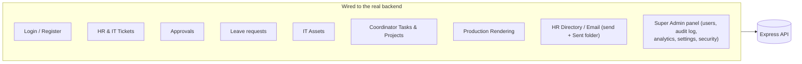
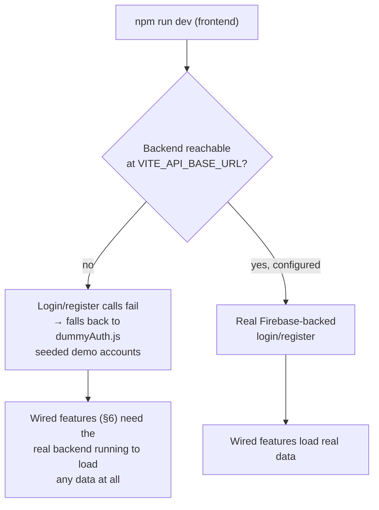

# BACKEND_WORKFLOW.md
# Fute Services: Project Ticket Portal

> This explains what the backend server actually does, what the website (frontend) actually calls on it, and, spelled out on purpose, where the two stop matching up. It's written from the actual code in `main/backend` and `main/frontend/src`, and checked against a real permissions test run during quality assurance (QA) testing.

---

## 1. Request Lifecycle

Every page in the app except the login/registration pages requires a login token to be sent with the request. Any page that's restricted to specific roles (not just "any logged-in person") also runs a role check. This was directly tested during QA, using a stand-in database and real token creation/checking: 22 out of 22 checks passed. That covered a missing token, a broken token, a token signed with the wrong secret key, and every wrong-role combination across HR, IT, and Founder. None of them were able to reach a page they shouldn't have been able to.

## 2. Registration & Role Detection

A person's role used to be guessed from the email address they signed up with (for example, `hr.fute` in the address would grant the `hr` role), which meant anyone could grant themselves a privileged role just by picking a matching email. That has been removed. The `hr`, `it`, `coordinator`, and `founder` roles can now only be granted by an already-logged-in Founder, through a dedicated admin action (or set by hand for the very first Founder account when the system is first set up). Both the registration and login pages now also limit how many attempts can come from the same internet address in a short time, on top of the per-account lockout described below.

## 3. Login

Firebase (the identity and database service this app is built on) can create and manage user accounts, but its admin tools can't check a password directly. So logging in makes a second call to Google's own service to check the password, and once that succeeds, issues the app's own login token from the result:

## 4. Complaint Lifecycle (HR and IT)

This was the original feature connected all the way through, from the website to the database. As section 6 below explains, it's no longer the only one that is.

- Creating a complaint sends an email to the department's mailbox (either HR's or IT's, depending which one it is).
- Updating a complaint's status sends an email back to the person who originally submitted it.
- Both of those emails are sent on a best-effort basis: if sending fails, it's recorded in the logs but doesn't stop the action itself, so submitting a complaint or updating its status still succeeds even if the email server happens to be down.
- How long a complaint has been open ("duration") is calculated once on the server, at the moment it's written, from the complaint's submission date to that moment. It isn't recalculated every time someone looks at it.

Who is allowed to do what:

| Action | Employee | HR | IT | Founder |
|---|:---:|:---:|:---:|:---:|
| Submit an HR or IT complaint | ✅ | ✅ | ✅ | ✅ |
| List all HR complaints | ❌ | ✅ | ❌ | ✅ |
| List all IT complaints | ❌ | ❌ | ✅ | ✅ |
| List own complaints | ✅ | ✅ | ✅ | ✅ |
| Search any complaint by token | ✅ | ✅ | ✅ | ✅ |
| Update HR complaint status | ❌ | ✅ | ❌ | ✅ |
| Update IT complaint status | ❌ | ❌ | ✅ | ✅ |
| List everything, both departments | ❌ | ❌ | ❌ | ✅ |

## 5. Leave and Approval Routing

Leave requests are now handled by a real feature on the backend server (not just something the website pretends to do), and the routing rule shown below is enforced by the server itself, not only suggested by the website's interface.

This matches the equivalent check that already existed in the website's own code, except now it's driven by the requester's actual saved department, rather than a stand-in sample lookup.

## 6. What's Actually Connected to the Backend Right Now

As of August 2026, it would no longer be accurate to describe this app as "almost nothing talks to the backend." Most of it is now genuinely connected, from the website through to the database:

What's still missing is a handful of smaller **HR Desk features**: candidates, interviews, meetings, attendance, feedback, and job postings. Reading data for all of these already works and shows real information. But as of this writing, only the Candidates and Interviews pages can actually create or update records. The Meetings, Attendance, Feedback, and Jobs pages don't yet have that "save" path connected on the website side, even though the backend is already built and ready for them.

## 7. Working Locally Without a Live Backend Server Running

Now that most features are connected (see section 6), this fallback option is narrower than it used to be. It only helps with logging in, not with the features that now genuinely depend on the real backend (tickets, approvals, leave, assets, tasks, rendering, and the HR directory):

This is a deliberate design choice, documented right in the login page's own code, not an accident. It's what allowed the QA testing in the previous phase of this project to run entirely using the local development setup, with no backend server running at all.
