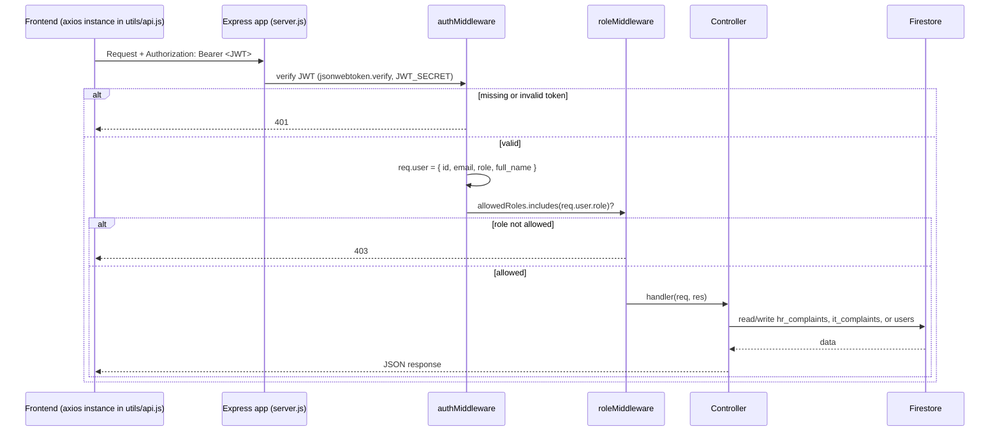
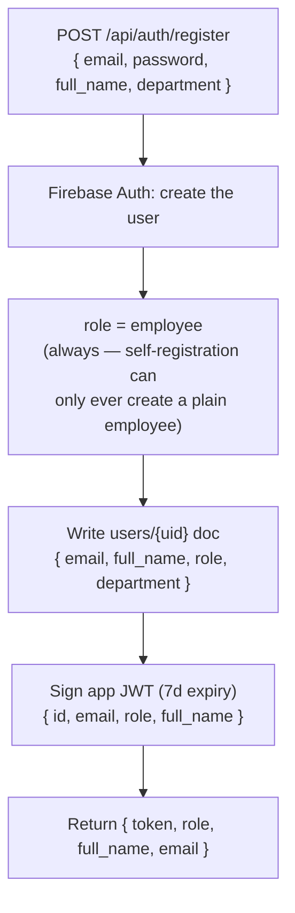
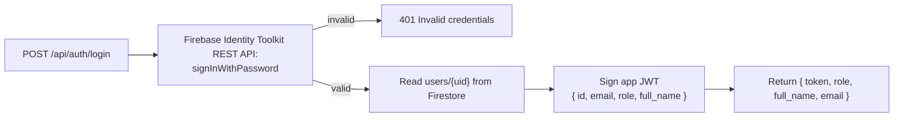
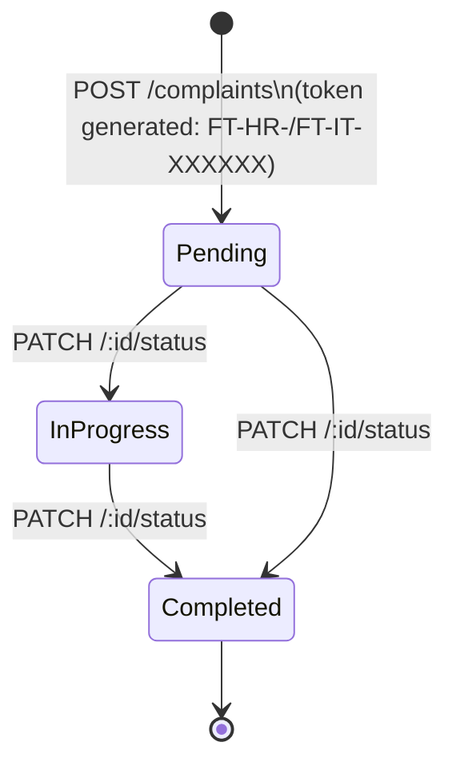
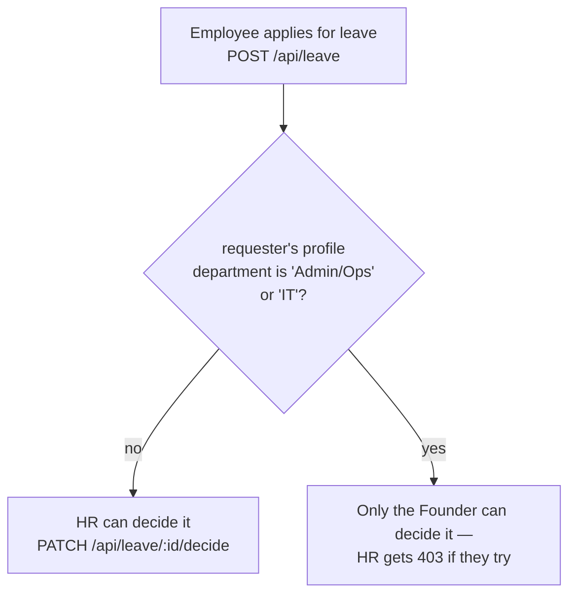
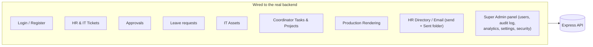
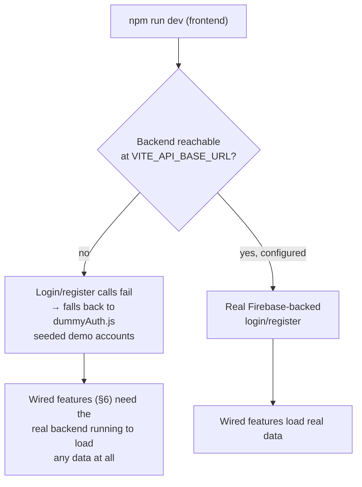

# BACKEND_WORKFLOW.md
# Fute Services — Project Ticket Portal

> What the Express + Firebase backend actually does, what the frontend actually calls, and — deliberately spelled out — where those two stop matching up. Written from the code in `main/backend` and `main/frontend/src`, cross-checked against a live authorization test run during QA.

---

## 1. Request Lifecycle

Every route except `/api/auth/*` requires a bearer token; every route beyond "any authenticated user" also runs `roleMiddleware(...allowedRoles)`. This was exercised directly (stubbed Firestore, real JWT signing/verification) during QA: 22/22 checks passed, covering no token, a malformed token, a token signed with the wrong secret, and every wrong-role combination across HR/IT/Founder — none of them leaked into a handler they shouldn't reach.

## 2. Registration & Role Detection

Role used to be guessed from the caller-supplied email string (`hr.fute` → `hr`, etc.), which let anyone
grant themselves a privileged role by picking a matching email — that's been removed. `hr`/`it`/
`coordinator`/`founder` are now only ever granted by an authenticated founder via `POST /api/founder/users`
(or set by hand for the first founder account). Both `/register` and `/login` are now rate-limited
per-IP (`express-rate-limit`) as well as the per-account lockout described below.

## 3. Login

Firebase's Admin SDK can create/manage users but can't verify a password directly, so login makes a second call to Google's own REST endpoint to check the password, then re-signs the app's own JWT from the result:

## 4. Complaint Lifecycle (HR & IT)

The original feature wired end to end, frontend to Firestore — since §6 below, no longer the only one:

- Creating a complaint emails the department mailbox (`HR_EMAIL` / `IT_EMAIL`) via Nodemailer.
- Updating status emails the original submitter.
- Both emails are best-effort — a mail failure is logged, not thrown, so a submission or status change still succeeds if SMTP is down.
- `duration` is computed server-side once, at write time (`complaint_date` → now), not recalculated on read.

Who can do what:

| Action | Employee | HR | IT | Founder |
|---|:---:|:---:|:---:|:---:|
| Submit an HR or IT complaint | ✅ | ✅ | ✅ | ✅ |
| List all HR complaints | ❌ | ✅ | ❌ | ✅ |
| List all IT complaints | ❌ | ❌ | ✅ | ✅ |
| List own complaints | ✅ | ✅ | ✅ | ✅ |
| Search any complaint by token | ✅ | ✅ | ✅ | ✅ |
| Update HR complaint status | ❌ | ✅ | ❌ | ✅ |
| Update IT complaint status | ❌ | ❌ | ✅ | ✅ |
| List everything, both departments | ❌ | ❌ | ❌ | ✅ |

## 5. Leave & Approval Routing

Now a real backend endpoint (`routes/leaveRoutes.js`, `controllers/leaveController.js`, `leave_requests`
collection) — the routing rule below is enforced server-side in `decide()`, not just client-side:

Mirrors `isFounderApproval()` in the frontend's `LeaveContext.jsx`, now driven by the requester's real
profile `department` field instead of a mock lookup.

## 6. Current Wiring Status

As of 2026-08, this is no longer accurate to describe as "almost nothing calls the backend" — most of
the app is wired end to end (frontend → Express → Firestore):

The remaining gap is the **HR Desk sub-resources** served by `hrDeskController.js`'s generic CRUD
factory (candidates, interviews, meetings, attendance, feedback, jobs) — the `GET` endpoints are wired
and read real data, but as of this writing only the Candidates and Interviews pages actually call
`create`/`update`; Meetings, Attendance, Feedback and Jobs pages still don't have a write path wired up
from their UI even though the backend endpoints exist and are ready.

## 7. Local Development Without a Live Backend

Now that most features are wired (§6), this fallback is narrower than it used to be — it only helps for
auth, not for the now-real-backed features (tickets, approvals, leave, assets, tasks, rendering, HR
directory):

This is intentional and documented in the login page's own source comments, not an accident — it's what let the QA pass in the previous phase of this project run entirely against `npm run dev` with no backend process alive at all.
