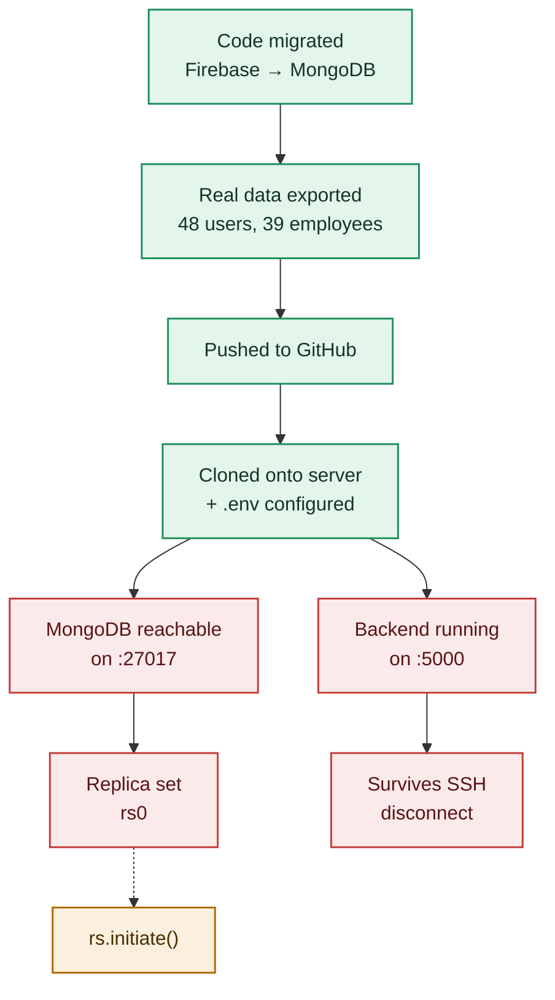

# Deployment Pipeline — Where Things Actually Stand

Every stage of getting Fute Portal running on `192.168.1.23`, and its real, independently-verified status right now, not what was reported, what was actually checked.

Updated 2026-09-04. Checked directly via SSH + `netstat`, not taken on report.

## Pipeline

🟢 Verified working · 🔴 Verified broken right now · 🟡 Blocked, waiting on the step before it

## Stage by stage

| Stage | Status | Note |
|---|---|---|
| Code migrated off Firebase | ✅ Done | 30 backend files, Firestore-shaped shim over MongoDB, bcrypt auth, local file storage. |
| Real data exported | ✅ Done | All 27 collections copied from the live Firebase project into MongoDB. |
| Pushed to GitHub, cloned to server | ✅ Done | `C:\fute-portal-backend`, `.env` configured with the Mongo URL and secrets. |
| MongoDB reachable | ❌ Down right now | Was working reliably for hours. As of the last check, `netstat` on the server itself shows nothing listening on `:27017`, the service isn't up. |
| Replica set (`rs0`) | ⚠️ Blocked on above | Can't run `rs.initiate()`, there's no running MongoDB to connect to yet. |
| Backend reachable on `:5000` | ❌ Down right now | Nothing listening locally on the server either. The scheduled-task/service setup hasn't actually kept it running. |
| Survives SSH disconnect | ⚠️ Blocked on above | Can't verify persistence until the backend is actually up in the first place. |
