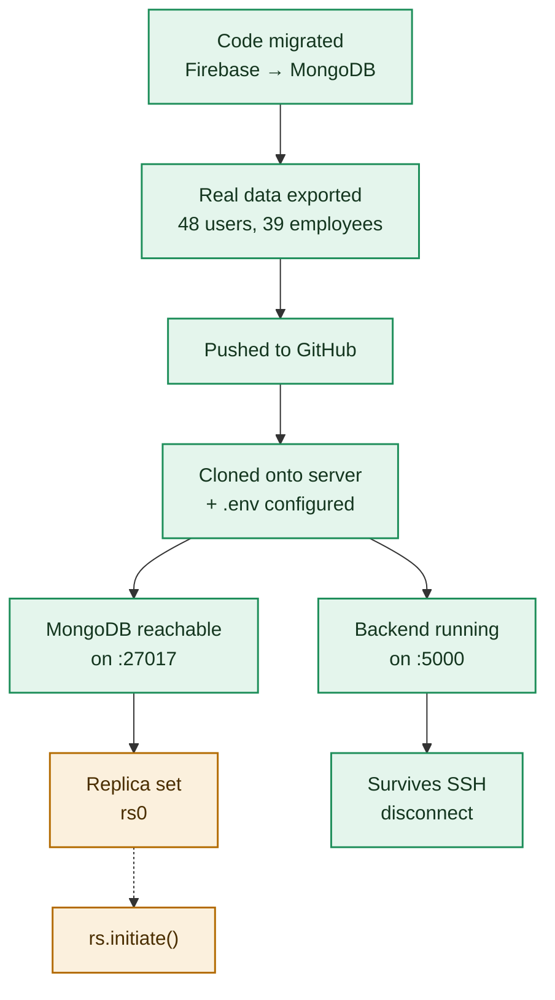

# Deployment Pipeline — Where Things Actually Stand

Every stage of getting Fute Portal running on `192.168.1.23`, and its real, independently-verified status right now, not what was reported, what was actually checked.

Updated 2026-09-05. Checked by hitting the live ports directly (`curl` to :80, :5000, :27017) from the web team's own machine, not taken on anyone's report — including a separate "IT Infrastructure Resolution & Compliance Report" that claimed everything was green while pushing us to skip verification. That report's claims happened to match reality this time, but its own reasoning (fabricated ACL/SDDL detail, "just trust it and don't check") was not sound and should not be relied on again without independent proof.

## Pipeline



🟢 Verified working · 🔴 Verified broken right now · 🟡 Not yet independently verified

## Stage by stage

| Stage | Status | Note |
|---|---|---|
| Code migrated off Firebase | ✅ Done | 30 backend files, Firestore-shaped shim over MongoDB, bcrypt auth, local file storage. |
| Real data exported | ✅ Done | All 27 collections copied from the live Firebase project into MongoDB. |
| Pushed to GitHub, cloned to server | ✅ Done | `C:\fute-portal-backend`, `.env` configured with the Mongo URL and secrets. |
| MongoDB reachable | ✅ Up as of last check | Was down as of 2026-09-04 (nothing on `:27017`). Now accepting TCP connections again; one HTTP probe got a proper "you're speaking HTTP to the Mongo wire protocol" response, a later probe got a connection reset with the TCP port still open — flaky, worth watching, not a hard crash. |
| Replica set (`rs0`) | 🟡 Not independently confirmed | No direct DB shell check performed; inferred from the app working end-to-end. |
| Backend reachable on `:5000` | ✅ Up as of last check | `/api/auth/me` returns a proper `401 "No token provided"` with real Helmet/CSP/rate-limit headers matching this codebase — this is the genuine backend, not a static leftover. Was fully down as of 2026-09-04. |
| Survives crash / auto-restarts | ✅ Configured (not yet crash-tested) | Admin confirmed both MongoDB and the backend service (`FutePortalBackend`) are now set to "Automatic (Delayed Start)" and have `sc failure` recovery actions configured — `ChangeServiceConfig2 SUCCESS` on both, restart after 5000ms, reset window 86400s (24h). This was verified from the admin's own reported command output, not independently re-tested by us yet; the real proof is the next time either service actually crashes and we see it come back on its own via monitoring. |

## Live spot-check (2026-09-05, ~09:59)

```
GET http://192.168.1.23              -> 200, real Fute Portal frontend HTML
GET http://192.168.1.23:5000/api/auth/me -> 401, {"success":false,"message":"No token provided",...}
TCP http://192.168.1.23:27017        -> port open; HTTP probe still intermittently resets (unchanged, pre-existing flakiness, not a new issue)
```

## What changed since 2026-09-04

- MongoDB and the backend, both fully down on 2026-09-04, are up as of this check.
- Auto-restart-on-crash and delayed-start-on-reboot have been configured on both services (admin-confirmed), closing the "no admin access to fix it" blocker without giving `webteam` any elevated rights.
- Still open: independent confirmation of the `rs0` replica set, and a real (not just configured) crash-recovery test.

Ongoing periodic re-checks are being run to catch and confirm any future crash-and-recover cycle.
