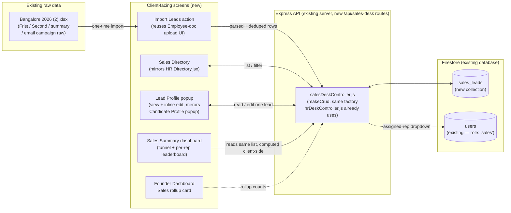

# Fute Services Sales Desk: Implementation Plan

A build plan for a new Sales module, mirroring how the HR Desk module (Directory, roles, Firestore collections, approval/reporting patterns) is already built and shipped in this app. Grounded directly against the real working file (`Bangalore 2026 (2).xlsx`, 7 sheets) rather than a guessed shape.

**Status:** Parts 1–2 (role, `sales_leads`, import, Directory, Overview stats, Founder rollup) are **shipped**. Part 3 below is planning only, no code written. **Scope:** Sales, Founder. **Prepared:** 31 Aug 2026. **Corrected:** 31 Aug 2026 — the first pass under-checked deep rows in two sheets; see the correction note below. **Extended:** 31 Aug 2026 — Part 3 added, matching a reference CRM (screenshots) the user is standardizing the full sidebar against.

Throughout this document, items are labeled: **Already exists (reuse)**, **New build**, or **Decision needed first**.

> **Correction, made before any code was written:** the first version of this document reported `Frist` as "997 companies." That number was the sheet's raw *dimensioned* row count (Excel keeps formatting reserved past the last real row) — not real data. Checked row-by-row, `Frist` actually contains **231 real companies** (data stops at row 233; rows 234–997 are genuinely blank). The same check found `email campaign raw`'s real count is **231** (not 1,006), and that `Pivot Second` is **not** empty — it holds a real cached pivot table, useful as a cross-check. All figures below are the corrected, row-verified ones.

## What the Real Data Actually Looks Like

The workbook was opened and read sheet-by-sheet, checking every row (not just the first few) before writing this plan.

| Sheet | Real rows | What it is |
|---|---|---|
| `Frist` | 231 companies | The master cold-call list — one row per company: Name, Title/Designation, Contact Person, Address (2 lines), City/PIN/State, Tel(O), Mobile, Email. It also carries its own `Call Status`/`Comments` columns, filled in on 30 and 11 rows respectively — an earlier, coarser round of tracking using short codes (`DNP`, `Positive`) that predates `Second`'s fuller tracking. |
| `Second` | 245 unique companies (246 rows — one company appears twice) | The working call-tracking sheet: Status, Assigned to, Comment, Last/Next call date, "Given to Sales" flag. **Only 165 of these 245 companies (67%) are also in `Frist`** — the other 80 were sourced independently (referrals, a rep's own outreach), not drawn from the master list. |
| `Moving to sales team` | 231 unique companies | Not a third, separate source — every one of its 231 companies is also found in `Second`. This is a working copy/subset of `Second` (possibly the point-in-time snapshot handed to the sales team), not new leads. Its one unlabeled extra column has only a single non-blank value seen (`"U"`) — meaning undocumented in the sheet itself. |
| `summary` | 11 real rows | Not raw data — a hand-typed status funnel plus a free-text "Meetings Arranged" log with notes per company. |
| `email campaign raw` | 231 rows | Name, Title, Contact Person, Email — confirmed to be exactly `Frist`'s own 231 companies with only those four columns kept. Not an independent list. |
| `First Pivot` | 0 rows | Genuinely empty — an Excel PivotTable with no cached values. Safe to ignore. |
| `Pivot Second` | 20 rows | **Not empty** — a real cached pivot of `Second`'s status funnel. Cross-checked against `Second`'s own status column and it matches exactly (Grand Total 246), plus it names one rep (`Gaurav`) and a "Yet to be assigned: 150" bucket not otherwise obvious from `Second` alone. Useful as a validation reference during import, not an additional data source. |

**The real universe of companies is 311 unique** — the union of `Frist` (231) and `Second` (245), overlapping on 165. Every real status value in use across `Second`/`Moving`: **Contacted (13), Did Not Pick (111), Invalid (15), Not Interested (13, split across two inconsistent casings), Details Shared (1), Requested Call Back (17), Meeting Arranged (6), Lost (3)**, plus 67 blank rows meaning "Yet to be Called." **Seven real reps** appear across the sheets, not four: **Akshay, Sarath, Punit, Umashree, Shareen, Bhavya, Gaurav**.

## Part 1: Core Lead Management (new module, mirrors HR's Directory)

### 01. Sales role and access

1. **(Already exists, extend)** A `sales` role already exists in the codebase (`HOME_FOR_ROLE.sales` in `AuthContext.jsx`, `DEPARTMENT_ROLES` in `App.jsx`) — but only as one of five "demo" department roles pointing at a generic illustrative dashboard with no real backend. This plan turns it into a real, fully-backed role: same flat role, not per-rep permissions. Reps (Akshay, Sarath, Punit, Umashree, Shareen, Bhavya, Gaurav) would each get a normal login with `role: 'sales'`, the same self-registration-then-Founder-grants-the-role pattern already used for HR/IT/Coordinator. **(New, small)** `sales` also needs adding to Super Admin's `EDITABLE_ROLES` list (`SuperAdminUsersPage.jsx`) — it's missing there today, so nobody can actually be granted this role from the UI yet.
2. **(Reuse)** Reuse the existing role-gating middleware (`roleMiddleware.js`) and the Founder's "grant a role" screen — no new access-control mechanism needed.

### 02. The `sales_leads` collection (new)

3. **(New build)** One new Firestore collection, `sales_leads` — one document per company/contact, consolidating what's currently split across the `Frist` master sheet and the `Second` tracking sheet into a single record:

   | Field | Source in the Excel file |
   |---|---|
   | `companyName` | `Frist`."NAME OF THE COMPANY" |
   | `contactTitle`, `contactName`, `designation` | `Frist`."Title" / "NAME OF THE PERSON" / "DESIGNATION" |
   | `address1`, `address2`, `city`, `pin`, `state` | `Frist`.ADD1/ADD2/CITY/PIN/STATE |
   | `phone`, `mobile`, `email` | `Frist`.TEL(O)/MOBILE/E-MAIL |
   | `status` | `Second`.Status (enum below) |
   | `assignedTo` | `Second`."Assigned to" |
   | `comments` | `Second`.Comment |
   | `lastCalledDate`, `nextCallDate` | `Second`."Last called Date" / "Next call Date" |
   | `meetingNotes` | `summary` sheet's free-text "Meetings Arranged" log, per company |
   | `source` | fixed value on import, e.g. `"Bangalore 2026"` — so leads from a future city list (Chennai, Pune, …) stay distinguishable in the same collection |
   | `importRowNo` | `Frist`/`Second`."Sl. No" — kept so a row can always be traced back to its exact place in the original file |
   | `importFlag` | `Moving to sales team`'s unlabeled last column, kept as-is (not dropped) since its meaning isn't documented anywhere in the sheet — flag for the sales team to clarify before deciding whether it drives any logic |
   | `created_at` / `updated_at` / `lastUpdatedBy` | same audit-field convention already used on `candidates` |

4. **(Decision needed first)** Finalize the `status` enum. Recommendation, based on what's already in the sheet: `Yet to be Called` (default/blank), `Contacted`, `Did Not Pick`, `Invalid`, `Not Interested`, `Details Shared`, `Requested Call Back`, `Meeting Arranged`, `Lost`, plus a new terminal state not yet in the sheet, `Converted`, for when a meeting actually turns into a client.
5. **(Reuse)** Reuse the exact `makeCrud` factory pattern from `hrDeskController.js` (list/create/update/delete against one collection, bounded reads, `lastUpdatedBy` tracking) for `sales_leads` — no new CRUD mechanism needs to be invented, it's the same shape HR's `candidates`/`employees` already use.

### 03. Bulk import from the existing Excel file

6. **(New build)** An "Import Leads" action (HR/Founder- and Sales-manager-facing), reusing the file-upload pattern already built for Employee Document uploads (`multer` on the backend). The uploaded `.xlsx` is parsed server-side and mapped into `sales_leads` docs.
7. **(New build, small)** Import logic dedupes on normalized `companyName` (+ `mobile` as a tiebreaker): a row that already exists gets its `status`/`assignedTo`/`comments`/call dates updated from the newer file rather than creating a duplicate lead. This matters because `Frist` (231 companies) and `Second` (245 companies) only overlap on 165 of them — the other 80 in `Second` are genuinely new companies, not the same list at an earlier stage (see the Migration Note below for the exact split).
8. **(Decision needed first)** Whether the first import run should be exactly this file (`Bangalore 2026 (2).xlsx`) done once by hand from the HR/Sales screen, or whether it's worth scripting a one-time migration script instead. For a single ~1,000-row file, doing it once through the built UI is simpler and doubles as the first real test of the import feature.

### 04. Sales Directory screen (new frontend, mirrors `Directory.jsx`)

9. **(New build)** `pages/sales/Directory.jsx` — same shape as HR's Directory: a searchable/filterable list (search by company/contact/city, filter by status and by assigned rep) plus a Lead Profile popup on click, matching the popup pattern already redesigned for HR (view mode with all details, an Edit pencil button that flips the same card into inline-editable fields, Save/Cancel).
10. **(Reuse)** Reuse `SalesDeskContext` (a new context, but copying `HrDeskContext`'s exact shape: one shared fetch on mount, `leads`/`setLeads`/`refreshLeads`, role-gated the same way) instead of each screen fetching its own copy.
11. **(New build)** "Assign to" dropdown sourced from real `sales` role users (reuse the Founder's existing user-list endpoint, filtered to `role === 'sales'`), instead of a hardcoded rep list — so it stays correct as reps are added or leave.

## Part 2: Pipeline, Meetings & Reporting

### 05. Meeting tracking

12. **(Decision needed first)** Whether a meeting is a couple of fields directly on the lead (`meetingDate`, `meetingNotes` — enough for the current one-meeting-then-converts-or-not flow visible in the `summary` sheet's log) or a separate `sales_meetings` collection (needed only if a single company can have several meetings tracked over time, e.g. first meeting → follow-up meeting). The real data today shows simple one-line notes per company ("meeting fixed for 7th feb", "meeting done with owner... asked to meet son"), which fits the simpler on-lead fields.
13. **(New build)** Once decided, a "Log Meeting" action on the Lead Profile that sets `status: 'Meeting Arranged'` and records the date/notes — same interaction shape as HR's inline Leave/Performance "Save" pattern already built.

### 06. Summary dashboard (new, mirrors Founder's reporting cards)

14. **(New build)** A status-funnel card set (Yet to be Called / Contacted / Meeting Arranged / etc. counts) — this is exactly what the `summary` sheet's hand-typed status table already does manually; the new dashboard makes it live instead of a snapshot someone has to recount by hand.
15. **(New build)** A per-rep leaderboard (leads contacted, meetings arranged, this month) — straightforward now that `assignedTo` and `status` live on real records instead of a spreadsheet column.
16. **(Reuse)** Reuse `recharts` (already a dependency, already used in Founder's reporting views) for the funnel/leaderboard charts — no new charting library needed.

### 07. Email campaign export

17. **(New build)** A filtered CSV export button (Name, Title, Contact, Email — the exact shape of the `email campaign raw` sheet), reusing the CSV-export pattern already built for Super Admin Analytics (`exportAnalyticsCsv`, `responseType: 'blob'`) rather than inventing a new export mechanism.

### 08. Founder oversight

18. **(New build, small)** A "Sales" rollup card on the Founder Dashboard (leads contacted this month, meetings arranged, active reps) — same visual pattern as the existing HR Portal rollup grid (Employees / Pending sign-off / Leave taken / Extra hours cards) already on that dashboard.

## System Architecture: How This Plugs Into What's Already Running

- A solid connection means real data flows there today (once built) — the same request/response shape already proven by HR's `/api/hr-desk` routes.
- A dotted connection is a read used only for display context (the rep dropdown, the Founder's rollup numbers), not a new data-ownership relationship.
- Nothing here is invented from scratch: every client screen, backend pattern, and data-access rule listed above already exists in this codebase for HR/Candidates and is being reused, not rebuilt, for Sales.

## Migration Note, Specific to This File

Every sheet in the workbook needs to be accounted for, and — now that the real counts are known — **`Second` is not a strict subset of `Frist`**, so the import can't just overlay one onto the other. It has to build a true union:

- Start from `Frist`'s 231 companies. Every one becomes one `sales_leads` doc, including the ~30 that already have a `Call Status`/`Comments` value on this sheet itself — those get their old short codes mapped into the new enum (`DNP` → `Did Not Pick`, `Positive` → `Contacted`, and so on) rather than imported as literal unrecognized values.
- Match each of `Second`'s 245 companies against that set by normalized company name. **165 of them (67%) match** a `Frist` company — for those, `Second`'s status/assignment/comments/dates overwrite whatever coarser status `Frist` itself had, same record. **The other 80 don't match anything in `Frist`** — they become brand-new `sales_leads` docs sourced only from `Second` (company name, promoter/contact name, mobile, status, assignment — `Second` never carried the fuller address/email detail `Frist` has, so those fields stay blank for these 80 until someone fills them in).
- `Moving to sales team` needs no separate handling — every one of its 231 companies is already inside `Second`, so it's fully covered by the step above. Its one unlabeled column imports into `importFlag` (see field table above) on the matching lead, not dropped, since its meaning isn't written down anywhere in the source file.
- End state: **311 total `sales_leads` docs** — 151 `Frist`-only (231 − 165 + a handful of `Frist`-side near-duplicates) at "Yet to be Called," 165 with both master-list detail and real tracking history, and 80 tracking-only leads with thinner contact detail.
- `Pivot Second`'s cached funnel (Grand Total 246, matching `Second`'s own row count) is a good post-import sanity check — after import, the new Summary dashboard's counts should reconcile against these once `Second`'s 246 rows (245 unique + 1 duplicate) are accounted for, not against `Frist`'s or the union's totals.
- `summary`'s hand-typed funnel counts and meeting-notes log aren't imported as data — they're exactly what the new Summary dashboard (step 14) and Lead Profile's `meetingNotes` field replace going forward. The specific meeting notes already logged there (Aisshwarya Group, Ajmera, Anika Developers, Concorde, …) should be copied into the matching lead's `meetingNotes` field by hand during import, since they're free text tied to a company name, not a column that lines up mechanically with the other sheets.
- `email campaign raw` needs no import path at all — confirmed to be exactly `Frist`'s 231 companies with only Name/Title/Person/Email kept. Once `sales_leads` exists, the email-campaign export (step 17) reproduces it live from real data.

## Part 3: The Full CRM Sidebar (Dashboard, Daily Calls, Follow-ups, Meetings, Pipeline, Campaigns, Reports, Settings)

Parts 1–2 above are shipped: the `sales` role, `sales_leads`, the Excel import, a Directory (view/edit lead popup), an Overview page (funnel + rep leaderboard), and a Founder rollup card. The user then pointed at a reference CRM (fute-sales-marketing-crm, 3 screenshots: sidebar, Dashboard, Priority-leads/Team-activity/Today's-schedule) and asked for the same sidebar structure and Dashboard depth, in our own theme, on our own data. Read with 10+ years of sales-ops eyes, not just an engineering one — a few things in that reference aren't UI polish, they're basic CRM fundamentals our schema doesn't have yet. Those come first, because every later section depends on them.

### 09. Schema gaps a sales manager would flag immediately (decision needed first)

The reference tracks money and urgency in a way `sales_leads` currently can't:

1. **Deal value.** "Revenue closed ₹11.4L", "Monthly target ₹40L", every pipeline stage's "₹42L / ₹35L / ₹24L" — none of this is possible without a rupee value per lead. **New field: `dealValue` (number)** on `sales_leads`. Real estate cold-calling leads (this data's actual domain) don't have a closed-won amount until a unit is booked — so this starts blank/zero for imported leads and gets filled in as a deal firms up, same as HR's `leaveTaken` pattern: HR-editable, not auto-computed.
2. **Lead temperature, separate from call status.** The reference's "Hot / Warm / Cold" badge is a priority judgment call a rep makes ("how likely is this to close"), completely different from our `status` field (which tracks "where is this in the call cycle" — Did Not Pick, Contacted, etc.). Conflating them would be a real mistake — a lead can be freshly "Contacted" and still be "Hot." **New field: `priority` (`Hot` / `Warm` / `Cold`, default `Warm`)**, independent of `status`.
3. **Source, as a real per-lead field, not an import label.** Right now `source` is hardcoded to `"Bangalore 2026"` on every imported lead. The reference's Source column (Referral, Existing Client, Outbound, Campaign, Email) is what actually tells a sales manager which channel is producing quality pipeline — worth reporting on. **Change:** make `source` editable per-lead from the Lead Profile (already a field on the record — Part 1 just never exposed it to editing), with those five values as the suggested set (same datalist-of-existing-values pattern already used for `assignedTo`, not a hard enum).
4. **A place to set the monthly target.** The donut ("29% achieved," "₹40L target") needs a target number to compare against — there's no such number anywhere today. **New, small: a `sales_settings` document** (one doc, same shape as Super Admin's existing `system_config` settings doc) holding `monthlyRevenueTarget` and, for the Team Activity section, a `dailyCallTargetPerRep`. Editable from the new Settings screen (§18), read by Dashboard and nowhere else.
5. **A real notion of "a call happened," not just "status changed."** "Calls today: 146 of 200," and each rep's "58 calls · 88%" on Team Activity, need to count actual call events — inferring "a call happened" from `updated_at` matching today is fragile (an HR-style bulk edit or a re-import would inflate the count). **New: append a `callLog` entry — `{ at: timestamp, by: repName, outcome: status }` — inside each lead's own doc every time its status changes via a "Log Call" action** (a small array field, not a new collection — one lead rarely accumulates more than a handful of calls, so this stays well within Firestore's per-document size limits and avoids an N+1 query to reconstruct "what happened today" across 300+ leads).

None of this is a breaking change to what's shipped — `dealValue`/`priority` are additive fields (blank/default for existing leads), and `callLog` only starts recording from the point this ships forward (existing `lastCalledDate`/`comments` data isn't retroactively backfilled into it, and doesn't need to be — Dashboard's "calls today" is a going-forward metric).

### 10. Dashboard (redesign of the shipped Overview.jsx)

Rebuilt to match the reference's actual layout, our theme (dark background, card borders, orange accent — not the reference's white/blue), our real data:

1. **(New build)** Top stat row — Calls Today (from today's `callLog` entries across all leads, count + "of `dailyCallTargetPerRep` × active reps target"), New Leads (leads with `created_at` today/this month), Meetings (count with `meetingDate` set, "X completed" = those already past with an outcome), Revenue Closed (`sum(dealValue)` where `status === 'Converted'` this month, "of `monthlyRevenueTarget`").
2. **(New build)** Follow-ups banner — "N follow-ups need your attention, X overdue and Y due today" — computed live from `nextCallDate <= today`, linking into the new Follow-ups screen (§13), exactly like the reference's orange banner.
3. **(Reuse, restyle)** Sales pipeline stage bars — already have the funnel bar chart from Part 2; extend each stage with its `sum(dealValue)` and a conversion-from-previous-stage % next to the bar, matching the reference's "₹42L · 76% conversion" pattern.
4. **(New build)** Monthly target donut — `sum(dealValue)` where `Converted` this month, against `sales_settings.monthlyRevenueTarget`, plus a naive forecast (current run-rate × days remaining in month / days elapsed) — the reference's "Forecast ₹26.8L · 67% of target" line.
5. **(New build)** Priority Leads table — top leads by `priority === 'Hot'`, sorted by soonest next activity (`min(nextCallDate, meetingDate)`), same columns as the reference (Company & Contact, Source, Owner, Lead Status badge, Deal Value, Next Activity) — reusing the existing Lead Profile popup on row click instead of a separate detail view.
6. **(New build)** Team Activity — per rep, today's `callLog` count vs `dailyCallTargetPerRep`, as a progress bar ("58 calls · 88% · On track" / "41 calls · 63% · Needs focus" — the "needs focus" label is just `< 70%` of target, a reasonable default a sales manager can later tune from Settings).
7. **(New build)** Today's Schedule — a merged feed of everything due today: calls (`nextCallDate === today`) and meetings (`meetingDate === today`), sorted by time, each linking into the relevant lead.

### 11. Leads (already shipped as Directory — extend, don't rebuild)

1. **(New, small)** Add `dealValue`, `priority` (Hot/Warm/Cold selector), and make `source` an editable field (datalist-suggested) to the existing Lead Profile edit form and card badges — the Directory itself, its search/filter, and the view↔edit toggle pattern stay exactly as shipped.
2. **(New, small)** A `priority` filter pill row alongside the existing status pills, so "show me all Hot leads" is one click, matching how the reference's Priority Leads table is really just "Directory, pre-filtered to Hot."

### 12. Daily Calls (new)

1. **(New build)** A rep-focused worklist: leads where `nextCallDate === today` OR newly imported/assigned with no `callLog` entry yet, one row each, ordered by priority then by whoever hasn't been called longest.
2. **(New build)** A one-click "Log Call" action per row — a small inline form (outcome dropdown from the `status` enum, optional comment, optional next-call date) that updates the lead's `status`, appends the `callLog` entry, and clears it off today's worklist — this is the single highest-leverage screen for a cold-calling operation, since it's the one reps live in all day; the full Lead Profile popup (with address, email, full history) is one click away for when more context is needed, not the default view here.
3. **(Reuse)** Everything here writes through the same `PATCH /api/sales-desk/leads/:id` endpoint Directory already uses — no new backend resource, just a purpose-built frontend view over it.

### 13. Follow-ups (new)

1. **(New build)** Leads where `nextCallDate <= today`, split into two sections — **Overdue** (`nextCallDate < today`, shown first, visually flagged) and **Due Today** — sorted soonest-overdue-first within each, matching the reference's "3 overdue, 5 due today, prioritise the hot leads first" framing (secondary sort: `priority === 'Hot'` first).
2. **(New build, small)** The sidebar's own "8" badge (seen on the reference's Follow-ups nav item) — a live count of this same query, computed once in `SalesDeskContext` from the already-loaded `leads` list (no extra request) and passed down to `SalesLayout`'s nav.

### 14. Meetings (new)

1. **(New build)** List of leads with `meetingDate` set, tabbed Upcoming (`meetingDate >= today`) / Past (`meetingDate < today` with no outcome recorded yet — a nudge to close the loop, since an unresolved past meeting is a lead quietly going cold).
2. **(New build, small)** A "Log Outcome" action after a past meeting — moves `status` to `Converted` or back to an earlier stage (e.g., `Requested Call Back` for a follow-up meeting needed), same underlying update as everywhere else.

### 15. Pipeline (new — kanban board)

1. **(Decision needed first)** The reference's 5 kanban columns (New leads → Contacted → Meeting → Proposal → Closure) are coarser than our 10-value `status` enum (which also carries operational detail like `Did Not Pick`/`Invalid`/`Not Interested` that doesn't belong on a deal-stage board). Recommendation: don't add a second stored field — **derive a `stage` grouping from `status` in the frontend** (`Yet to be Called`/`Did Not Pick`/`Invalid` → *New leads*; `Contacted`/`Not Interested` → *Contacted*; `Meeting Arranged` → *Meeting*; a new `Proposal` status value slotted into the enum → *Proposal*; `Converted`/`Lost` → *Closure*). Keeps one source of truth instead of two fields that can drift out of sync.
2. **(New build)** A column-per-stage board, cards showing company/contact/`dealValue`/priority dot, click-to-advance (or drag) moves the lead to the next stage's representative `status` — writes through the same update endpoint.

### 16. Campaigns (new)

1. **(New build)** A new, small `sales_campaigns` collection — `{ name, sourceTag, targetCity, sentDate, createdBy }`. Not a mass-email sending system (that's a materially bigger, separate build — SMTP sending at list scale, unsubscribe handling, deliverability); this tracks campaigns as records and reuses the CSV email-campaign export already shipped (§17 in Part 2) as the actual send mechanism outside the app, the same honest boundary this plan already drew around the Zoho payslip tool elsewhere in this codebase's other build plan.
2. **(New build, small)** Response rate shown per campaign — `count(leads where sourceTag matches AND status not in ['Yet to be Called','Invalid']) / count(leads where sourceTag matches)`, computed client-side from the already-loaded lead list, no new backend aggregation needed.

### 17. Reports (new)

1. **(Reuse, extend)** Everything Overview (§10) already computes, plus: a conversion-funnel-over-time line chart (reuse `LineChartCard`, already in `components/charts.tsx`) bucketed by week/month using each lead's `callLog` timestamps, and a win/loss reasons breakdown once `Lost` leads start carrying a reason (**decision needed first**: reuse the exact `rejectionReason`-as-enum-not-freetext pattern already established for HR's Candidates module, rather than inventing a new approach).
2. **(New build, small)** A date-range picker (reuse the pattern from Super Admin Analytics' own date-range export) so "this month" from Dashboard can become "last quarter" here without duplicating every chart.

### 18. Settings (new)

1. **(New build)** Edit `sales_settings.monthlyRevenueTarget` and `dailyCallTargetPerRep` — the two numbers §09 introduced — same "one settings doc, HR/Founder-editable" shape as Super Admin's existing System Settings screen, scoped to `sales`/`founder` instead.
2. **(Reuse)** A read-only rep roster (users where `role === 'sales'`) for visibility into who's active — actually granting/revoking the `sales` role stays on Super Admin's Users page (already extended in Part 1), not duplicated here.

Grounded against the real `Bangalore 2026 (2).xlsx` file, the current codebase, and the reference CRM screenshots on 31 Aug 2026. No code was written or changed in producing this plan.
