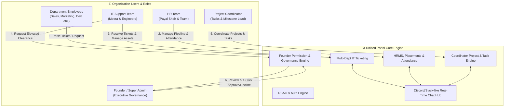
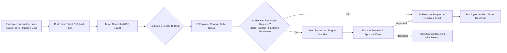
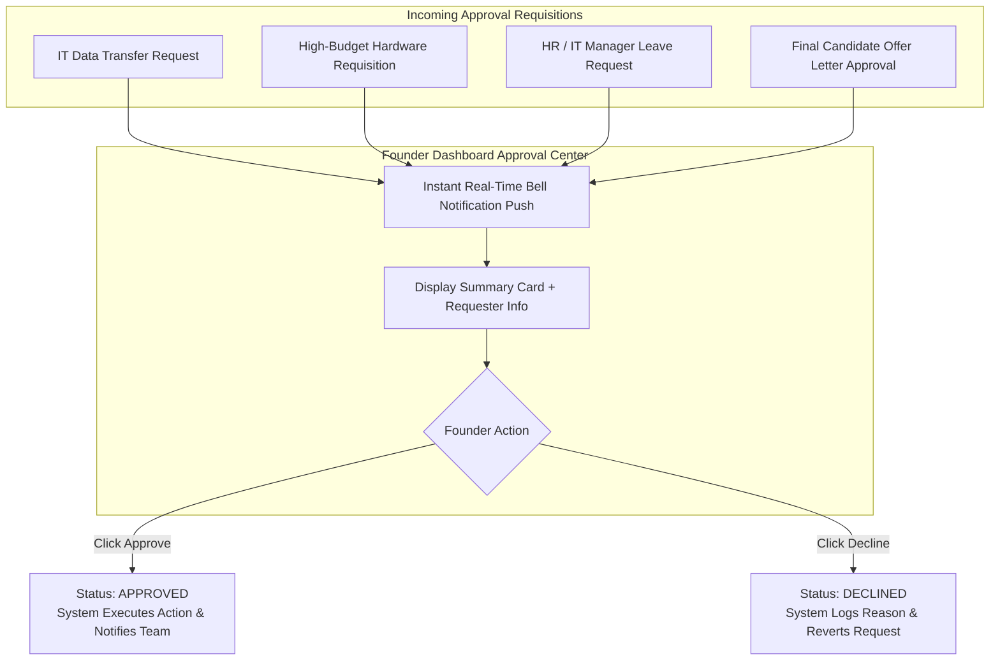
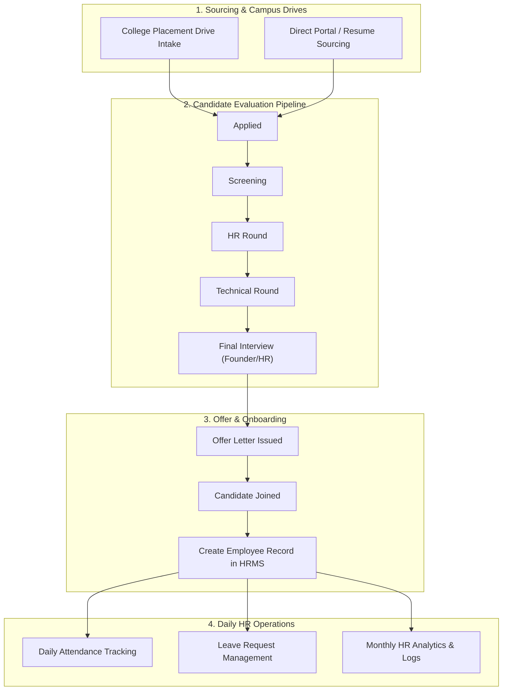
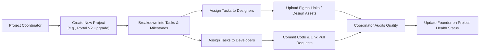
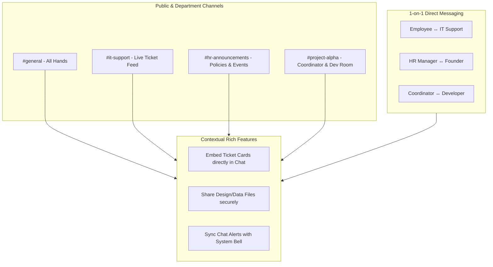

# Enterprise Portal: System Architecture, Workflows & Master Blueprint

> **Document Version**: 2.0  
> **Last Updated**: August 6, 2026  
> **System Purpose**: Unified Enterprise Operating System connecting **Multi-Department Employees**, **IT Service Desk**, **HRMS Operations**, **Project Coordinator Hub**, **Founder Governance**, and a **Real-Time Slack/Discord-like Collaboration Center**.

---

## 1. Executive Vision & Core Objectives

The portal serves as the single source of truth for the entire organization. It is designed to streamline operations, eliminate administrative bottlenecks, and establish real-time cross-departmental accountability:

1. **Multi-Department IT Ticketing System**: Every employee across any department (Sales, Marketing, HR, Engineering, Finance, Operations) can instantly raise an IT ticket when encountering technical, hardware, software, or network issues. The IT Desk receives instant notifications, tracks SLA compliance, manages hardware assets, and resolves issues.
2. **Founder Approval & Governance Engine**: Critical decisions—such as data transfers, high-budget hardware requisitions, HR/IT department head leave requests, and final candidate offers—are routed directly to the Founder's Dashboard for 1-click **Approve** or **Decline**.
3. **HRMS & Campus Recruitment Engine**: HR manages employee attendance, campus placement drives, candidate follow-up pipelines, interview scheduling, leave approvals, and analytical HR reports.
4. **Project Coordinator Workspace**: Coordinators sit at the intersection of the Founder, Designers, and Developers. They manage project creation, task assignments, milestone tracking, and technical asset allocation.
5. **Real-Time Discord/Slack-like Communication Hub**: Integrated chat channels (`#general`, `#it-support`, `#hr-announcements`, `#project-alpha`) and direct messaging where teams share tickets, files, data, and updates transparently.

---

## 2. Current Implementation Progress Report

| Module / Component | Status | Key Features Delivered |
| :--- | :--- | :--- |
| **Authentication & RBAC** | ✅ Completed | Demo login for Founder, HR Manager, IT Engineer, Project Coordinator, and Employee roles. |
| **IT Service Desk** | ✅ Completed | Single-screen compact view, Tickets Queue, Approval Center, Data Transfer Requests, Assets Breakdown, SLA Compliance tracking. |
| **HRMS Operations** | ✅ Completed | Employee Directory, Candidate Pipeline, Campus Interviews, Leave Management, Attendance Tracking, Meetings Calendar, HR Reports. |
| **Founder Executive Dashboard** | ✅ Completed | Top 6 Key Metrics row, HR Overview split, IT Overview split, Today's Schedule timeline, Weekly Attendance bar chart, Recruitment Funnel, IT Donut charts, 1-Click Quick Actions. |
| **Design System & UX** | ✅ Completed | Sleek dark mode (`#09090b`), Uppercase monospace typography, Handcrafted compact cards, Zero-scroll single viewport optimization (`h-screen overflow-hidden`). |
| **Real-Time Team Chat (Slack/Discord)** | 🚀 Planned (Next) | Channel creation, Direct Messaging, Ticket linking, File attachment, Notification badges. |

---

## 3. Comprehensive Role Workflows & Interactions

### 3.1 Multi-Department Employees (Ticket Raising)
- **Trigger**: Computer crash, VPN failure, software access request, or hardware fault in any department.
- **Action**: Employee clicks **"New Ticket"** on their interface.
- **Payload**: Subject, Category (Hardware, Software, Network, VPN, Data), Priority (Low, Medium, High, Critical), Description.
- **Routing**: Instant notification pushed to the **IT Service Desk Queue** and relevant Slack/Discord `#it-support` channel.

### 3.2 IT Department (Issue Resolution & Asset Management)
- **Ticket Lifecycle**: `Open` → `In Progress` → `Waiting for Approval` (if needed) → `Resolved` / `Closed`.
- **Founder Permission Ping**: If an IT request requires elevated security clearance or budget (e.g. Server Data Backup Transfer or Laptop Requisition), IT clicks **"Request Founder Approval"**.
- **Asset Control**: Tracks laptops, desktops, servers, switches, and printers. Next maintenance schedules alerted automatically.

### 3.3 HR Department (Talent, Attendance & Placements)
- **Recruitment Pipeline**: Sourcing → Screening → HR Round → Technical Round → Final Interview → Offer Sent → Joined.
- **Campus Placement Drives**: College candidate intake tracking, interview follow-ups, automated status badges.
- **Leave Governance**: HR approves leaves for all employees. Leaves requested by HR/IT leads automatically route to the Founder.

### 3.4 Project Coordinator (Design, Dev & Founder Synchronization)
- **Project Setup**: Creates multi-disciplinary projects, assigns milestone deadlines.
- **Task Delegation**: Assigns specific tasks to Designers and Developers with priority tags.
- **Resource Tracking**: Monitors code commits, design link drops, and asset availability.

### 3.5 Founder (Super Admin & Approval Authority)
- **Global Overview**: Real-time status of HR pipeline, IT health, server uptime, and active project tasks.
- **Approval Queue**: Single-click **Approve** or **Decline** for elevated leave requests, data transfers, IT purchases, and offer letters.

---

## 4. Mermaid Flowcharts & Architecture Diagrams

### Diagram 1: High-Level System Architecture & Cross-Department Integration

---

### Diagram 2: Multi-Department IT Ticketing & Escalation Flowchart

---

### Diagram 3: Founder Approval & Permission Governance Flowchart

---

### Diagram 4: HR Recruitment, Campus Placement & Attendance Flowchart

---

### Diagram 5: Project Coordinator & Team Collaboration Flowchart

---

### Diagram 6: Discord/Slack-like Real-Time Communication Hub Architecture

---

## 5. Next Steps & Implementation Roadmap

1. **Integrated Multi-Department Ticket Modal**: Enable any logged-in user across HR, Sales, Coordinator, or Engineering to trigger a universal "Raise Ticket" modal from their header bar.
2. **Real-Time Team Chat Component**: Build the Discord/Slack-like chat drawer component (`TeamChat.jsx`) with channel switching, direct messaging, and ticket link embeds.
3. **Founder Approval Center Push Sync**: Connect all data transfer, hardware, and leave requests into a unified Founder Approval drawer with instant 1-click decision buttons.
