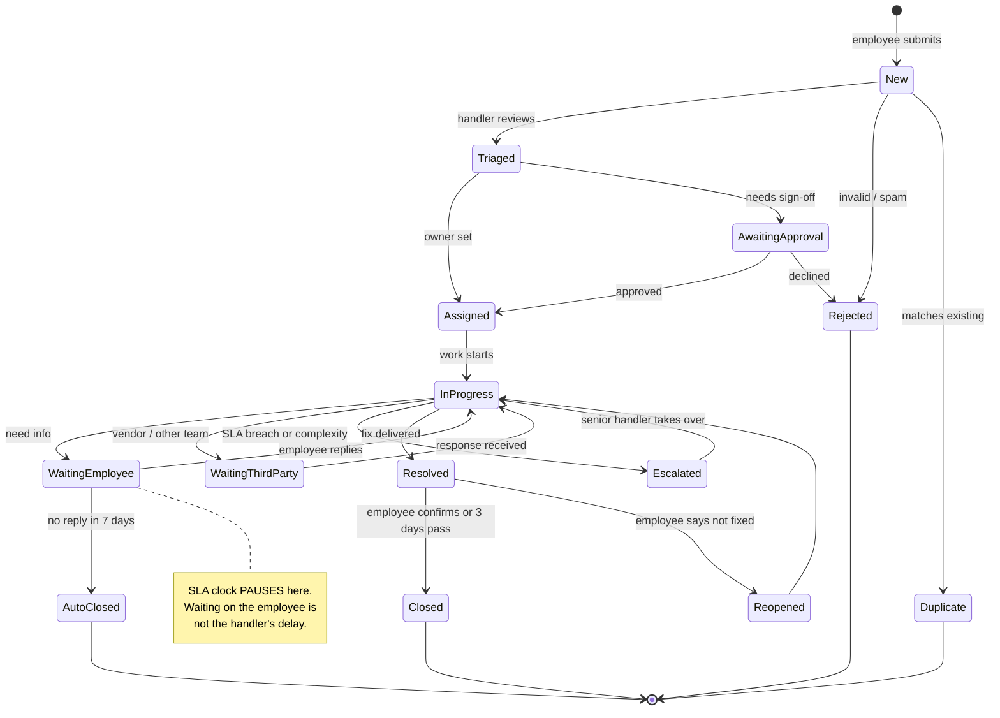
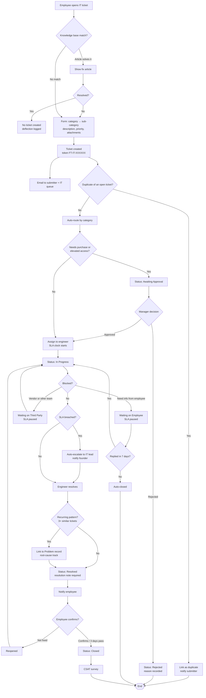
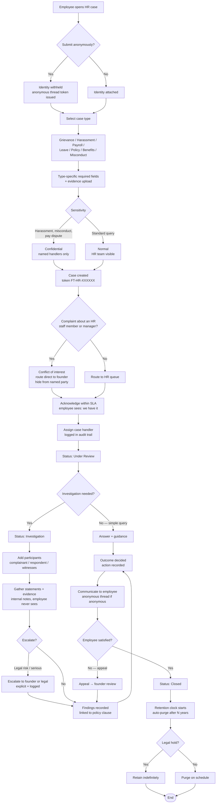
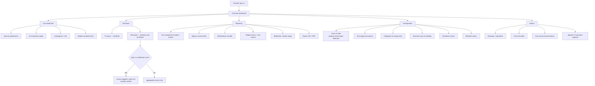
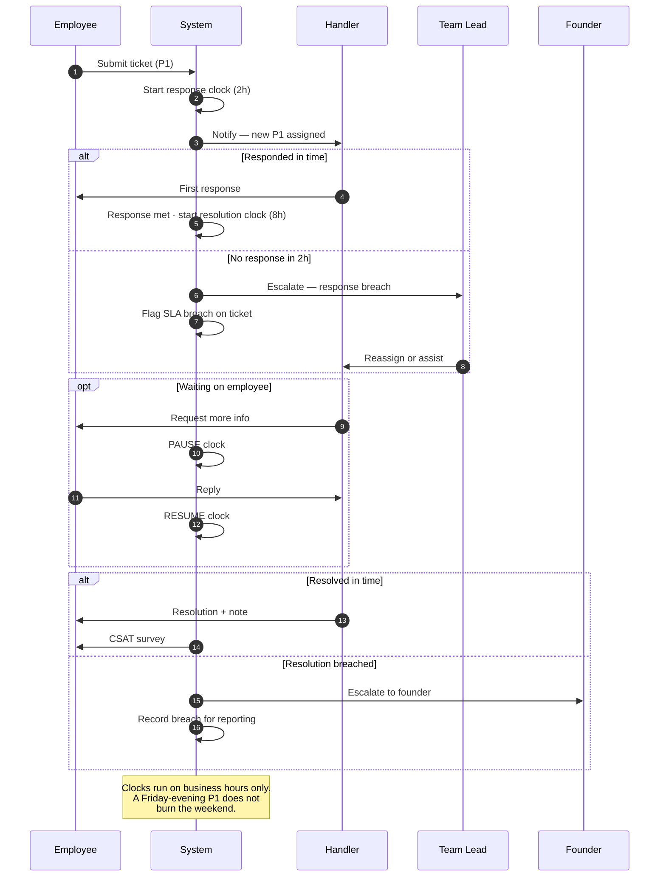
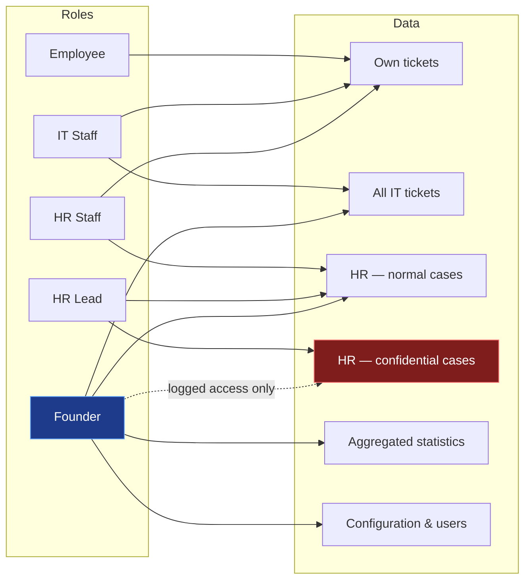

# Ticketing — Feature Research & Workflows

Research into what HR and IT ticketing systems actually need, and the full
workflows for **IT**, **HR**, and **Admin/Founder**.

Companion to `PRD.md` / `USER_FLOW.md`. Where those describe what was built,
this describes what a real service desk needs and where the current build sits.

---

## 1. Where the product stands today

Grounded in the code, not aspiration:

| Piece | Today |
|-------|-------|
| Roles | `employee`, `hr`, `it`, `founder` — detected from email pattern (`authController.js:5`) |
| Departments | Two separate collections: `hr_complaints`, `it_complaints` |
| Statuses | `Pending` → `In Progress` → `Completed` (flat, no sub-states) |
| Priority | `P1` / `P2` / `P3` — stored, but no SLA attached |
| Token | `FT-HR-8X2A7K` / `FT-IT-…` — generated per ticket |
| Assignment | **None** — tickets belong to a department, never to a person |
| Notifications | Email on create (to dept) and on status change (to submitter) |
| Audit trail | **None** — only `updated_at` is kept; who changed what is lost |
| Attachments | **None** |
| SLA / escalation | **None** |

The two biggest structural gaps: **no assignee** and **no event history**.
Almost every feature below depends on one or both, so they come first.

---

## 2. The core insight: HR and IT are not the same product

They are currently built as mirror images of each other. They shouldn't be.

| | **IT** | **HR** |
|---|---|---|
| Domain model | Incident / service request | **Case** |
| Volume | High, repetitive | Low, each one unique |
| Visibility | Whole IT team should see it | **Only assigned handler + escalation path** |
| Optimised for | Speed, deflection, automation | Fairness, documentation, defensibility |
| Success metric | Time to resolve | Consistency and completeness of record |
| Reporter | Always known | May need to be **anonymous** |
| Risk if leaked | Annoying | **Legal liability** |

Industry tooling reflects this: IT desks follow ITIL (incident management,
request fulfilment, problem management), while HR uses *employee relations case
management* — anonymous intake, access-controlled records, audit-ready trails
for regulators or legal review.

**Practical consequence:** an IT ticket can default to team-visible. An HR ticket
must default to *need-to-know*, and the current `getAllComplaints` — which
returns every HR complaint to every HR user — is the wrong default for
harassment, pay, or manager-conduct cases.

---

## 3. Feature research

### 3.1 Shared core — both HR and IT

| Feature | Why it matters | Status |
|---|---|---|
| **Assignment to a person** | "The IT team" is not accountable; a named owner is | ❌ missing |
| **Activity timeline / audit log** | Every state change, comment, reassignment, with actor + timestamp | ❌ missing |
| **Threaded comments** | Handler ↔ employee conversation without leaving the ticket | ❌ missing |
| **Internal notes** | Handler-only notes, never shown to the employee | ❌ missing |
| **Attachments** | Screenshots for IT, documents for HR | ❌ missing |
| **SLA timers** | Response + resolution clocks per priority, visible countdown | ❌ missing |
| **Auto-escalation** | Breach → escalate to manager/founder automatically | ❌ missing |
| **Richer status model** | `Waiting on employee` must stop the SLA clock | ⚠️ 3 flat states |
| **Reopen** | A "fixed" ticket that isn't fixed should reopen, not spawn a duplicate | ❌ missing |
| **Server-side search & filter** | Filtering a client-side page only filters what's loaded | ⚠️ partial |
| **Saved views** | "My open P1s", "Unassigned > 24h" | ❌ missing |
| **CSAT after close** | One question: was this resolved? | ❌ missing |
| **Bulk actions** | Assign / close many at once | ❌ missing |
| **Notification preferences** | Per-user, per-event; email today, in-app later | ⚠️ hardcoded |

### 3.2 IT-specific

| Feature | Why |
|---|---|
| **Category → sub-category routing** | Already modelled in `IT_CATEGORIES`; use it to auto-assign to the right engineer |
| **Approval workflow** | The `approval` flag exists but does nothing. Hardware/licence purchases should route to a manager and **block** fulfilment until approved |
| **Asset linking** | Tie a ticket to the laptop/monitor it's about; see that asset's whole history |
| **Knowledge base + deflection** | "VPN not connecting" should offer the fix article *before* the submit button — the cheapest ticket is the one never raised |
| **Templates for common requests** | New joiner setup, software install, access request — pre-filled forms |
| **Problem management** | 8 tickets about the same crash = one underlying problem. Link children to a parent |
| **Change requests** | Planned work with a scheduled window, distinct from break/fix |
| **Recurring / scheduled tickets** | Monthly backup checks, licence renewals |
| **Duplicate detection** | Flag similar open tickets at intake |
| **Asset/licence expiry alerts** | Ticket auto-raised before a licence lapses |

### 3.3 HR-specific

| Feature | Why |
|---|---|
| **Case confidentiality levels** | `Normal` / `Confidential` / `Restricted`. Restricted = named handlers only, invisible to other HR staff |
| **Anonymous submission** | Reporter identity withheld, with a **two-way anonymous thread** so HR can still ask questions. This is the single most-cited HR-desk feature |
| **Conflict-of-interest routing** | A complaint *about* an HR person must never route to that person. Auto-reroute to founder |
| **Case type taxonomy** | Grievance, harassment, payroll, leave, policy, benefits, misconduct — each with its own required fields |
| **Investigation workflow** | Structured stages: intake → acknowledge → investigate → findings → outcome → closure |
| **Investigation notes & evidence** | Separate from the employee-visible thread, timestamped, immutable |
| **Participants** | Complainant, respondent, witnesses — each with controlled visibility |
| **Policy linkage** | Which handbook clause applies |
| **Outcome & action record** | What was decided, what action was taken, was it communicated |
| **Retention & legal hold** | Auto-delete after N years, unless held for litigation |
| **Immutable audit trail** | Who opened the case, who read it, what changed — defensible if challenged |
| **Escalation to founder/legal** | Explicit, logged, one click |
| **Anonymised reporting** | Trend stats without exposing individuals ("4 payroll cases this quarter") |

### 3.4 Admin / Founder

| Feature | Why |
|---|---|
| **Cross-department dashboard** | Both queues in one view |
| **SLA compliance reporting** | % met by department, by priority, trend over time |
| **Ageing report** | Oldest unresolved, stuck tickets, unassigned backlog |
| **Workload distribution** | Who is overloaded, who is idle |
| **Resolution-time analytics** | Median and P90 — the average hides the pain |
| **Repeat-issue detection** | Same employee or same category recurring → a systemic problem |
| **Bottleneck view** | Which stage consumes the most time |
| **User & role management** | Currently role comes from an email regex — brittle. Needs real admin control |
| **SLA policy configuration** | Change targets without a deploy |
| **Category & routing rules** | Add categories and assignment rules from the UI |
| **Business-hours calendar** | A P1 raised Friday 6pm shouldn't breach over the weekend |
| **Announcements** | "Mail server down — we know" banner to stop duplicate tickets |
| **Restricted HR access** | The founder sees HR *statistics* by default; opening a restricted case is an explicit, logged action |
| **Data export & audit** | CSV/PDF export for compliance |

### 3.5 Suggested build order

| Phase | Items | Rationale |
|---|---|---|
| **1 — Foundation** | Assignee, activity log, comments, internal notes, richer statuses | Everything else depends on these |
| **2 — Accountability** | SLA timers, auto-escalation, business hours, reopen, CSAT | Makes the promise in `PriorityBadge` real |
| **3 — HR safety** | Confidentiality levels, anonymous intake, conflict-of-interest routing, investigation stages, retention | Closes the current privacy gap |
| **4 — IT scale** | Approval gating, auto-routing, knowledge base, templates, asset linking, problem management | High-volume efficiency |
| **5 — Insight** | Founder analytics, SLA reporting, workload, bottlenecks, config UI | Answers "which department is slow?" |

---

## 4. Workflows

### 4.1 Unified ticket lifecycle (state machine)

Both departments share the skeleton; HR adds investigation stages.

### 4.2 IT workflow — full

### 4.3 HR workflow — full

Confidentiality is the spine of this flow, not a feature bolted on.

### 4.4 Admin / Founder workflow

### 4.5 SLA & escalation timing

**Proposed SLA matrix** — makes the promise already shown in the priority
picker enforceable:

| Priority | Meaning | First response | Resolution target | On breach |
|---|---|---|---|---|
| **P1 — High** | Work is blocked | 2 hours | 8 business hours | Team lead, then founder |
| **P2 — Medium** | Work continues | 24 hours | 3 business days | Team lead |
| **P3 — Low** | Minor request | 3 days | 10 business days | Flag in ageing report |

### 4.6 Access control — who sees what

The dashed edge is deliberate: the founder *can* open a confidential HR case,
but never silently. Every such read is written to the audit trail and the
assigned handler is notified.

---

## 5. Immediate recommendations

1. **Add `assignee_id` and an `events` sub-collection first.** Without them,
   SLA, escalation, audit, and analytics are all unbuildable.
2. **Split HR read access.** `getAllComplaints` handing every HR case to every
   HR user is the highest-risk gap in the product today.
3. **Make P1/P2/P3 mean something.** The UI already promises "response within
   2 hours" — right now nothing measures or enforces it.
4. **Replace email-regex role detection** with admin-managed roles. A typo in an
   email today silently grants or denies HR access.
5. **Add `Waiting on Employee`** before anything else in the status model — it
   is the difference between honest and flattering resolution metrics.

---

## Sources

- [IT Ticketing Systems: Essential Features (2026) — Intercom](https://www.intercom.com/learning-center/it-ticketing-systems)
- [Help desk ticketing system features and requirements — ManageEngine](https://www.manageengine.com/products/service-desk/helpdesk-tour.html)
- [Ticketing System for ITIL Workflows — Meegle](https://www.meegle.com/en_us/topics/ticketing-system/ticketing-system-for-itil-workflows)
- [Ticketing System: How It Works, Key Features — InvGate](https://blog.invgate.com/ticketing-system)
- [HR Grievance Management Software for Employee Relations — SpeakUp](https://www.speakup.com/solutions/hr-grievance-management-software-for-employee-relations)
- [Case Management Software for HR: Features & Platforms 2026 — HR Acuity](https://www.hracuity.com/blog/case-mangement-software-for-hr/)
- [HR and Labor Relations Case Management Software — VComply](https://www.v-comply.com/blog/hr-labor-relations-employee-case-management-software/)
- [Employee Relations Case Management Tools — FaceUp](https://www.faceup.com/en/blog/best-employee-case-management-tools)
