```mermaid
flowchart TB
    subgraph Browser["Browser (React SPA)"]
        UI["Pages & Dashboards\n(founder / hr / it / coordinator / employee)"]
        CTX["React Context state\nTicketContext, LeaveContext,\nApprovalContext, TaskProjectContext"]
        AUTHCTX["AuthContext\n(JWT in localStorage/sessionStorage)"]
        UI --> CTX
        UI --> AUTHCTX
    end

    subgraph Backend["Express API (main/backend)"]
        AUTHR["/api/auth\nregister, login"]
        HRR["/api/hr/complaints"]
        ITR["/api/it/complaints"]
        FDR["/api/founder/complaints"]
        MW["authMiddleware (JWT)\nroleMiddleware (RBAC)"]
        AUTHR --> MW
        HRR --> MW
        ITR --> MW
        FDR --> MW
    end

    subgraph External["External services"]
        FB["Firebase Auth + Firestore"]
        SMTP["SMTP (Nodemailer)"]
        GEMINI["Gemini API\n(browser calls directly, own API key)"]
    end

    AUTHCTX -- "login / register only" --> AUTHR
    Backend --> FB
    Backend --> SMTP
    UI -- "AI Cabinet (Founder only)" --> GEMINI

    style CTX fill:#3a2a1a,stroke:#e8874a
    style GEMINI fill:#1a2a3a,stroke:#4a90e8
```

# TRD: Technical Requirements Document
# Fute Services: Project Ticket Portal

> Verified against the actual repository. The folder structure, endpoints, and settings below are read from the code, not carried forward from an earlier plan (the app moved from an earlier database choice, Supabase/Postgres, to Firebase; this document reflects Firebase only).
>
> **Note (2026-08-29):** this document has not been updated since it was first written and is now out of date in places (for example, it still describes login tokens stored in the browser's local storage and a role system detected from someone's email address, both of which have since changed). Treat this as historical context for how the project started, and check `docs/SECURITY.md` and `docs/AUTH_WORKFLOW.md` for how login and permissions actually work today.

---

## 1. Technology used

| Layer | Technology |
|-------|-----------|
| Frontend (what people see and click) | React 18, Vite, TypeScript (`.jsx` and `.tsx` files coexist), React Router v6, Tailwind CSS, shadcn/ui (Radix), Framer Motion, Recharts, Lucide Icons, Sonner (toast notifications) |
| Backend (the server that handles requests) | Node.js, Express 4 |
| Login & database | Firebase Admin SDK: Firebase Auth (login) plus Firestore (database) |
| Email | Nodemailer (sends email through a mail server) |
| AI | Google Gemini (`generativelanguage.googleapis.com`), called directly from the browser; see [AI_WORKFLOW.md](./AI_WORKFLOW.md) |
| Hosting | Vercel (frontend); the backend is a separate program, not currently hosted alongside it; see section 9 |
| Package manager | npm |
| End-to-end tests (automated tests that click through the app like a person would) | Playwright (`main/frontend/tests/e2e`) |

## 2. Architecture at a glance



*(Note: the diagram above reflects how the app looked when this document was first written, including "JWT in localStorage/sessionStorage" for login. That part has since changed; see the note at the top of this document.)*

One detail in the diagram matters: at the time this was written, **only login and registration** actually talked to the backend server. Everything else drawn inside "React Context state" was working with data held only in the browser, not saved anywhere permanent. See [BACKEND_WORKFLOW.md](./BACKEND_WORKFLOW.md) section 6 for why, and what connecting it up for real would take.

## 3. Folder structure (as originally documented)

```
Project-Ticket/
├── docs/                              # PRD, TRD, USER_FLOW, BACKEND_WORKFLOW, AI_WORKFLOW
│
└── main/
    ├── frontend/
    │   ├── src/
    │   │   ├── pages/
    │   │   │   ├── LoginPage.jsx / SignupPage.jsx
    │   │   │   ├── FounderDashboardPage.jsx / FounderLandingPage.jsx
    │   │   │   ├── EmployeeDashboardPage.jsx
    │   │   │   ├── DashboardPage.jsx          # IT dashboard shell
    │   │   │   ├── hr/                        # Overview, Candidates, Interviews,
    │   │   │   │                              # Attendance, Directory, Email, Reports
    │   │   │   └── coordinator/               # Overview, Projects, ProjectDetail, Tasks
    │   │   ├── components/
    │   │   │   ├── ui/                        # shadcn/Radix primitives
    │   │   │   ├── ui.jsx                     # Card, Badge, StatCard, Modal, Drawer, etc.
    │   │   │   ├── hr/HrLayout.jsx, coordinator/CoordinatorLayout.jsx, ItDeskLayout.jsx
    │   │   │   ├── FounderAiAdvisorView.jsx   # AI Agent Command Room
    │   │   │   ├── NewItTicketModal.jsx, DataTransferModal.jsx, TeamChatDrawer.jsx
    │   │   │   ├── ProductionDashboardView.jsx # Production's interactive dashboard
    │   │   │   └── RequireAuth.jsx            # Route guard (role allow-list)
    │   │   ├── context/                       # AuthContext, TicketContext, LeaveContext,
    │   │   │                                   # ApprovalContext, TaskProjectContext
    │   │   ├── data/                           # coordinatorMockData, hrMockData, itMockData, deptDemoData
    │   │   ├── hooks/useOverlayDismiss.js
    │   │   ├── utils/
    │   │   │   ├── api.js                     # axios instance + endpoint functions
    │   │   │   ├── aiCabinet.js               # Gemini system prompt + call/parse
    │   │   │   └── dummyAuth.js               # offline demo-account login
    │   │   └── App.jsx / main.jsx
    │   ├── tests/e2e/                         # Playwright suite
    │   ├── playwright.config.js
    │   ├── vite.config.js
    │   └── vercel.json                        # framework: vite, SPA rewrite
    │
    └── backend/
        ├── config/firebase.js                # Firebase Admin init (Auth + Firestore)
        ├── controllers/                      # authController, hrController, itController,
        │                                     # founderController
        ├── middleware/                       # authMiddleware (JWT), roleMiddleware (RBAC)
        ├── routes/                           # authRoutes, hrRoutes, itRoutes, founderRoutes
        ├── utils/mailer.js                   # Nodemailer + email templates
        └── server.js
```

*(This has grown considerably since this document was first written; treat it as the starting shape, not the current one.)*

## 4. Data model

The database (Firestore) doesn't use rigid tables the way a traditional database does. Its collections (roughly, folders of records) don't enforce a fixed shape. What's below is what the code actually reads and writes for each one.

**`users`** (each record's ID is the person's Firebase login ID)
```
email, full_name, role ('employee'|'hr'|'it'|'coordinator'|'founder'), department, created_at
```

**`hr_complaints`**
```
token          "FT-HR-XXXXXX"  (a short reference code the submitter can use to look up their complaint)
user_id        Firebase login ID of the person who submitted it
name, department, description, complaint_date
duration       calculated automatically from complaint_date up to right now
submitted_at, updated_at
priority       a text value supplied by whoever created the complaint
status         'Pending' | 'In Progress' | 'Completed'
```

**`it_complaints`**: same shape as `hr_complaints`, plus:
```
token          "FT-IT-XXXXXX"
category, sub_category
approval       true or false
```

The Founder's `/api/founder/complaints` request reads both collections and combines them into one list, marking each row `dept_tag: 'HR'` or `'IT'` so the founder can tell them apart.

At the time this was written, everything else the app showed (tickets, leave requests, approvals, tasks and projects) had **no database collection behind it at all**. It was placeholder data held only in the browser's memory, gone the moment the page refreshed. See [BACKEND_WORKFLOW.md](./BACKEND_WORKFLOW.md) section 6 for detail on this.

Two of those browser-only data shapes carried more fields than you'd expect just from reading the backend code, worth noting since they're easy to miss:

**Tickets** carried `id, token, title, user, dept, status, statusColor`, plus `employeeId, vpnNo, date, username`. The last four were administrative details the raise-a-ticket forms didn't actually ask for; the code filled them in automatically (a running ID number, today's date, a simplified version of the username) so every ticket had them regardless of which form created it.

**Assets** carried, beyond the basic inventory fields, a `hardDisk` value, a list of components, and two running logs: one for component/hard-disk changes and one for status changes. The asset editing screen adds a new entry to those logs every time something relevant changes, so the record's history builds up over time instead of starting blank on every edit.

## 5. API endpoints (as originally implemented)

### Login: `/api/auth`
| Method | Path | Notes |
|---|---|---|
| POST | `/register` | Creates the Firebase login account plus a matching `users` record. At the time, the person's role was guessed from their email address (see below), not chosen by them. |
| POST | `/login` | Checks the password through Firebase's own verification service, then issues the app's own sign-in token. |

### HR: `/api/hr` (every route here requires the caller to already be signed in)
| Method | Path | Who's allowed |
|---|---|---|
| POST | `/complaints` | anyone signed in |
| GET | `/complaints` | HR staff, founders |
| GET | `/complaints/my` | anyone signed in (their own complaints only) |
| GET | `/complaints/search?token=` | anyone signed in |
| PATCH | `/complaints/:id/status` | HR staff, founders |

### IT: `/api/it`: same shape as HR above, but restricted to IT staff and founders instead of HR and founders.

### Founder: `/api/founder`
| Method | Path | Who's allowed |
|---|---|---|
| GET | `/complaints` | founders only |

This was checked with a one-off test during quality review: 22 out of 22 checks passed. No sign-in token, a fake token, a token signed with the wrong secret, and every attempt by one role to reach another role's screen (for example, IT staff trying to open an HR-only request) were all correctly refused, and every role that should have access got through.

## 6. How a role used to be decided

```
email contains "hr.fute"                                 -> hr
email contains "system.fute" or "system.futeservice"     -> it
email contains "coordinator.fute"                         -> coordinator
anything else                                              -> employee
founder                                                     -> set manually in the database, never by self-signup
```

*(This email-pattern approach has since been replaced; see the note at the top of this document.)*

## 7. Reference-code format

```
HR: FT-HR-XXXXXX   (6 random uppercase letters and digits)
IT: FT-IT-XXXXXX
```
Generated by the server itself at the moment a complaint is created.

## 8. Configuration values (environment variables)

**`main/frontend/.env`**
```
VITE_API_BASE_URL=http://localhost:5000
```

**`main/backend/.env`**
```
FIREBASE_PROJECT_ID=
FIREBASE_CLIENT_EMAIL=
FIREBASE_PRIVATE_KEY=
FIREBASE_API_KEY=
JWT_SECRET=
SMTP_HOST=
SMTP_PORT=
SMTP_USER=
SMTP_PASS=
HR_EMAIL=
IT_EMAIL=
PORT=5000
```
The Gemini API key used for the AI Cabinet feature is not one of these settings. It's entered per person through the Founder dashboard's Settings panel and saved in that browser only, since there's no server standing between the app and Gemini for it (see [AI_WORKFLOW.md](./AI_WORKFLOW.md)).

## 9. Deployment

- **Frontend**: hosted on Vercel, project name `project-ticket`, built from the `main/frontend` folder using the Vite build tool. `main/frontend/vercel.json` handles the redirect rule single-page apps need.
- **Backend**: at the time this was written, not hosted anywhere live. The `main/backend/.env` file on the development machine still held unfilled placeholder values, so the server couldn't even start (it failed with a "badly formatted key" error) until real Firebase credentials were supplied. Until then, sign-in and sign-up in the app would fail and quietly fall back to offline demo accounts by design (see [BACKEND_WORKFLOW.md](./BACKEND_WORKFLOW.md) section 7).
- A duplicate Vercel project (`project-ticket-xx63`) existed with an incorrectly configured build setting and has since been deleted.

## 10. Testing

- `main/frontend/tests/e2e`: automated browser tests (Playwright), run against both a desktop-sized and a mobile-sized (Pixel 5) screen. These cover signing in, making sure people can't reach pages they shouldn't, navigating around, creating/reading/updating/deleting records, search and filtering, table behavior, exporting reports, closing pop-ups, and the layout adjusting to different screen sizes. Run them with `npm run test:e2e`.
- Backend permission checks were verified with a one-off test setup (not saved as a permanent, repeatable test suite); see section 5 above.
