# TRD — Technical Requirements Document
# Fute Services — Project Ticket Portal

> Verified against the actual repository — folder structure, endpoints, and env vars below are read from the code, not carried forward from an earlier stack (the app moved from a Supabase/Postgres draft to Firebase; this document reflects Firebase only).

---

## 1. Tech Stack

| Layer | Technology |
|-------|-----------|
| Frontend | React 18, Vite, TypeScript (`allowJs`, incremental — `.jsx` and `.tsx` coexist), React Router v6, Tailwind CSS, shadcn/ui (Radix), Framer Motion, Recharts, Lucide Icons, Sonner (toasts) |
| Backend | Node.js, Express 4 |
| Auth & DB | Firebase Admin SDK — Firebase Auth + Firestore |
| Email | Nodemailer (SMTP) |
| AI | Google Gemini (`generativelanguage.googleapis.com`), called directly from the browser — see [AI_WORKFLOW.md](./AI_WORKFLOW.md) |
| Deployment | Vercel (frontend); backend is a separate Express app, not currently deployed alongside it — see §9 |
| Package Manager | npm |
| E2E Tests | Playwright (`main/frontend/tests/e2e`) |

## 2. Architecture at a Glance

```mermaid
flowchart TB
    subgraph Browser["Browser (React SPA)"]
        UI["Pages & Dashboards\n(founder / hr / it / coordinator / employee)"]
        CTX["React Context state\nTicketContext, LeaveContext,\nApprovalContext, TaskProjectContext"]
        AUTHCTX["AuthContext\n(JWT in localStorage/sessionStorage)"]
        UI --> CTX
        UI --> AUTHCTX
    end

    subgraph Backend["Express API (main/backend)"]
        AUTHR["/api/auth\nregister, login"]
        HRR["/api/hr/complaints"]
        ITR["/api/it/complaints"]
        FDR["/api/founder/complaints"]
        MW["authMiddleware (JWT)\nroleMiddleware (RBAC)"]
        AUTHR --> MW
        HRR --> MW
        ITR --> MW
        FDR --> MW
    end

    subgraph External["External services"]
        FB["Firebase Auth + Firestore"]
        SMTP["SMTP (Nodemailer)"]
        GEMINI["Gemini API\n(browser calls directly, own API key)"]
    end

    AUTHCTX -- "login / register only" --> AUTHR
    Backend --> FB
    Backend --> SMTP
    UI -- "AI Cabinet (Founder only)" --> GEMINI

    style CTX fill:#3a2a1a,stroke:#e8874a
    style GEMINI fill:#1a2a3a,stroke:#4a90e8
```



The dashed line matters: as of this document, **only login and registration** cross from the browser to the Express API. Everything else drawn inside "React Context state" is client-only — see [BACKEND_WORKFLOW.md](./BACKEND_WORKFLOW.md) §6 for why, and what wiring it up would take.

## 3. Folder Structure (current)

```
Project-Ticket/
├── docs/                              # PRD, TRD, USER_FLOW, BACKEND_WORKFLOW, AI_WORKFLOW
│
└── main/
    ├── frontend/
    │   ├── src/
    │   │   ├── pages/
    │   │   │   ├── LoginPage.jsx / SignupPage.jsx
    │   │   │   ├── FounderDashboardPage.jsx / FounderLandingPage.jsx
    │   │   │   ├── EmployeeDashboardPage.jsx
    │   │   │   ├── DashboardPage.jsx          # IT dashboard shell
    │   │   │   ├── hr/                        # Overview, Candidates, Interviews,
    │   │   │   │                              # Attendance, Directory, Email, Reports
    │   │   │   └── coordinator/               # Overview, Projects, ProjectDetail, Tasks
    │   │   ├── components/
    │   │   │   ├── ui/                        # shadcn/Radix primitives
    │   │   │   ├── ui.jsx                     # Card, Badge, StatCard, Modal, Drawer, etc.
    │   │   │   ├── hr/HrLayout.jsx, coordinator/CoordinatorLayout.jsx, ItDeskLayout.jsx
    │   │   │   ├── FounderAiAdvisorView.jsx   # AI Agent Command Room
    │   │   │   ├── NewItTicketModal.jsx, DataTransferModal.jsx, TeamChatDrawer.jsx
    │   │   │   ├── ProductionDashboardView.jsx # Production's interactive dashboard
    │   │   │   └── RequireAuth.jsx            # Route guard (role allow-list)
    │   │   ├── context/                       # AuthContext, TicketContext, LeaveContext,
    │   │   │                                   # ApprovalContext, TaskProjectContext
    │   │   ├── data/                           # coordinatorMockData, hrMockData, itMockData, deptDemoData
    │   │   ├── hooks/useOverlayDismiss.js
    │   │   ├── utils/
    │   │   │   ├── api.js                     # axios instance + endpoint functions
    │   │   │   ├── aiCabinet.js               # Gemini system prompt + call/parse
    │   │   │   └── dummyAuth.js               # offline demo-account login
    │   │   └── App.jsx / main.jsx
    │   ├── tests/e2e/                         # Playwright suite
    │   ├── playwright.config.js
    │   ├── vite.config.js
    │   └── vercel.json                        # framework: vite, SPA rewrite
    │
    └── backend/
        ├── config/firebase.js                # Firebase Admin init (Auth + Firestore)
        ├── controllers/                      # authController, hrController, itController,
        │                                     # founderController
        ├── middleware/                       # authMiddleware (JWT), roleMiddleware (RBAC)
        ├── routes/                           # authRoutes, hrRoutes, itRoutes, founderRoutes
        ├── utils/mailer.js                   # Nodemailer + email templates
        └── server.js
```

## 4. Data Model

Firestore, not SQL — collections are schemaless; the shapes below are what the controllers actually read and write.

**`users`** (doc id = Firebase Auth UID)
```
email, full_name, role ('employee'|'hr'|'it'|'coordinator'|'founder'), department, created_at
```

**`hr_complaints`**
```
token          "FT-HR-XXXXXX"
user_id        Firebase UID of the submitter
name, department, description, complaint_date
duration       computed at write time from complaint_date → now
submitted_at, updated_at
priority       caller-supplied string
status         'Pending' | 'In Progress' | 'Completed'
```

**`it_complaints`** — same shape as `hr_complaints`, plus:
```
token          "FT-IT-XXXXXX"
category, sub_category
approval       boolean
```

The Founder's `/api/founder/complaints` endpoint reads both collections and merges them, tagging each row `dept_tag: 'HR' | 'IT'`.

Everything else the UI shows — tickets (`data/itMockData.js` → `TicketContext`), leave requests, approvals, tasks/projects — has **no Firestore collection**. It's seed data held in React state. See [BACKEND_WORKFLOW.md](./BACKEND_WORKFLOW.md) §6.

Two of those client-only shapes carry more fields than they used to, worth noting since they're easy to miss reading the controllers alone:

**Tickets** (`TicketContext`) — `id, token, title, user, dept, status, statusColor`, plus `employeeId, vpnNo, date, username`. The last four are administrative metadata the raise-ticket forms don't collect; `addTicket()` derives them (sequential IDs, current date, a slugified username) so every ticket has them regardless of which form created it.

**Assets** (`data/itMockData.js` → `AssetsView`) — beyond the original inventory fields, each asset also carries `hardDisk` (string), `componentsList` (string array), `componentsLog` and `history` (arrays of `{ date, change|event }`). `AssetFormModal` appends to `componentsLog` when components/hard disk change and to `history` when status changes, so the audit drawer accumulates real entries rather than starting empty on every edit.

## 5. API Endpoints (as implemented)

### Auth — `/api/auth`
| Method | Path | Notes |
|---|---|---|
| POST | `/register` | Creates the Firebase Auth user + `users` doc. Role is detected from the email (§ below), not chosen by the caller. |
| POST | `/login` | Verifies the password via the Firebase Identity Toolkit REST API, then issues the app's own JWT. |

### HR — `/api/hr` (all routes require a valid JWT)
| Method | Path | Role gate |
|---|---|---|
| POST | `/complaints` | any authenticated user |
| GET | `/complaints` | `hr`, `founder` |
| GET | `/complaints/my` | any authenticated user (own complaints only) |
| GET | `/complaints/search?token=` | any authenticated user |
| PATCH | `/complaints/:id/status` | `hr`, `founder` |

### IT — `/api/it` — identical shape, gated to `it`/`founder` instead of `hr`/`founder`.

### Founder — `/api/founder`
| Method | Path | Role gate |
|---|---|---|
| GET | `/complaints` | `founder` only |

Verified with a stubbed-Firestore integration test during QA: 22/22 checks passed — no token, a garbage token, a token signed with the wrong secret, and every cross-role access attempt (e.g. `it` calling an `hr` endpoint) all correctly return 401/403, and every permitted role reaches its handler.

## 6. Role Detection

```
email matches /hr\.fute/i                          → hr
email matches /system\.fute/i or /system\.futeservice/i → it
email matches /coordinator\.fute/i                 → coordinator
anything else                                      → employee
founder                                            → set manually in Firestore, never self-registered
```

## 7. Token Format

```
HR: FT-HR-XXXXXX   (6 random uppercase alphanumeric)
IT: FT-IT-XXXXXX
```
Generated server-side in the respective controller at creation time.

## 8. Environment Variables

**`main/frontend/.env`**
```
VITE_API_BASE_URL=http://localhost:5000
```

**`main/backend/.env`**
```
FIREBASE_PROJECT_ID=
FIREBASE_CLIENT_EMAIL=
FIREBASE_PRIVATE_KEY=
FIREBASE_API_KEY=
JWT_SECRET=
SMTP_HOST=
SMTP_PORT=
SMTP_USER=
SMTP_PASS=
HR_EMAIL=
IT_EMAIL=
PORT=5000
```
The Gemini API key for the AI Cabinet is **not** an env var — it's supplied per-user through the Founder dashboard's Settings drawer and stored in that browser's `localStorage`, since there's no backend proxy for it (see [AI_WORKFLOW.md](./AI_WORKFLOW.md)).

## 9. Deployment

- **Frontend**: Vercel project `project-ticket`, root directory `main/frontend`, framework `vite`. `main/frontend/vercel.json` sets the SPA fallback rewrite.
- **Backend**: not currently deployed. `main/backend/.env` on this machine still holds the unedited `.env.example` placeholders, so the Express app cannot start (`FirebaseAppError: Invalid PEM formatted message`) until real Firebase credentials are supplied. Until then, the frontend's login/register calls fail and fall back to the offline demo accounts by design (see [BACKEND_WORKFLOW.md](./BACKEND_WORKFLOW.md) §7).
- A duplicate Vercel project (`project-ticket-xx63`) existed with a misconfigured build command and has been deleted.

## 10. Testing

- `main/frontend/tests/e2e` — Playwright, two projects (`desktop`, `mobile`/Pixel 5). Covers auth, route protection, navigation, CRUD flows, search/filter/sort, table behavior, report exports, overlay dismissal, and responsive layout. Run with `npm run test:e2e`.
- Backend authorization was verified with a one-off stubbed-Firestore harness (not checked in as a suite) — see §5.
