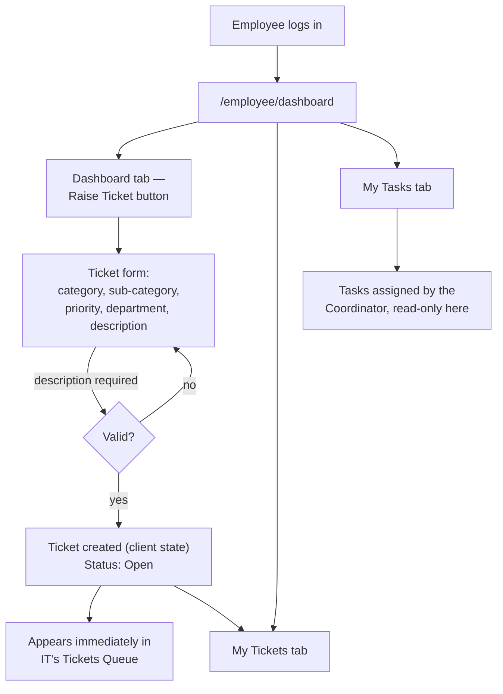
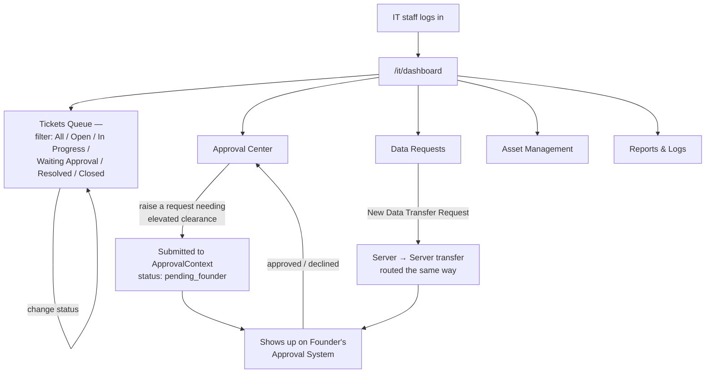
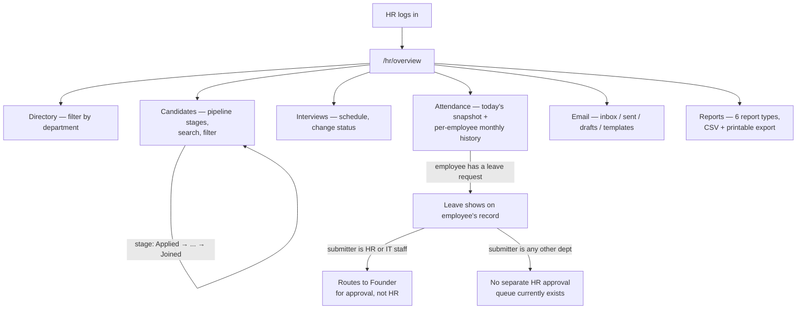
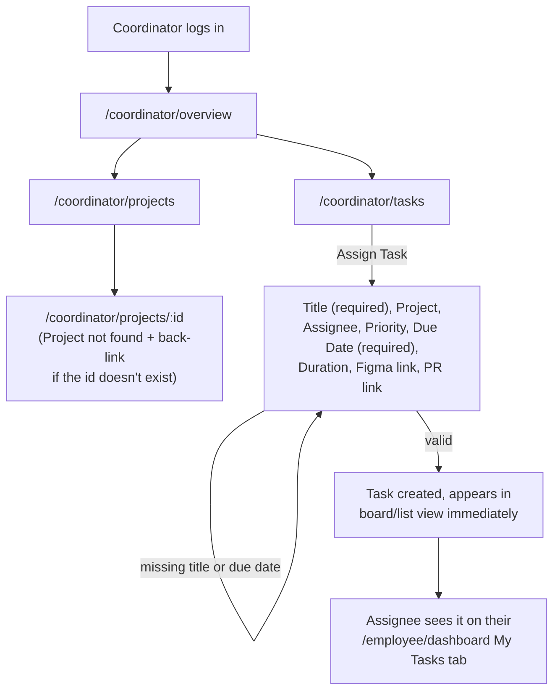
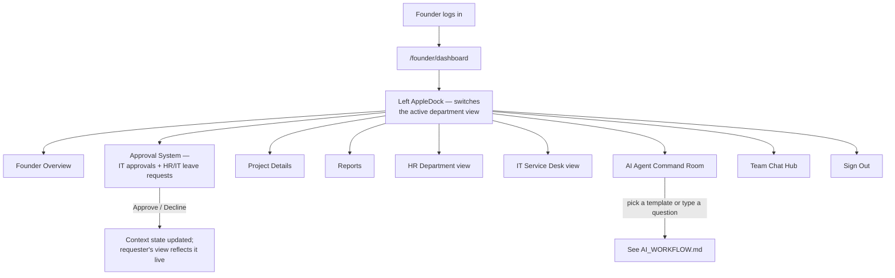
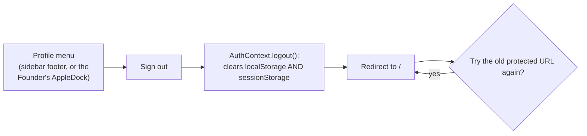

# USER_FLOW.md — User Flows
# Fute Services — Project Ticket Portal

> Traced against `App.jsx`'s actual route table and each dashboard's real controls — not the original single-role complaint-form concept.

---

## 1. Overall Flow


A visitor who isn't signed in, or who is signed in as the wrong role, is redirected straight back to `/` — there is no "access denied" page (`RequireAuth`, enforced on every protected route).

## 2. Authentication Flow


Five quick-demo tiles on the login screen (Founder, HR, IT, Coordinator, Employee) skip typing entirely and log in as a seeded account for exactly this reason — trying every role without a live backend.

## 3. Employee Flow



## 4. IT Service Desk Flow



## 5. HR Flow



> HR currently has no dedicated leave-approval screen of its own — every leave request, regardless of department, is decided on the Founder's dashboard. This is a deliberate current design, not an oversight (see [BACKEND_WORKFLOW.md](./BACKEND_WORKFLOW.md) §5), but worth knowing if you're looking for an "HR approves leave" screen and can't find one.

## 6. Coordinator Flow



## 7. Founder Flow



## 8. Sign-out Flow (all roles)



## 9. Page Map (as routed in `App.jsx`)

```
/                              → Login
/login, /signup                → both redirect to /
/founder                       → redirects to /founder/dashboard
/founder/dashboard             → Founder (role: founder)
/it/dashboard                  → IT Service Desk (role: it)
/employee/dashboard            → Employee (role: employee)
/hr/dashboard                  → redirects to /hr/overview (legacy path)
/hr/overview                   → HR Dashboard (role: hr)
/hr/candidates                 → HR Candidates
/hr/interviews                 → HR Interviews
/hr/attendance                 → HR Attendance
/hr/email                      → HR Email
/hr/directory                  → HR Directory
/hr/reports                    → HR Reports
/coordinator/overview          → Coordinator Dashboard (role: coordinator)
/coordinator/tasks             → Coordinator Tasks
/coordinator/projects          → Coordinator Projects
/coordinator/projects/:id      → Coordinator Project Detail
*                              → redirects to /
```
