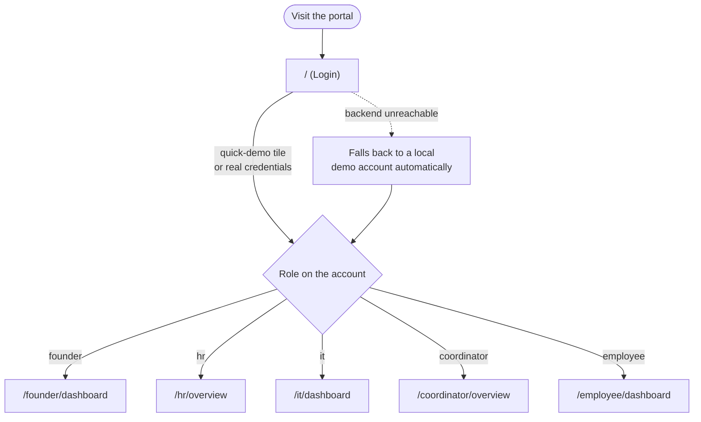
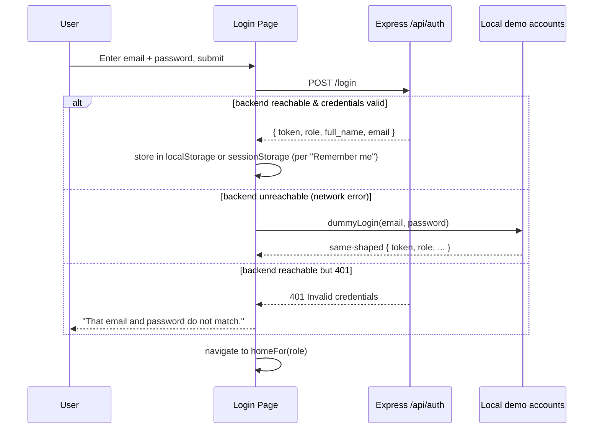
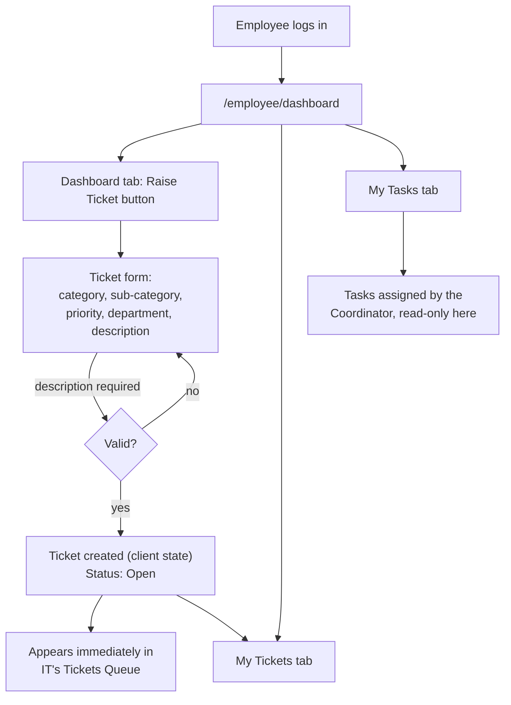
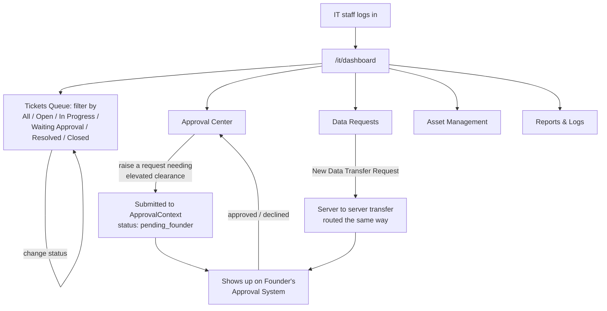
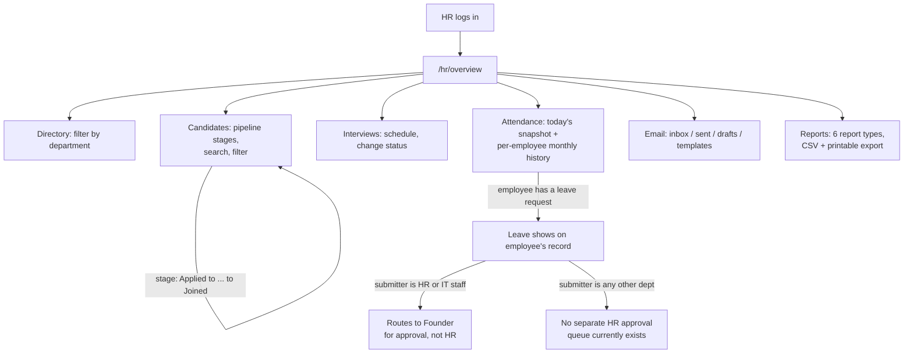
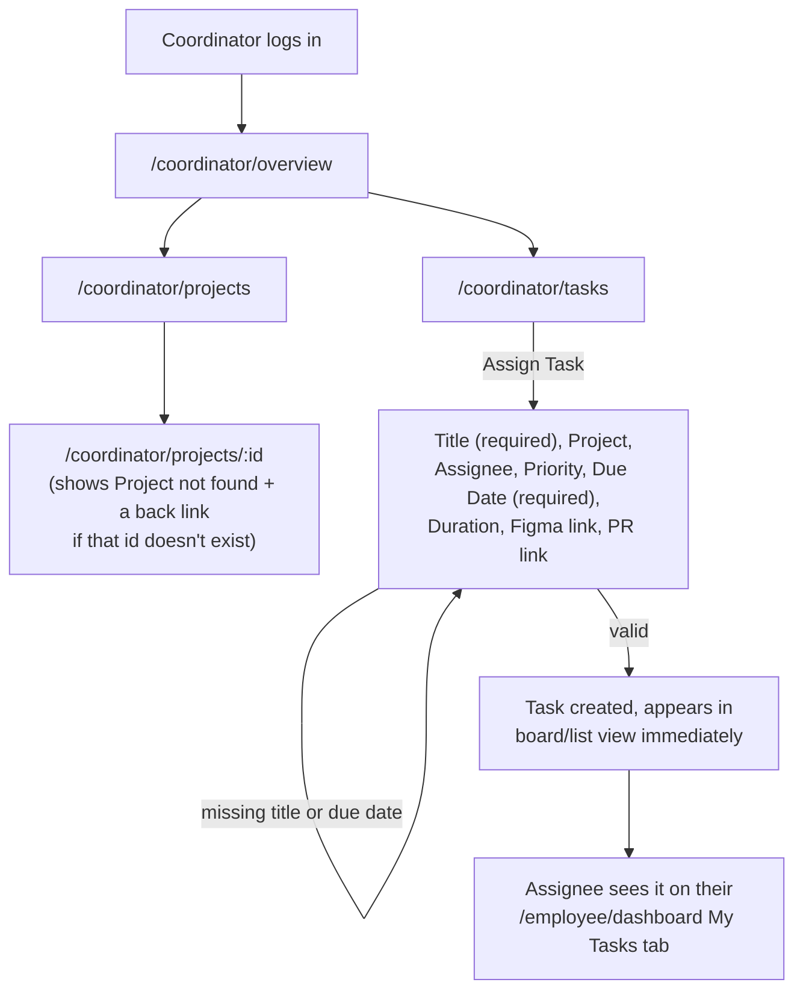
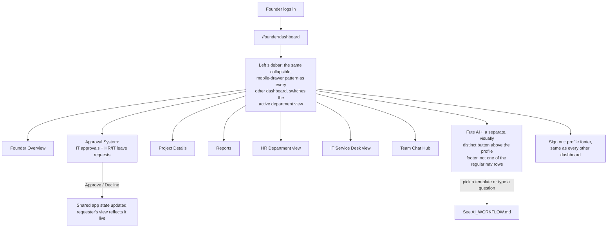
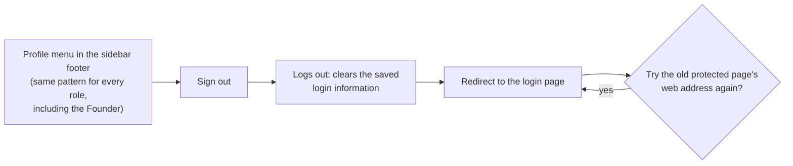

# USER_FLOW.md: User Flows
# Fute Services: Project Ticket Portal

> This document was traced against the app's actual navigation code and each dashboard's real, working controls, not the original single-role complaint-form idea the project started from.

---

## 1. Overall flow



A visitor who isn't signed in, or who is signed in but as the wrong role for a given page, is sent straight back to the login page. There's no separate "access denied" page for this, it's handled by a single route-guard component (`RequireAuth`) that every protected page uses.

## 2. Signing in



*(Note: the diagram above describes how sign-in worked when this document was first written, storing a login token in the browser's local storage. That part has since changed to a more secure approach; see `docs/AUTH_WORKFLOW.md` for how it actually works today.)*

There are five "quick demo" tiles on the login screen, one each for Founder, HR, IT, Coordinator, and Employee. They skip typing a password entirely and sign straight into a pre-set sample account, specifically so anyone can try out every role without needing a live backend server running.

## 3. What an employee sees



## 4. What IT staff see



## 5. What HR sees



> HR doesn't currently have its own dedicated screen for approving leave requests. Every leave request, no matter which department it comes from, is decided on the Founder's dashboard instead. This is a deliberate design choice as things stand today, not something that was overlooked (see [BACKEND_WORKFLOW.md](./BACKEND_WORKFLOW.md) section 5), but it's worth knowing if you go looking for an "HR approves leave" screen and can't find one.

## 6. What a coordinator sees



## 7. What the Founder sees



## 8. Signing out (every role)



## 9. Page map (every page the app can navigate to)

```
/                              → Login
/login, /signup                → both redirect to /
/founder                       → redirects to /founder/dashboard
/founder/dashboard             → Founder (role: founder)
/it/dashboard                  → IT Service Desk (role: it)
/employee/dashboard            → Employee (role: employee)
/hr/dashboard                  → redirects to /hr/overview (an older, no-longer-used path)
/hr/overview                   → HR Dashboard (role: hr)
/hr/candidates                 → HR Candidates
/hr/interviews                 → HR Interviews
/hr/attendance                 → HR Attendance
/hr/email                      → HR Email
/hr/directory                  → HR Directory
/hr/reports                    → HR Reports
/coordinator/overview          → Coordinator Dashboard (role: coordinator)
/coordinator/tasks             → Coordinator Tasks
/coordinator/projects          → Coordinator Projects
/coordinator/projects/:id      → Coordinator Project Detail
*                              → redirects to /
```
